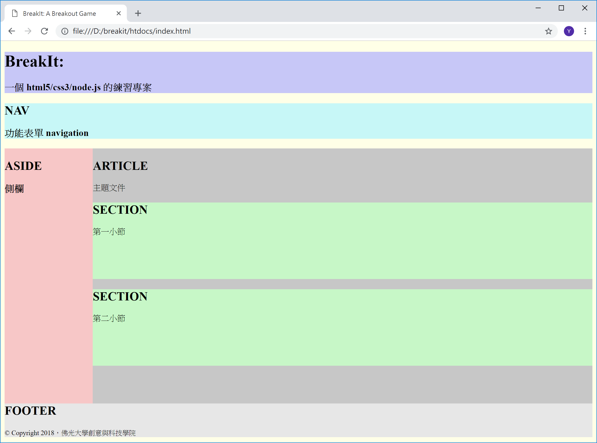

<!---
  @file       chapter_02.md
  @date       12/14/2018 created.
  @copyright  CC-BY, (C) 2017 Yiwei Chiao
  @detail
    This file is machine-generated. DONOT MODIFY IT DIRECTLY.
-->
# Web App

  這一章介紹如何建構一個 Web App (網頁應用程式) 的專案。先從專案
  的目錄結構開始。

## 專案目錄結構

  專案目錄結構是程式碼住的小窩。程式碼住的舒服，程式開發與維護才能輕鬆
  寫意。[BreakIt][breakit] 的專案結構規劃如下：

---

**專案目錄結構**
```
  D:\breakit         專案資料夾
  │  .gitignore        .gitignore 檔
  │  LICENSE           授權聲明
  │  README.md         專案說明檔。 Markdwon 格式。
  │
  ├─htdocs           客戶端程式資料夾
  │  ├─assets          客戶端程式資源
  │  │  ├─css             .css 檔
  │  │  ├─fonts           web 字型檔
  │  │  └─png             .png 檔
  │  ├─html            .html 檔
  │  └─js              .js 檔；客戶端 Javascript/ECMAScript 程式碼
  └─httpd            伺服端程式資料夾
      │  index.js         伺服端程式入口 (main)
      │
      └─js             伺服端 Javascript/ECMAScript 程式碼
```
---

  如列表所示，整個專案大致分為兩個資料夾：

  * *htdocs*: 客戶端 (瀏覽器) 相關程式與資源。
  * *httpd*: 伺服端 (node.js) 程式。

  基本上，專案啟動時是啟動 *httpd* 資料夾內的 `index.js` 檔案 (伺服端程式進入點)；而使用者利用瀏覽器 (browser) 連上伺服後，伺服端會先將放在 *htdocs*
  資料夾裡的程式文件與資源按瀏覽器的要求依序傳送到客戶端執行或顯示。從而完成網頁
  應用程式的執行。

  目前因為專案剛起動，所以除了 *htdocs* 資料夾下的 `index.html` 檔案之外，其它
  資料夾下的內容大多是空的。而隨著專案進展，不同的檔案會逐步被引入，同時置於相應
  的資料夾之內。這樣規劃資料夾 (目錄) 結構的好處也就是不同用途，作用的檔案會存在
  不同的資料夾之內，使得專案發展時不會被不是當下相關的檔案干擾。

  如果不清楚怎麼在 Linux/MacOS/Windows 作業環境下建立這樣的目錄結構，可以先
  跳到最後附錄一節有簡單的操作說明。

## 問題與思考

  如果這個專案目錄結構 (或它的變形) 是可以接受的，那麼為了省下每次開一個新的專
  案都要手動建立一次同樣的目錄結構的麻煩：

  * 有沒有一個自動化的方式可以在給定了專案名稱之後就自動建立相應的專案目錄結構？
  * 進階：自己寫一個小工具來作這件事如何？ (提示：
    [shell scripts][shellScript]，
    [scripting languages][scriptingLanguage])
  * 進進階：你寫的工具，可不可以 **客製化** (customize)；讀取一個 **設定檔**
    (config file) 之後，依設定檔的內容自動建立不同的目錄結構？

# HTML5/CSS3

 在網頁瀏覽器 (browser) 上，[JavaScript][wikiECMAScript]
 ([ECMAScript][]) 控制**程式行為** (behavior)，
 [HTML][wikiHTML] ([Hyper Text Markup Language][wikiHTML]) 決定文件
 的**組織結構** (structure)，而
 [CSS][wikiCSS] ([Cascading Style Sheets][wikiCSS])
 處理**排版**(style)。三者各司其職。

 [BreakIt][breakit] 專案既然是一個網頁遊戲專案，自然少不了
 [HTML][wikiHTML] 和 [CSS][wikiCSS]。只是專案重心在
 [JavaScript][mdnJavaScript]，所以
 [HTML][mdnHTML]，[CSS][mdnCSS] 只會簡單帶過使用到的部份。其餘更全面的介紹
 或進階的主題，需要去參考其它的資源 (如這裡給的連結：[HTML][mdnHTML]，和
 [CSS][mdnCSS])。

## index.html

  首先，在 `breakit/htdocs` 資料夾下，建立 `index.html` 檔案，內容如下：

```html
<!DOCTYPE html>
<html lang="zh-TW">
  <head>
    <meta charset="utf-8">
    <meta name="viewport" content="width=device-width, initial-scale=1.0">

    <title>BreakIt: A Breakout Game</title>
    <meta name="author" content="Yiwei Chiao">
    <meta name="description" content="A web-based Breakout (打磚塊) game.">
    <meta name="keywords" content="Javascript, game, Breakout">
  </head>
  <body>
    Hello World!
  </body>
</html>
```

 在 `index.html` 的內容列表中，用 `<>` 框起的字串稱為**標記** (*tag*)，
 它們也就是 [HTML][wikiHTML] 標記語言的組成部份。針對 [HTML][wikiHTML]
 較詳細的介紹放在這一章的後半，這裡需要注意的只是 `<body>` 和 `</body>`
 夾起的 `Hello World!`。

 準備好 `breakit/htdocs` 資料夾下的 `index.html` 後，可以開啟瀏覽器，在瀏
 覽器的網址列內輸入：

  * Windows: `file:///d:/breakit/htdocs/index.html`
  * Linux: `file:///home/ywchiao/breakit/htdocs/index.html`
  * MacOs: `file:///Users/ywchiao/breakit/htdocs/index.html`

 其中 Windows 的 `d:`，Linux/MacOS 裡的 `ywchiao` 請依個人情況更改。在
 Linux/MacOS 系統如果不清楚路徑要怎麼打，可以在 terminal 下利用 `cd` 指令，
 切換工作目錄到 `breakit/htdocs` 之後，輸入 `pwd`
 (Present Working Directory)，依螢幕輸出打就行了；而 Windows 則可以利用
 檔案總管，切換資料夾到 `breakit/htdocs` 後，在檔管總管的瀏覽器列空白處，
 點一下滑鼠左鍵就可以看到要輸入的內容。

 如果瀏覽器的網址列輸入正確，應該會看見如 Figuer \ref{file:index} 的畫面。

 

### [HTML][mdnHTML] 標題 `<h1> ... <h6>`

 Figure \ref{file:index} 看起來沒什麼不同？的確如此，因為前面提過，
 [HTML][wikiHTML] 的用途在決定文件**結構** (structure)，而非呈現。不過，
 一些簡單的效果還是有的。修改:

```html
 <body>
   Hello World!
 </body>
```

 成為：

```html
 <body>
   <h1>Hello World!</h1>
 </body>
```

 存檔後，重新整理網頁，可以發現 `Hello World!` 的字型大小變了。這是因為
 `<h1></h1>` 是 [HTML][mdnHTML] 用來標記**標題** (Heading) 的 *tag*；
 其中，`<h1>` 標記標題的開始，而 `</h1>` 則標記標題的結束。排版習慣上，標題
 的字體通常會比內文大一些。所以，[HTML][mdnHTML] 的 heading tags，標記的
 文字也會大一些。

 [HTML][mdnHTML] 總共定義了六 (6) 級的 heading 大小，分別以 `<h1>`.
 `<h2>`。一直到 `<h6>` 標記。可以逐一試試效果。

<!-- intro.md -->

# HTML 簡介

 [HTML][wikiHTML] 是 [HyperText Markup Language][wikiHTML] (超文本
 標記語言) 的縮寫。[**標記語言**][wikiMarkupLang]
 ([markup language][wikiMarkupLang]) 和[程式語言][wikiProgLang]
 ([programming language][wikiProgLang]) 有本質的不同。
 如 [HTML][wikiHTML]
 這樣的[標記語言][wikiMarkupLang]設計上是為[**文本**][wikiText]
 ([text][wikiText]) 的不同部份加上**標記** (tag)，方便工作人員或處理工具
 理解原始設計者／創作者的創作意圖，進而依據這些預先定義好的**標記**意義進行後製
 (post-production) 加工。
 在 Web 相關領域，目前常見的標記語言有
 [HTML][wikiHTML]，[Markdown][wikiMarkdown]，[XML][wikiXML]，
 [YAML][wikiYAML] 等。
 每個[標記語言][wikiMarkupLang]都有它想解決的問題和想達成的目的。

## [HTML][mdnHTML] 結構

 [HTML][mdnHTML] 採用的**標記**，稱為 [HTML][mdnHTML] *tag*，
 都以**成對**的角括號 `<...>` 包夾，成 `<tag>` 型式；如 `<h1>`，`<h2>`
 等。

 之前提過，[HTML][mdnHTML] 是設計來規範文件的結構。而一個最簡單的
 [HTML][mdnHTML] 結構大概如下所示：

```html
<html>
  <head>
    <title>HTML 簡介</title>  
  </head>
  <body>
    Hello HTML。
  </body>
</html>
```

 由上面的 [HTML][mdnHTML] 內容可以注意到幾件事情：

 * [HTML][mdnHTML] 檔案開頭與結束分別是 `<html>` 與 `</html>` 的 *tag*
  其中 `<tag>` 稱為 *tag* **開始**標記，而 `</tag>` 則稱為 *tag* **結東**
  標記。
 * [HTML][mdnHTML] 的內容可以分為 `<head></head>` 和 `<body></body>`
  兩大區塊：
    - `<head></head>`: 放置 .html 作者想讓瀏覽器知道，除了文件結構之外，
     一些額外的處理**注意事項**，相關檔案，和被稱為
     [*meta-data*][wikiMetadata] 的文件描述。在
     [GitHub][github] 上有一份整理的很好的文可以參考：
     [*HEAD*][githubHead]
    - `<body></body>`: [HTML][mdnHTML] 真正要呈現的內容。
 * [HTML][mdnHTML] *tag* **不**
  區分大小寫，不過 [HTML5][mdnHTML5] 建議採用**全**小寫。

## `index.html` 的 `<head></head>`

  `htdocs/index.html` 裡的 `<head></head>` 內容如下：

```html
1.  <head>
2.    <meta charset="utf-8">
3.    <meta name="viewport" content="width=device-width, initial-scale=1.0">
4.
5.    <title>BreakIt: A Breakout Game</title>
6.    <meta name="author" content="Yiwei Chiao">
7.    <meta name="description" content="A web-based Breakout (打磚塊) game.">
8.    <meta name="keywords" content="Javascript, game, Breakout">
9.  </head>
```

  * 第 2 行：通知瀏覽器，`index.html` 採用的內容編碼是 `utf-8`。
  * 第 3 行：預設使用設備的全螢幕顯示；放大倍率是 `1.0`
  * 第 5 行：網頁的標題 (title)；這個值會被用作網址列的內容，我的最愛，或搜尋
   引擎。
  * 第 6~8 行：網頁基本資訊，提供給搜尋引擎或網路爬蟲處理。

<!-- html.md -->

# 簡單的 HTML 版面架構

 目前 `index.html` 看起來看單純的 `Hello World!` 沒什麼兩樣。因為整個還沒有
 置入文件結構和版面訊息。為了對 [HTML][mdnHTML] 文件結構和版面的關係有個基本的
 理解，Figure \ref{html:layout} 利用 [CSS][mdnCSS] 將 [HTML][mdnHTML]
 不同版塊設定不同的背景顏色，以呈現 [HTML][mdnHTML] 元素之間的關聯。

  

## [HTML][mdnHTML] 和內嵌的 [CSS][mdnCSS]

 Figure \ref{html:layout} 的源碼如下：

```html
 1. <!DOCTYPE html>
 2. <html lang="zh-TW">
 3.   <head>
 4.     <meta charset="utf-8">
 5.     <meta name="viewport" content="width=device-width,
          initial-scale=1.0">
 6.
 7.     <title>BreakIt: A Breakout Game</title>
 8.     <meta name="author" content="Yiwei Chiao">
 9.     <meta name="description" content="A web-based Breakout
          (打磚塊) game.">
10.     <meta name="keywords" content="Javascript, game, Breakout">
11.   </head>
12.   <body style="background-color: #ffffe7;">
13.     <header style="background-color: #c7c7f7;">
14.       <h1>BreakIt:</h1>
15.       <h3>一個 html5/css3/node.js 的練習專案</h3>
16.     </header>
17.     <nav style="background-color: #c7f7f7;">
18.       <h2>NAV</h2>
19.       <h3>功能表單 navigation</h3>
20.     </nav>
21.     <aside style="background-color: #f7c7c7; width: 15%;
          height: 500px; float: left;">
22.       <h2>ASIDE</h2><h3>側欄</h3>
23.     </aside>
24.     <article style="background-color: #c7c7c7; width: 85%;
          height: 500px; float: left;">
25.       <h2>ARTICLE</h2>
26.       主題文件
27.       <section style="background-color: #c7f7c7;
            height: 150px;">
28.         <h2>SECTION</h2>
29.         第一小節
30.       </section>
31.       <section style="background-color: #c7f7c7;
            height: 150px;">
32.         <h2>SECTION</h2>
33.         第二小節
34.       </section>
35.     </article>
36.     <footer style="background-color: #e7e7e7;">
37.       <h2>FOOTER</h2>
          <small>&copy; Copyright 2018，佛光大學創意與科技學院<small>
38.     </footer>
39.   </body>
40. </html>
```

 約 40 行的 [HTML][mdnHTML] 碼，看起來是有那麼點手足無措。對照 Figure
 \ref{html:layout}，將 `index.html` 的 `<body></body>` 結構獨立出來後，
 其實只有如下約 20 行的內容：

```html
12.   <body style="background-color: #ffffe7;">
13.     <header style="background-color: #c7c7f7;">
16.     </header>
17.     <nav style="background-color: #c7f7f7;">
20.     </nav>
21.     <aside style="background-color: #f7c7c7; width: 15%;
          height: 500px; float: left;">
23.     </aside>
24.     <article style="background-color: #c7c7c7; width: 85%;
          height: 500px; float: left;">
27.       <section style="background-color: #c7f7c7;
            height: 150px;">
30.       </section>
31.       <section style="background-color: #c7f7c7;
            height: 150px;">
34.       </section>
35.     </article>
36.     <footer style="background-color: #e7e7e7;">
38.     </footer>
39.   </body>
```

 為了讓 [HTML][mdnHTML5] 的 `<tag>` 能更清楚的表達文件的結構，網頁設計者能更
 明確地將他/她的設計意圖傳逹給瀏覽器，[HTML5][mdnHTML5] 引入了一些，如上面片段裡的，新的**語義化** (semantic) 的 `<tag>` 來標示文件結構：

  * `<header></header>`: 用來放網頁横幅 (banner)，摘要 (abstract)
   等表頭 (head) 資訊。
  * `<footer></footer>`: 放置版權聲明，腳註 (footnote) 資料，頁碼等。
  * `<nav></nav>`: 分頁，功能表，等引導使用者在網頁內移動的資訊。
  * `<aside></aside>`: 側橺。置放和主要文章的相關資料或導覽。
  * `<article></article>`: 主題文草。
  * `<section></section>`: 文件段落。

 在如 `<body style="background-color: #ffffe7;">` 內出現的
 `style="..."` 就是所謂的 [CSS][mdnCSS]。如在上面的 `index.html` 源碼裡
 看到的，在 [CSS][mdnCSS] 裡可以利用 `background-color` 來設定背景顏色；
 `height`, `width` 屬性等。

 像這樣將 [CSS][mdnCSS] 設定直接利用 [HTML][mdnHTML5] `tag` 的 `style`
 屬性寫在 [HTML][mdnHTML5] 檔案裡稱為 *embedded CSS*，嵌入式的寫法。這種作
 法在 Web 早期還沒有目前這麼泛用，或簡單網頁時很方便；但明顯已無法應付現在對網頁
 的嚴苛要求。因此，目前作法多會將 [CSS][mdnCSS] 獨立在自己的 `.css` 檔內，再
 利用 `<head>` 區塊裡的 `<link> tag` 來結合兩者。

<!-- sketch.md -->

# 簡單的 CSS 檔案設定

 直接在 [HTML][mdnHTML] *tag* 裡插入各式各樣的屬性設定，除了極少數
 的情況外，實在不是個好主意。所以才有 [CSS][mdnCSS] 的出現，也就是
 **外部的** (*external*) 獨立 `.css` 檔案。

 原來的 `index.html` 可以改寫如下：

```html
 1. <!DOCTYPE html>
 2. <html lang="zh-TW">
 3.   <head>
11.
12.     <link rel="stylesheet" href="assets/css/styles.css">
13.   </head>
14.   <body>
15.     <header id="page_top">
16.       <h1 class="irontext">BreakIt:</h1>
17.       <h3>一個 html5/css3/node.js 的練習專案</h3>
18.     </header>
19.     <nav>
20.       <h2>NAV</h2>
21.       <h3>功能表單 navigation</h3>
47.     </nav>
48.     <div class="flexbox">
49.       <aside>
50.         <h2 class="irontext">ASIDE</h2>
51.         <h3>側欄</h3>
52.       </aside>
53.       <article>
54.         <h2 class="bluetext">ARTICLE</h2>
55.         主題文件
56.         <section class="browntext" id="sec1">
57.           <h2 class="redtext">SECTION</h2>
58.           第一小節
59.           <button type="button">
60.             <a href="#page_top">回上方</a>
61.           </button>
62.         </section>
63.         <section class="browntext milky" id="sec2">
64.           <h2 class="redtext">SECTION</h2>
65.           第二小節
66.         </section>
67.         <section class="browntext milky" id="sec3">
68.           <h2 class="redtext">SECTION</h2>
69.           第三小節
70.         </section>
71.       </article>
72.     </div>
73.     <footer class="lighttext">
74.       <h2 class="blacktext">FOOTER</h2>
75.       <small>&copy; Copyright 2018，佛光大學創意與科技學院<small>
76.     </footer>
77.   </body>
78. </html>
```

 和原來的 `index.html` 重要的差別有四 (4):
  1. 第 *12* 行，加入了 `<link>` *tag*，連結到外部的 `.css` 檔案，
   `styles.css`。
  1. 所有 *tag* 裡有關**背景顏色** (*background-color*) 的描述都拿掉了。
  1. 有些 *tag* (如第 *15* 行的 `<header>`) 多了 `id` 的設定；而另有些
   *tag* (如第 *16* 行的 `<h1>`) 多了 `class` 的設定。

## `<link>` *tag*

 [HTML][mdnHTML] 利用 `<link>` *tag* 來標明和外部 (external) 資源
 (resource) 的聯繫。最**常用**的情況就是用來標明使用的 `.css` 檔。

 `index.html` 的第 *12* 行內容如下：

```html
12.     <link rel="stylesheet" href="assets/css/styles.css">
```

 其中 `rel` 代表 *relation* (關係)，就是 `<link>` 的外部資源和目前的
 `.html` 檔的**關係** (relationship)，這裡填入 `stylesheet` 代表是相關的
 `.css` 檔案；後面 `href` (hyper-reference) 則是 `url` 指出如何取得這個
 外部 `.css` 檔案。這裡利用以 `index.html` 為**參考點**的**相對路徑**
 (relative path) 去取得置於在 `assets/css` 資料夾下的 `styles.css`
 檔案。

## `styles.css` 檔

 `assets/css` 資料夾的 `styles.css` 檔案內容如下：

```css
  1. html {
  2.     height: 100%;
  3. }
  4.
  5. body {
  6.     background-color: #ffffe7;
  7.     height: 100%;
  8. }
  9.
 10. header {
 11.     background-color: #c7c7f7;
 12. }
 13.
 14. nav {
 15.     background-color: #c7f7f7;
 16. }
 17.
 46. aside {
 47.     background-color: #f7c7c7;
 48.     width: 15%;
 49.     float: left;
 50. }
 51.
 52. article {
 53.     background-color: #c7c7c7;
 54.     width: 85%;
 55.     float: left;
 56. }
 57.
 58. section {
 59.     background-color: #c7f7c7;
 60. }
 61.
 62. footer {
 63.     background-color: #e7e7e7;
 64. }
 65.
 66. .flexbox {
 67.     display: flex;
 68. }
 69.
 70. .blacktext{
 71.     color: #0f0f0f;
 72. }
 73.
 74. .redtext {
 75.     color: #ff3333;
 76. }
 77.
 78. .bluetext {
 79.     color: #3333ff;
 80. }
 81.
 82. .irontext {
 83.     color: #efefaf;
 84. }
 85.
 86. .browntext {
 87.     color: #9f5f5f;
 88. }
 89.
 90. .sectext {
 91.     color: #7f7fef;
 92. }
 93.
 94. .lighttext {
 95.     color: #9f9f7f;
 96. }
 97.
137. #about {
138.     float: right;
139.     margin: 0px 2em 0px 0px;
140. }
141.
150. .milky {
151.     background-color: #ffffea;
152. }
```

 如上所示，`.css` 內是以一個名稱，稱作**選擇器** (*selector*) 開始，後面跟著
 用 `{...}` 標示的**區塊** (block)，在**區塊**內就是 `css` 的屬性設定。

 **屬性** (atttibute) 設定遵循 `attribute: value;` 的格式；要設定的
 **屬性**名稱和**值** (value) 由 `:` 隔開；而**屬性**和**屬性**之間則以
 `;` 分隔。

### 選擇器 (selector)

 為了知道 `.css` 檔內設定的屬性要應用在 `.html` 檔內的那個 `tag` 上，
 [CSS][mdnCSS] 設定了**三***(*3*) 的層級的**選擇器**，如下：

 * HTML tag: 每個 [HTML][mdnHTML] 的 `tag` 都是**第一階**的選擇器。在這裡
  設定的 style，如果沒有被其它選擇器覆蓋掉，會應用在 `.html` 檔裡**所有**相
  同的 `tag` 上。如 `styles.css` 裡的第 1, 5, 10 行等。
 * class: 在 [HTML][mdnHTML] 的 `tag` 裡設定的 `class`；如
  `index.html` 的第 *16* 行 `<h1 class="irontext"` 裡的 `irontext`
  就對應上面 `styles.css` 檔裡的第 *82* 行。注意，在 [CSS][mdnCSS] 裡，
  `class` 選擇器以 `.` (句點) 開頭。和 HTML tag 選擇器類似，如果沒有另外被覆
  蓋，設定的 style 會應用在**所用**相同 *class* 的 *tag* 上。
 * `id`: 在 [HTML][mdnHTML] 的 `tag` 裡設定的 `id`；如 `index.html`
  裡的第 *15* 行和 `styles.css` 裡的第 *138* 行；和前兩 (*2*) 者不同的是，
  `id` 是**唯一** (*unique*) 的。

 [CSS][mdnCSS] 除了上述三類選擇器，還設計了輔助用的運算子，如 `>`，可以更精確
 的選出需要排版的元素，可以參照 [CSS][mdnCSS] 的說明。

## 範例：以 [CSS][mdnCSS] 搭配 [HTML][mdnHTML] 製作下拉功能表

 上面 `index.html` 和 `styles.css` 裡刪除的部份其實是個簡易的下拉式功能
 表單。程式表列出如下。將它們放入原來的檔案後，`index.html` 就有了一個簡單的
 下拉表單。

```html
22.       <ul>
23.         <li id="sec1">第一頁
24.           <ul class="drop_box" id="drop_1">
25.             <li><a href="#sec1">Section 1</a></li>
26.           </ul>
27.         </li>
28.         <li>第二頁
29.           <ul class="drop_box" id="drop_2">
30.             <li><a href="#sec2">Section 2</a></li>
31.           </ul>
32.         </li>
33.         <li>第三頁
34.           <ul class="drop_box" id="drop_3">
35.             <li><a href="#sec3">Section 3</a></li>
36.           </ul>
37.         </li>
38.         <li>第四頁</li>
39.         <li>第五頁</li>
40.         <li id="about">關  於
41.           <ul class="drop_box" id="drop_about">
42.             <li>小組成員</li>
43.             <li>工作分工</li>
44.           </ul>
45.         </li>
46.       </ul>
```

```css
18. /*
19.  * 選擇 nav 下面的 ul 元素下的 *所有* li 元素
20.  */
21. nav > ul > li {
22.     display: inline-block;
23.     height: 2em;
24.     min-width: 4em;
25.     line-height: 2em;
26.     text-align: center;
27.     // 上下 pading: 0; 左右 padding: 0.5 em;
28.     padding: 0px .5em;
29.     // 上下 pading: 0; 左右 padding: 0.25 em;
30.     margin: 0px .25em;
31.     border: none;
32.     background-color: bisque;
33. }
34.
35. /*
36.  * 當滑鼠游標移到 nav > ul > li 上時，更改 *背景顏色*
37.  */
38. nav > ul > li:hover {
39.     background-color: #dfdfdf;
40. }
41.
42. nav > ul > li:hover [id*=drop_] {
43.     display: block;
44. }
45.
98. /*
99.  * 下拉式 (drop-down) 功能表
100.  */
101. .drop_box {
102.     // 預設不顯示;
103.     display: none;
104.     // 去除 ul.li 的項目標示;
105.     list-style-type: none;
106.     // 位置跟隨它的父元素;
107.     position: absolute;
108.     background-color: #f9f9f9;
109.     padding: 0px;
110.     margin: 0px .25em;
111. }
112.
113. /*
114.  * 下拉式功能表裡的 *li* (list item)
115.  * 選單項目屬性設定
116.  */
117. .drop_box ul li {
118.     min-width: 4em;
119.     text-align: center;
120.     padding: 0px .5em;
121.     margin: .25em 0px;
122.     border: none;
123.     background-color: bisque;
124. }
125.
126. /*
127.  * 當滑鼠游標移至
128.  * 下拉式功能表裡的 *li* (list item)
129.  * 選單項目時，
130.  * 更改屬性設定
131.  */
132. .drop_box li:hover {
133.     color: DodgerBlue;
134.     background-color: Salmon;
135. }
136.
142. /*
143.  * 當滑鼠游標移至 *關於* (about) 時，將
144.  * 對應的 drop_box 顯示出來
145.  */
146. #about:hover #drop_about {
147.     display: block;
148. }
149.
```

<!-- css.md -->

[ECMAScript]: https://www.ecma-international.org/publications/standards/Ecma-262.htm
[breakit]: https://github.com/ywchiao/breakit.git
[breakout]: https://en.wikipedia.org/wiki/Breakout_(video_game)
[nodejs]: https://nodejs.org
[atom]: https://atom.io
[babeljs]: https://babeljs.io
[browserify]: http://browserify.org
[git]: https://git-scm.com
[github]: https://github.com/
[ide]: https://en.wikipedia.org/wiki/Integrated_development_environment
[rollupjs]: https://rollupjs.org
[terser]: https://github.com/terser-js/terser
[torvalds]: https://en.wikipedia.org/wiki/Linus_Torvalds
[typescript]: https://www.typescriptlang.org
[vcs]: https://en.wikipedia.org/wiki/Version_control
[vscode]: https://github.com/Microsoft/vscode
[webpack]: https://webpack.github.io
[brew]: https://github.com/Homebrew/brew
[cli]: https://en.wikipedia.org/wiki/Command-line_interface
[cmder]: https://github.com/cmderdev/cmder
[gui]: https://en.wikipedia.org/wiki/Graphical_user_interface
[npm]: https://www.npmjs.com
[nvm]: https://github.com/creationix/nvm
[vim]: https://vim.sourceforge.io
[xcode]: https://developer.apple.com/xcode
[commonmark]: http://commonmark.org
[gfm]: https://github.github.com/gfm
[gitignore]: https://git-scm.com/docs/gitignore
[markdown]: https://en.wikipedia.org/wiki/Markdown
[MIT]: https://opensource.org/licenses/MIT
[scriptingLanguage]: https://en.wikipedia.org/wiki/Scripting_language
[shellScript]: https://en.wikipedia.org/wiki/Shell_script
[mdnCSS]: https://developer.mozilla.org/en-US/docs/Web/CSS
[mdnHTML]: https://developer.mozilla.org/en-US/docs/Web/HTML
[mdnJavaScript]: https://developer.mozilla.org/zh-TW/docs/Web/JavaScript
[wikiCSS]: https://en.wikipedia.org/wiki/Cascading_Style_Sheets
[wikiECMAScript]: https://en.wikipedia.org/wiki/ECMAScript
[wikiHTML]: https://en.wikipedia.org/wiki/HTML
[githubHead]: https://github.com/joshbuchea/HEAD
[mdnHTML5]: https://developer.mozilla.org/en-US/docs/Web/Guide/HTML/HTML5
[wikiMarkdown]: https://en.wikipedia.org/wiki/Markdown
[wikiMarkupLang]: https://en.wikipedia.org/wiki/Markup_language
[wikiMetadata]: https://en.wikipedia.org/wiki/Metadata
[wikiProgLang]: https://en.wikipedia.org/wiki/Programming_language
[wikiText]: https://en.wikipedia.org/wiki/Text_(literary_theory)
[wikiXML]: https://en.wikipedia.org/wiki/XML
[wikiYAML]: https://en.wikipedia.org/wiki/YAML
[^ECMAScript]: https://en.wikipedia.org/wiki/ECMAScript
[^breakit]: https://github.com/ywchiao/breakit
[^breakout]: https://en.wikipedia.org/wiki/Breakout_(video_game)
[^nodejs]: https://nodejs.org
[^atom]: https://atom.io
[^babeljs]: https://babeljs.io
[^browserify]: http://browserify.org
[^git]: https://git-scm.com
[^github]: https://github.com
[^ide]: https://en.wikipedia.org/wiki/Integrated_development_environment
[^rollupjs]: https://rollupjs.org
[^terser]: https://github.com/terser-js/terser
[^torvalds]: https://en.wikipedia.org/wiki/Linus_Torvalds
[^typescript]: https://www.typescriptlang.org
[^vcs]: https://en.wikipedia.org/wiki/Version_control
[^vscode]: https://github.com/Microsoft/vscode
[^webpack]: https://webpack.github.io
[^brew]: https://github.com/Homebrew/brew
[^cli]: https://en.wikipedia.org/wiki/Command-line_interface
[^cmder]: https://github.com/cmderdev/cmder
[^gui]: https://en.wikipedia.org/wiki/Graphical_user_interface
[^npm]: https://www.npmjs.com
[^nvm]: https://github.com/creationix/nvm
[^vim]: https://vim.sourceforge.io
[^xcode]: https://developer.apple.com/xcode
[^commonmark]: http://commonmark.org
[^gfm]: https://github.github.com/gfm
[^gitignore]: https://git-scm.com/docs/gitignore
[^markdown]: https://en.wikipedia.org/wiki/Markdown
[^MIT]: https://opensource.org/licenses/MIT

<!--- chapter_02.md -->