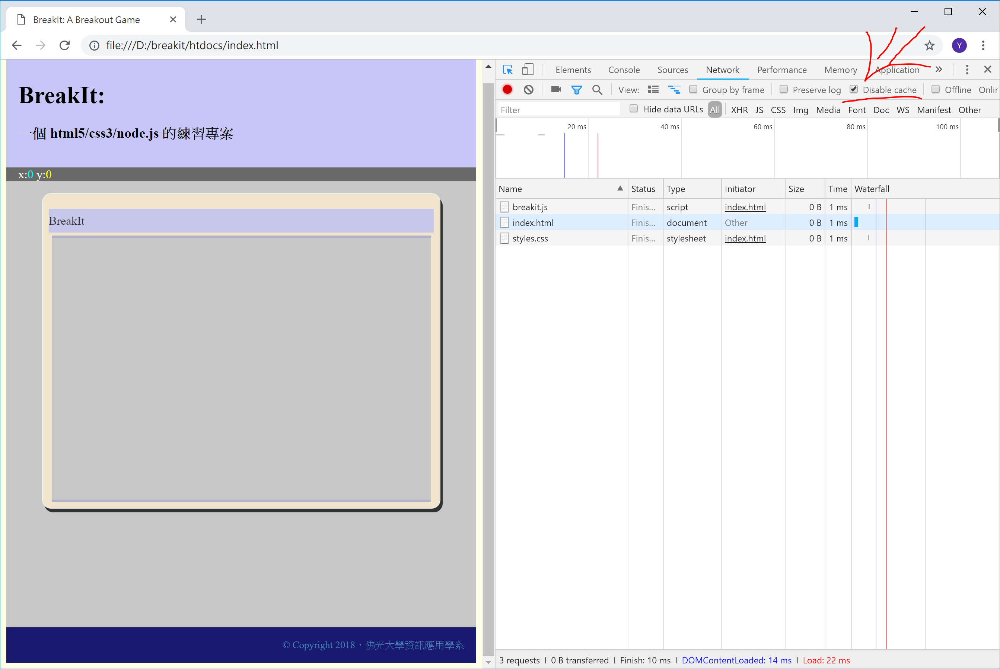
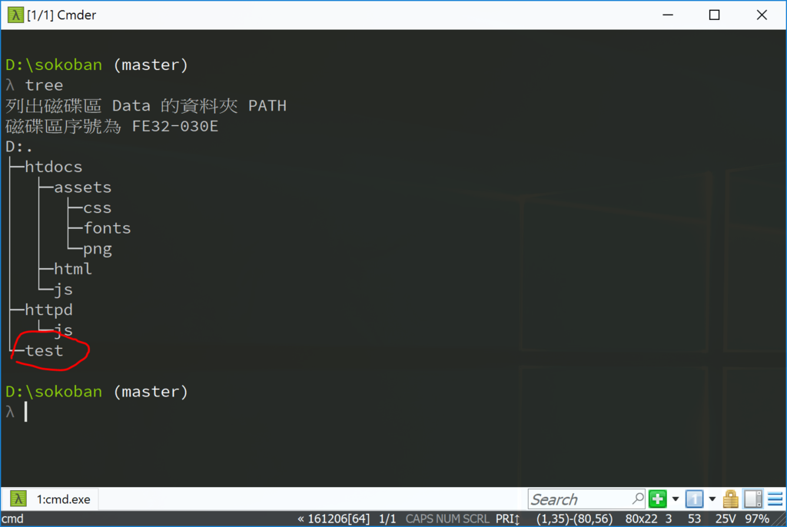
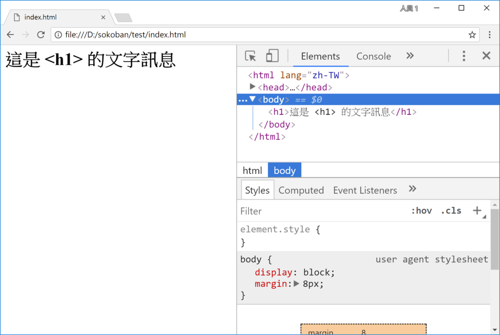

<!---
  @file       chapter_03.md
  @date       11/30/2018 created.
  @copyright  CC-BY, (C) 2017 Yiwei Chiao
  @detail
    This file is machine-generated. DONOT MODIFY IT DIRECTLY.
-->
# 導論

 程式開發過程裡一件最重要的事就是知道目前電腦裡發生了什麼事，程式設計師才能由此
 找出程式的錯誤或改變程式行為。

 現代的網頁瀏覽器，因為網頁應用程式的普及，也都內建了讓程式設計師了解網頁內部
 行為的工具，以協助網頁程式設計師完成工作。這裡以 Google [Chrome][chrome]
 為例，一窺瀏覽器在這個面向可以給我們什麼幫助。

 

## 專案準備

 為了了解 [Chrome][chrome] 的開發人員工具，請先準備好下面的檔案：

  * `index.html`: 放在 `breakit/htdocs` 資料夾下。
  * `styles.css`: 放在 `breakit/htdocs/asssets/css` 資料夾下。
  * `breakit.js`: 放在 `breakit/htdocs/js` 資料夾下。

 這三個檔案的作用：

  * `index.html`: 使用者瀏覽/網路爬蟲爬梳時，看到的網頁頁面。記錄了基本的
  網站資訊，如文字編碼，主題資訊等。也作為通知瀏覽器，後續 Web 資源，如
   `.js`，`.css` 等檔案的 `url` 資訊。
  * `styles.css`: 網頁的設計風格設定檔。網站的視覺風格由 `.css` 檔案決定。
  一個好的網站設計應該可以利用切換不同的 `.css` 檔作到不同的視覺呈現。
  * `breakit.js`: [Breakit][breakit] 專案的客戶端程式。`.html` 提供了
  頁面的骨架，`.css` 為骨架加上了衣服，而 `.js` 是血肉。有了 `.js`，網頁才
  真正有了生命。

 三個檔案準備好了以後，啟動 `breakit/httpd` 下的網頁伺服，可以準備來看看
 [Chrome][chrome] 的開發工具。

   

## [Chrome][chrome] 開發人員工具

 啟動 [Chrome][chrome] 瀏覽器，如圖 Figure \ref{chrome}，注意畫面右上角
 的按紐。那裡是開啓 [Chrome][chrome] ([Firefox][firefox] 也是) 瀏覽器
 設定的地方。

 打開後，如圖 Figure \ref{chrome:tool}，找到 \[開發人員工具\]，開啟它。
 開啟後，瀏覽器的畫面應該很類似圖 Figure \ref{chrome:debug_init} 的樣子。
 先如圖 Figure \ref{chrome:debug_init} 所示，找到 \[network\] 標籤下
 的 \[Disable Cache\] 將 [Chrome][chrome] 的**快取** (*cache*) 保持
 **關閉** (*disabled*)，以確保網頁開發過程中，瀏覽器執行的確定是最新修定的
 版本。

 同樣如圖 Figure \ref{chrome:debug_init} 所示， \[network\] 標籤下，
 可以看到瀏覽器和伺服器間的資料傳輸網路延遲等資訊，那些在開發大型網站應用作優
 化時是很重要的資訊。不過目前知道有它存在就好，暫時可以不用管它。

  

 將快取關閉後，就可以回頭來看最常接觸的兩個標籤：\[Elements\] 和 \[Console\] 了。

## [Chrome][chrome] \[Elements\] 標籤

 \[Elemtns\] 指得是 [HTML][mdnHTML5] 和 [CSS][mdnCSS]。在這個頁籤，可以
 看到\[開發人員工具\]上半部的畫面，顯示的是 [HTML][mdnHTML5] 的內容；而下半
 部則是 [CSS][mdnCSS] 的樣子。

  

 如圖 Figure \ref{chrome:debug_element} 所示，試著在\[Elements\]
 顯示的 [HTML][mdnHTML5] 標籤上移動滑鼠，可以注意到畫面左邊也有視覺變化的
 效果。那是 [Chrome][chrome] 在標示滑鼠所在的 [HTML][mdnHTML5] 標籤，
 在網頁上呈現的效果和範圍大小。

 所以，有這個頁面協助，設定 [HTML][mdnHTML5] 與 [CSS][mdnCSS] 就不用再憑空
 想像，而可以實時看到效果。

## [Chrome][chrome] \[Console\] 標籤

 在寫 [Node.js][nodejs] 程式時，可以利用 `console.log(...)` 在螢幕上輸出
 訊息以理解程式內部實際發生的事情；同樣的 `console.log(...)` 在瀏覽器裡，就是
 輸出到這個 \[Console\] 頁籤。

   

 可以打開 `breakit/htdocs/js/index.js` 看到程式一開始就有一行 `console.log(...)`，和圖 Figure \ref{chrome:debug_console} 裡顯示的相同。

```javascript
window.addEventListener('load', () => {
  console.log('Breakit.js loaded');
};
```

 而如果網頁程式執行有**錯誤**發生，[Chrome][chrome] 的 \[console\] 頁籤會
 如圖 Figure \ref{debug_error} 所顯示。右上角會有紅色的數字顯示程式中止前的
 錯誤個數；而 \[Console\] 視窗則會顯示出錯的程式碼和它的 `.js` 檔名與行號。

   

## 問題與練習

 1. 在 \[Elements\] 裡移動滑鼠游標，嘗試理解它的顯示和作用。
 1. 利用文字編輯器 (如 `atom`)，打開 `htdocs/index.html` 比較它的內容和
  \[Elements\] 顯示的內容。好像有些不大一樣？將 `htdocs/js/index.js` 裡
  `console.log(...)` 後的內容都註解掉，再比對看看內容是否相同？研究一下？

[mdnCSS]: https://developer.mozilla.org/en-US/docs/Web/CSS  

<!-- intro.md -->

# [DOM][mdnDOM] (Data Object Model) 背景

 要寫作網頁應用程式 (`WebApp`)，在客戶端 (網頁瀏覽器) 有三大支柱：
  * [HTML][mdnHTML5]：負責**文件** (*Document*) 結構
  * [CSS][mdnCSS]：負責**文件**排版
  * [JavaScript][mdnJavaScript]：負責**文作**操作 (*manipulate*)
 一個有趣的問題就出現了。[HTML][mdnHTML5] 和 [CSS][mdnCSS] 都是簡單的文字
 檔案。[JavaScript][mdnJavaScript] (或任何其它程式語言) 當然可以將它們當作
 **文字** (*text*)，或說**字串** (*string*) 來處理。事實上，在伺服端 (網頁
 伺服器)，所謂的**後台** (或稱**後端**，*backend*) 程式，如 [PHP][]，
 [JSP][wikiJSP]，[Python][]，[Ruby][] 等開發工具就是這麼作的。甚至還開發了
 專門的**樣本語言** ([*template engine*][wikiTemplateEngine]) 來作這件
 事。例如，給 [Node.js][nodejs] 用的 [Jade][jade]，[Python][]
 的 [Jinja2][jinja]，[Ruby][] 內建的 [ERB][wikiERuby]，[PHP][]
 的 [Twig][twig] 等。

 但是，現在是在**前端** (或稱 **前台**，*frontend*)；無論是
 [HTML][mdnHTML5] 或 [CSS][mdnCSS] 都己經 (也必需) 分析轉換成瀏覽器的
 **內部** (*internal*) 表示型式。所以在前端最好的方式應該是直接和瀏覽器溝通。
 直接操作解譯過的 [HTML][mdnHTML5] 物件。

 這個讓外部程式可以直接操縱瀏覽器解譯後的 [HTML][mdnHTML5]，[CSS][mdnCSS]
 物件的標準，就是 [DOM][mdnDOM] 應用程式介面 (api)。

## [DOM][mdnDOM] 簡介

 [DOM][mdnDOM] 全稱是 *`Data Object Model`^ (**資料物件模型**)；設計用來
 處理和表示 [HTML][mdnHTML]，[SVG][mdnSVG] 和 [XML][mdnXML] 文件的
 Web 公開標準。

 [DOM][mdnDOM] 背後的骨幹概念很簡單而直覺。[DOM][mdnDOM] 將文件視為
 一棵**樹** (*tree*)，文件內的結構則視作這棵樹的**分支** (*branch*)，
 最後的內容，自然是**樹葉** (*leaf*)，稱作**節點** (*node*)。
 因為 [DOM][mdnDOM] 將文件視為一棵樹，所以後面會用
 **[DOM][mdnDOM] 樹** 或 *[DOM][mdnDOM] tree* 來稱呼某個
 [HTML][mdnHTML5] 文件的 [DOM][mdnDOM] 型式。

## [DOM][mdnDOM] 和 [HTML][mdnHTML] 文件

一個簡單的例子，考慮下面這個簡單的 `.html` 檔案:

```html
<html>
  <body>
    Hello World!
  </body>
</html>
```
  以 [DOM][mdnDOM] 模型來表示，大概長成這樣：

```
window.document
  |
  + body
  |   |
  .   TextNode
  .
```

 和原來的 [HTML][mdnHTML] 對照，應該可以看到明確的一一對應。而上面列表中的
 `window.document` 就是 [JavaScript][mdnJavaScript] 在處理網頁文件時
 的**根** (*root*) 物件。其中的 `window` 代表的是瀏覽器視窗 (viewport)；
 是真正的**瀏覽器物件**；也就是說，`window` **不是** [HTML][mdnHTML5]
 物件的一部份，它的存在是作為一個容器，將瀏覽器和外來的 [HTML][mdnHTML5]
 文件結合在一起，就是 `window.document` 這個**屬性**裡存放的物件才是真正
 [HTML][mdnHTML5] 文件。一般在 [JavaScript][mdnJavaScript] 裡，可以
 直接寫 `document` 來存取它的方法。

 在 `body` 下面的 `TextNode` 就對應到 [HTML][mdnHTML] 裡的 `Hello World!`
 因為 `Hello World!` 不是個 [HTML][mdnHTML] 的**標籤** (*tag*)，而是
 普通的文字內容，所以 **DOM** 模型設計了一個 **TextNode** 節點物件來
 存放它。

## [DOM][mdnDOM] 實作練習

 來試試 [DOM][mdnDOM] 的實際操作。先在專案裡建立一個**測試** (*test*) 資料夾，如圖 \ref{folder_test}：

  

 將下面的程式碼放到 `test/index.html`：

```html
 1. <html lang="zh-TW">
 2.   <head>
 3.     <meta charset="utf-8">
 4.     <script src="index.js"></script>
 5.   </head>
 6.   <body>
 7.   </body>
 8. </html>
```

 再將下面的程式碼放到 `test/index.js`：

```javascript
 1. 'use strict';
 2.
 3. window.addEventListener('load', () => {
 4.   console.log("index.js loaded");
 5.
 6.   let h1 = document.createElement('h1');
 7.   let msg = document.createTextNode('這是 <h1> 的文字訊息');
 8.
 9.   h1.appendChild(msg);
10.
11.   document.body.appendChild(h1);
12. });
```
 利用 [Chrome][chrome] (或 [Firefox][firefox]) 打開
 `file:///d:/breakit/test/index.html` (記得將前面的網址修改成適合當下電腦
 配置。) 應該會看到類似圖 \ref{dom_test} 的畫面。

  

 回頭看 `index.html` 的源碼，應該可以看到它原來應該是一個空白的網頁；
 或者，可以將 `index.html` 的第四 (4) 行 (載入 `.js` 檔案那行) 改成如下的型式：

```html
 4.     <!--script src="index.js"></script-->
```

 也就將第四 (4) 行**註解** (*comment*) 掉。再載入一次，看到的應該是空白畫面。
 因為畫面上的訊息是由 `index.js` 裡的 [JavaScript][mdnJavaScirpt] 直接
 操作 [DOM][mdnDOM] tree 產生的。所以如果將載入 `index.js` 的源碼註解掉，
 程式沒載入，畫面自然回到空白的狀態。

## 程式說明

 因為這是我們和 [JavaScript][mdnJavaScript] 的第一次接觸，讓我們停
 下來仔細看一下這兩個檔案：`index.html` 和 `index.js`。

### `index.html`

 首先是 `index.html`。由上面的程式碼可以看到 `index.html` 裡，

```html
 6.   <body>
 7.   </body>
```

 第六行 `<body>` 和第七行 `</body>` 標籤裡是**沒有**任何內容的。造
 理說，網頁應該是空白的。如前面建議的，如果將第四行

```html
 4.     <script src="index.js"></script>
```

  註解掉

```html
 4.     <!--script src="index.js"></script-->
```

  網頁也真的如預期的變成了空白[^cmtTag]。

: [HTML][mdnHTML] 裡，`<!-- ... -->` 稱為**註解**
 (*comment tag*) 標籤，夾在 `<!--` 和 `-->` 間的內容不會被瀏覽器
 (browsers) 處理和顯示。

 明顯的，關鍵就是第四行：

```html
 4.     <script src="index.js"></script>
```

### `<script>` tag

 在 [HTML][mdnHTML] 裡 `<script`> 是用來放置 scripting 程式碼的
 標籤；以目前來說就是放置 [JavaScript][mdnJavaScript] 程式碼的地方。
 隨著 WebApp 的發展與成熟，現在的建議 (best practice) 是不直接將程
 式碼放在這個標籤裡；而是利用 `src` 這個**屬性**，通知瀏覽器去另外
 下載指定的程式碼檔案來執行。

 例如在這個例子裡，就利用 `src=index.js` 這個屬性設定，通知瀏覽器
 去取得 `index.js` 檔案來執行。

### `index.js`

 `index.js` 是我們看到的第一個 [JavaScript][mdnJavaScript] 程式，
 含空白行，只有 12 行。所以可以在下一節，一行行的說明它的行為。

<!-- dom.md -->

## `index.js` 說明

### [JavaScript][mdnJavaScript] 程式起點

 程式開始執行需要一個起點；`C/C++/C#/Java` 系列語言都有一個
 `main()` 函數或 `Main()` 方法當作程式的進入點，開始執行的地方。

 但是像 [JavaScript][mdnJavaScript] 這樣的**劇本式語言**
 (*scripting languages*，其它如 [Python][], [Ruby][] 等) 就不仰賴，
 也無法仰賴在特定的方法/函數上；它們是簡單的遵循程式碼的安排，
 由**第一行** 開始，**循序執行**。

### [JavaScript][mdnJavaScript] `strict` 模式

 `index.js` 的第一行，宣告了一個字串：

```javascript
 1. 'use strict';
```

  在 [JavaScript][mdnJavaScript] 裡 \' (單) 和 \" (雙) 引號都可以用
  來指定**字串** (*string*)。當然，這些標明字串的引號**必需**是成對
  出現的。

  `'use strict';` 後面的分號 `;` 標明一行的結束；[JavaScript][mdnJavaScript]
  其實並**不**要求這個分號 `;`；因為絕大部份時間，[JavaScript][mdnJavaScript]
  執行引擎會自行推斷出每一行指令的結束。不過為了和寫 `C/C++/C#/Java`
  系列程式的習慣相容，我們還是會放上分號 `;`。

#### strict mode

  `'use strict';` 其實也不是一個 [JavaScript][mdnJavaScript] 的指令/陳述。
  它其實是一個和 [JavaScript][mdnJavaScript] **執行環境** 溝通用的
  **標記字串**。

  如同之前提過的，[JavaScript][mdnJavaScript] 這些年迎來了重大的標準
  化進展；和任何重大變動一樣，這無可避免的造成語言新舊版本的相容問題。
  為了降低衝擊，[JavaScript][mdnJavaScript] 引入了所謂的 **strict**
  模式；使用新版 [JavaScript][mdnJavaScript] 語言標準的程式自動遵循
  **strict** 模式；而其它使用舊版標準；或混合式 (某些部份使用新版，
  有些用舊版) 的程式則可以利用 `'use strict'` 這個字串來通知
  [JavaScript][mdnJavaScript] 後續程式碼使用新版語言規範。

### window

```JavaScript
 3. window.addEventListener('load', () => {
 ...
12. });
```

  `window` 是 DOM 模型裡代表瀏覽器視窗的介面物件；整個 JavaScript
  程式就是在這個物件代表的環境下執行。

  這裡，利用 `window` 提供的 `addEventListener` 介面函數，在 `window`
  註冊了一個 `load` 事件的**事件處理函式** (event listener/handler)。

#### `load` 事件

  由之前對 [HTML][mdnHTML] 的介紹可以注意到，當瀏覽器開啟一個網頁時，
  它必需要下載相關的 *.html (頁面文件結構), *.css (頁面風格設計)，
  *.js (可能的互動控制) 和其它資源 (字型，圖片 ...) 等。

  `load` 事件就是設計來通知 `window` 物件，它使用的資源 (`window`
  將要呈現的 HTML 內容，和相關資源) **已經**下載完成。

  所以，在 `window` 物件上註冊 `load` 事件的處理程序就是在瀏覽器下
  載完相關資訊後，開始**接手**內容的處理。

#### `() => {...}`

  `() => {...}` 是一個**匿名**函式宣告；也就是我們用來處理 `load`
  事件的事件處理程序。

  傳統的 [JavaScript][mdnJavaScript] 寫法也可以寫成

```JavaScript
  function () {...}
```

  不過利用新版 [JavaScript][mdnJavaScript] 的**箭頭函數** (*arrow function*)
  寫法，感覺更簡潔。

  第 4 到 11 行就是這個函數的內容。

### `console`

```JavaScript
 4.   console.log("index.js loaded");
```

  第 4 行的 `console` 是 JavaScript 執行環境提供的命令列介面物件；
  最簡單直接的用途就是利用它在命令列介面輸出一些除錯用的信息；如第
  4 行作的。

  `console` 的 `log` 方法可以在命令列介面輸出一個訊息；第 4行這裡
  輸出一個簡單的訊息字串： `index.js loaded` 指出在第 3 行註冊的
  `load` 事件處理函式不但註冊成功，而且已被呼叫。

  而這個輸出結果會在瀏覽器開發者工具的 `console` 頁面出現；
  但**不會**在使用者看到的 window 裡出現。

### 動態型別與 let 變數宣告

  和 `C/C++/C#/Java` 等**靜態型別** (*static typed*) 語言，所有變數
  宣告都需要**指定**變數**型別** (type) 不同；
  [JavaScript][mdnJavaScript] 是**動態型別** (*dynamic typed*) 語言
  (參照 [Python][]，[Ruby][] 等) 語言，變數型別會由程式在執行
  時**自動**辨別，指定和使用。

  因此，在 [JavaScript][mdnJavaScript]，傳統上，變數是**不**需要
  宣告的。

  但是變數除了型別 (type) 外，還有一個**有效範圍 (作用域)** (*scope*)
  的問題存在；也就是特定變數在程式的那些區段內可以讀取，使用；
  又在什麼時後生成，什麼時後摧毀。

  傳統 [JavaScript][mdnJavaScript] 在這塊的處理，以最簡單的說法來說，
  是令人困惑的。

  標準化的 [JavaScript][mdnJavaScript] 引入了 `let` 變數宣告來處理
  這個問題。

#### `let`

```Javascript
 6.   let h1 = document.createElement('h1');
 7.   let msg = document.createTextNode('這是 <h1> 的文字訊息');
```

 `let varName` 宣告 `varName` 是一個變數，而 varName 的**作用域**
 就是 `let varName` 所屬的程式區塊 (`{}`) 在 `let varName` 這一行
 以下及延伸的範圍。何謂**延伸的範圍**，我們在之後遇到時再討論。以
 目前而言就是

 . 變數 `h1` 在第 6行宣告，它的作用域是第 6行到第 11行。

 . 變數 `msg` 在第 7行宣告，它的作用域是第 7行到第 11行。

### `document`

 `document` 是 **DOM** 模型裡代表 **HTML** 文件的物件；也是 DOM
 數的根節點。在 Web API (應用程式介面) 的設計裡，可以利用
 `document` 的 `createElement(...)` 方法，動態產生想要的 DOM 節點
 (HTML tag 元素) 或文字節點 (TextNode) 來安放文字內容。

```Javascript
 6.   let h1 = document.createElement('h1');
```

 產生一個 `<h1>` 的 HTML 節點，由變數 `h1` 記錄。

```Javascript
 7.   let msg = document.createTextNode('這是 <h1> 的文字訊息');
```

 產生一個內容是 `這是 <h1> 的文字訊息` 的文字節點 (TextNode)，
 由變數 `msg` 記錄。

#### 方法 `appendChild(...)`

 DOM 節點產生了，也保留在變數裡了，可是它們都還獨立放 DOM 樹之外；
 還沒有和 `document` 產生連結；所以下一步就是要將這些新產生的節點
 安插到 DOM 樹內。

 由之前對 `HTML` 與 `DOM` 的介紹，可以知道，這樣的 `HTML` 程式碼：

```HTML
 <h1>這是 <h1> 的文字訊息</h1>
```

對應的是這樣的結構：

```
  + h1
    |
    + TextNode
      |
      這是 <h1> 的文字訊息
```

 所以變數 `msg` 代表的 `TextNode` 應該是變數 `h1` 代表的 `<h1>`
 節點的**子節點** (*child node*)

 DOM 提供了 `ParentNode.appendChild(childNode)` 這個介面方法，
 讓我們可以將子節點添加到**親節點** (*ParentNode*) 之下。所以，
 我們有：

```Javascript
 9.   h1.appendChild(msg);
10.
11.   document.body.appendChild(h1);
```

  先將 `msg` 加入 `h1` (第 9行)，構成

```
  + h1
    |
    + TextNode
      |
      這是 <h1> 的文字訊息
```

  再將 `h1` 加入 `document.body` 構成：

```
window.document
  |
  + body
      |
      + h1
        |
        + TextNode
           |
           這是 <h1> 的文字訊息
```

## 思考與練習

 * 對 [DOM][mdnDOM] 的操作有基本概念了，範例程式介紹的是 `<h1>`；試試再加上
 幾個，如 `<h2>` 或 `<h6>` 的訊息。
  * 作上面的練習時，觀察一下瀏覽器除錯視窗 `Element` 窗口的訊息變化。
  * 查一下網路資訊，找找如何由 [DOM][mdnDOM] tree 裡：
    + 移除一個節點
    + 將某個節點由當位置搬到新位置。

<!-- javascript.md -->

[ECMAScript]: https://www.ecma-international.org/publications/standards/Ecma-262.htm
[breakit]: https://github.com/ywchiao/breakit.git
[breakout]: https://en.wikipedia.org/wiki/Breakout_(video_game)
[nodejs]: https://nodejs.org
[atom]: https://atom.io
[babeljs]: https://babeljs.io
[browserify]: http://browserify.org
[git]: https://git-scm.com
[github]: https://github.com/
[ide]: https://en.wikipedia.org/wiki/Integrated_development_environment
[rollupjs]: https://rollupjs.org
[terser]: https://github.com/terser-js/terser
[torvalds]: https://en.wikipedia.org/wiki/Linus_Torvalds
[typescript]: https://www.typescriptlang.org
[vcs]: https://en.wikipedia.org/wiki/Version_control
[vscode]: https://github.com/Microsoft/vscode
[webpack]: https://webpack.github.io
[brew]: https://github.com/Homebrew/brew
[cli]: https://en.wikipedia.org/wiki/Command-line_interface
[cmder]: https://github.com/cmderdev/cmder
[gui]: https://en.wikipedia.org/wiki/Graphical_user_interface
[npm]: https://www.npmjs.com
[nvm]: https://github.com/creationix/nvm
[vim]: https://vim.sourceforge.io
[xcode]: https://developer.apple.com/xcode
[commonmark]: http://commonmark.org
[gfm]: https://github.github.com/gfm
[gitignore]: https://git-scm.com/docs/gitignore
[markdown]: https://en.wikipedia.org/wiki/Markdown
[MIT]: https://opensource.org/licenses/MIT
[scriptingLanguage]: https://en.wikipedia.org/wiki/Scripting_language
[shellScript]: https://en.wikipedia.org/wiki/Shell_script
[mdnCSS]: https://developer.mozilla.org/en-US/docs/Web/CSS
[mdnHTML]: https://developer.mozilla.org/en-US/docs/Web/HTML
[mdnJavaScript]: https://developer.mozilla.org/zh-TW/docs/Web/JavaScript
[wikiCSS]: https://en.wikipedia.org/wiki/Cascading_Style_Sheets
[wikiECMAScript]: https://en.wikipedia.org/wiki/ECMAScript
[wikiHTML]: https://en.wikipedia.org/wiki/HTML
[githubHead]: https://github.com/joshbuchea/HEAD
[mdnHTML5]: https://developer.mozilla.org/en-US/docs/Web/Guide/HTML/HTML5
[wikiMarkdown]: https://en.wikipedia.org/wiki/Markdown
[wikiMarkupLang]: https://en.wikipedia.org/wiki/Markup_language
[wikiMetadata]: https://en.wikipedia.org/wiki/Metadata
[wikiProgLang]: https://en.wikipedia.org/wiki/Programming_language
[wikiText]: https://en.wikipedia.org/wiki/Text_(literary_theory)
[wikiXML]: https://en.wikipedia.org/wiki/XML
[wikiYAML]: https://en.wikipedia.org/wiki/YAML
[chrome]: https://www.google.com.tw/chrome
[firefox]: https://www.mozilla.org/zh-TW/firefox/
[jade]: http://jade-lang.com/
[jinja]: http://jinja.pocoo.org/
[mdnDOM]: https://developer.mozilla.org/en-US/docs/Web/API/Document_Object_Model
[mdnSVG]: https://developer.mozilla.org/zh-TW/docs/Web/SVG
[mdnXML]: https://developer.mozilla.org/en-US/docs/XML_introduction
[PHP]: https://secure.php.net/
[Python]: https://www.python.org/
[Ruby]: https://www.ruby-lang.org/zh_tw/
[twig]: https://twig.symfony.com/
[wikiERuby]: https://en.wikipedia.org/wiki/ERuby
[wikiJSP]: https://en.wikipedia.org/wiki/JavaServer_Pages
[wikiTemplatEngine]: https://en.wikipedia.org/wiki/Template_processor
[^ECMAScript]: https://en.wikipedia.org/wiki/ECMAScript
[^breakit]: https://github.com/ywchiao/breakit
[^breakout]: https://en.wikipedia.org/wiki/Breakout_(video_game)
[^nodejs]: https://nodejs.org
[^atom]: https://atom.io
[^babeljs]: https://babeljs.io
[^browserify]: http://browserify.org
[^git]: https://git-scm.com
[^github]: https://github.com
[^ide]: https://en.wikipedia.org/wiki/Integrated_development_environment
[^rollupjs]: https://rollupjs.org
[^terser]: https://github.com/terser-js/terser
[^torvalds]: https://en.wikipedia.org/wiki/Linus_Torvalds
[^typescript]: https://www.typescriptlang.org
[^vcs]: https://en.wikipedia.org/wiki/Version_control
[^vscode]: https://github.com/Microsoft/vscode
[^webpack]: https://webpack.github.io
[^brew]: https://github.com/Homebrew/brew
[^cli]: https://en.wikipedia.org/wiki/Command-line_interface
[^cmder]: https://github.com/cmderdev/cmder
[^gui]: https://en.wikipedia.org/wiki/Graphical_user_interface
[^npm]: https://www.npmjs.com
[^nvm]: https://github.com/creationix/nvm
[^vim]: https://vim.sourceforge.io
[^xcode]: https://developer.apple.com/xcode
[^commonmark]: http://commonmark.org
[^gfm]: https://github.github.com/gfm
[^gitignore]: https://git-scm.com/docs/gitignore
[^markdown]: https://en.wikipedia.org/wiki/Markdown
[^MIT]: https://opensource.org/licenses/MIT

<!--- chapter_03.md -->