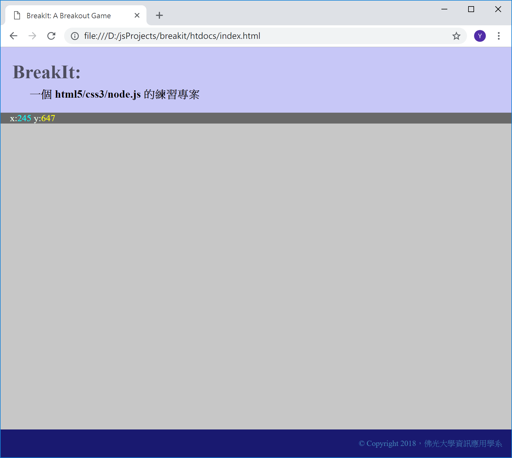

<!---
  @file       chapter_04.md
  @date       12/06/2018 created.
  @copyright  CC-BY, (C) 2017 Yiwei Chiao
  @detail
    This file is machine-generated. DONOT MODIFY IT DIRECTLY.
-->
# 前言

 前一章對 [DOM][mdnDOMl] 有了基本的輪廓認識。這一章開始慢慢進入
 [Breakit][breakit] 專案的建構。

## 專案準備

 由之前建立的概念了解，[Breakit][breakit] 專案基本需要下面這些檔案才能
 運作：

  * `index.html`: 放在 `breakit/htdocs` 資料夾下。
  * `styles.css`: 放在 `breakit/htdocs/asssets/css` 資料夾下。
  * `index.js`: 放在 `breakit/htdocs/js` 資料夾下。

 這三個檔案的作用：

  * `index.html`: 使用者瀏覽/網路爬蟲爬梳時，看到的網頁頁面。記錄了基本的
  網站資訊，如文字編碼，主題資訊等。也作為通知瀏覽器，後續 Web 資源，如
  `index.js`，`styles.css` 等檔案的 `url` 資訊。
  * `styles.css`: 網頁的設計風格設定檔。網站的視覺風格由 `.css` 檔案決定。
  一個好的網站設計應該可以利用切換不同的 `.css` 檔作到不同的視覺呈現。
  * `breakit.js`: [Breakit][breakit] 專案的客戶端程式。`.html` 提供了
  頁面的骨架，`.css` 為骨架加上了衣服，而 `.js` 是血肉。有了 `.js`，網頁才
  真正有了生命。

## `index.html`

  首先，`index.html` 的內容如下：

```html
 1. <html lang="zh-TW">
 2.   <head>
 3.     <meta charset="utf-8">
 4.     <meta name="viewport" content="width=device-width, initial-scale=1.0">
 5.
 6.     <title>BreakIt: A Breakout Game</title>
 7.
 8.     <link rel="stylesheet" href="assets/css/styles.css">
 9.     <script src="js/breakit.js"></script>
10.   </head>
11.   <body>
12.     <div class="site-container">
13.       <header class="site-banner">
14.         <h1 class="site-title">BreakIt:</h1>
15.         <h3 class="site-subtitle">一個 html5/css3/node.js 的練習專案</h3>
16.       </header>
17.       <article class="site-body">
18.         <header class="site-status">
19.           <span>
20.             x:<span id="cursor-x">0</span>
21.             y:<span id="cursor-y">0</span>
22.           </span>
23.         </header>
24.       </article>
25.       <footer class="site-footer">
26.         <small class="float-right">
27.           &copy; Copyright 2017，佛光大學資訊應用學系
28.         </small>
29.       </footer>
30.     </div>
31.   </body>
32. </html>
```

  其中，第 8 行載入 `styles.css`，而 `index.js` 則在第 9 行載入。
 快速瀏覽第 11 行到第 31 行之間的內容，可以看出它基本上就是建構了
 頁面的基本 head-content-footer 三段結構；同時，用一個 [CSS][mdnCSS]
 class 為 `site-container` 的 `<div>` 元素包裝起來。

 將第 11 行 `<body>` 到第 31 行 `</body>` 之間的內容用一個額外的
 `<div></div>` 包起來的原因在於，這可以將 `<body>` 內的所有內容變成
 [DOM][mdnDOM] tree 下的一顆完整的子樹，提供了整頁置換 (swap) 的彈性。

 第 11 行 `<body>` 到第 31 行 `</body>` 之間的每一個 `tag` 也都有指
 定一個 css class，去設定它的顯示風格。這些設定內容，都在 `styles.css`
 內可參考。

 目前執行畫面，如下圖 \ref{sketch}：

  

### [HTML][mdnHTML5] vs [DOM][mdnDOM]

  由之前的 [DOM][mdnDOM] 簡介知道，圖 \ref{sketch} 的效果可以全部
  利用 [JavaScript][mdnJavaScript] 操作 [DOM][mdnDOM] tree 來達成；
  換句話說，第 11 行到第 31 行之間的內容是可以省略的。這其實就是一
  個 *取捨* 或 *選擇* 的問題。

  在一個像 [BreakIt][breakit] 這樣的練習專案，其實兩者沒有什麼差別，
  端看著重的學習重心在那一方面；而若是一個嚴肅的正式專案，就可能會
  因為：

  * 分工：版面規畫，程式設計由不同人負責，
  * 效能與支援：
    - server rendering: 網頁版面在伺服端 (server) 建構完成，傳送
      到瀏覽器顯示；伺服負擔大量的運算，使用*靜態*的*樣版*
      (template) 可以減輕問題。
    - client rendering: 伺服端 (server) 僅傳送資料，網頁版面建構在
      客戶端 (瀏覽器 browser) 動態完成。問題使用者的瀏覽器可能不支
      援 JavaScript；或基於安全理由而關閉 JavaScript；

  這些考量而有不同的選擇。

  基本上，[BreakIt][breakit] 和大部份的專案相同，採用混合的模式。
  也就是，`index.html` 作為一個*靜態*的*模版* (**template**) 提供
  基本的版面規劃，具體的內容則由 [JavaScript][mdnJavaScript] 在客戶
  端直接操作 [DOM][mdnDOM] tree 來完成。

  因為作為一個互動式遊戲，除非採用*遊戲串流* (game streaming) 技術，
  否則不可能不在瀏覽器端進行 [JavaScript][mdnJavaScript]。

[mdnCSS]: https://developer.mozilla.org/en-US/docs/Web/CSS  

<!-- intro.md -->

## [DOM][mdnDOM] 滑鼠追蹤

 `htdocs/js/index.js` 的內容如下：

```javascript
 1. 'use strict';
 2.
 3. window.addEventListener('load', () => {
 4.   console.log("index.js loaded");
 5.
 6.   let desktop = document.querySelector('.site-body')
 7.
 8.   desktop.addEventListener('mousemove', (e) => {
 9.     document.getElementById('cursor-x').textContent = e.clientX;
10.     document.getElementById('cursor-y').textContent = e.clientY;
11.   });
12. });
```

  將以上的內容放到 `htdocs/js/index.js` 檔案內之後，在瀏覽器內移動
  滑鼠，應該可以看見螢幕左上角的 `x:` 和 `y:` 後面的數字在跟著變化。

## APIs 說明

  目前的 `index.js` 使用了兩個 [DOM][mdnDOM] 的*查詢* APIs (API:
  APplication Interface 應用程式介面)

  * 第 6 行的 **querySelector(...)**
  * 第 9 和第 10 行的 **getElementById(...)**

### `querySelector(...)`

  在介紹 [CSS][mdnCSS] 時提到，瀏覽器將 `.css` 檔內的 [CSS][mdnCSS]
  規則運用到 `.html` 的元素 (element) 時，是透過所謂的
  **CSS selector**(CSS *選擇器*) 來確認適用對象的。

  舉例而言，

  * `h1` 代表*所有* `<h1>` 元素
  * `.site-header` 代表 `class` 屬性值是 `site-header` 的 [HTML][mdnHTML5]
   元素；如 `<div class="site-header">`； `.site-header` 最前方的那個
   `.` 就代表後面的字串是 [CSS][mdnCSS] `class` 的名稱
  * `#userid` 代表 `id` 屬性值是 `userid` 的 [HTML][mdnHTML5]
   元素；如 `<input id="userid">`； `#userid` 最前面的那個
   `#` 代表後面的字串是 [CSS][mdnCSS] `id` 的名稱；一個 `.html` 檔裡
   `id` 是*唯一*的。

  [DOM][mdnDOM] api `querySelector` 這裡的 `Selector` 指得就是
  [CSS][mdnCSS] 的 `selector` 字串.

  所以，第 6 行的 

```javascript
 6.   let desktop = document.querySelector('.site-body')
```

  就是利用 [CSS][mdnCSS] 選擇器，在當下的 [DOM][mdnDOM} tree 裡尋
  找 `class` 屬性是`site-body` 的元素。對照 `index.html`，它找到
  的應該是第 17 行的 `article` 元素。

```html
17.       <article class="site-body">
```

### `mousemove` 事件

  找到 `<article>` 元素本身其實不是重點，重點在找到之後，為它加上一
  個 **mousemove** (滑鼠移動) 的事件處理程序，如 `index.js` 的第 8
  行：

```javascript
 8.   desktop.addEventListener('mousemove', (e) => {
 9.     document.getElementById('cursor-x').textContent = e.clientX;
10.     document.getElementById('cursor-y').textContent = e.clientY;
11.   });
```

 `mousemove` 事件，如它的名字所示，每當瀏覽器偵測到滑鼠移動時，就會
 觸發。這裡將利用這個事件取得滑鼠當下的螢幕座標，就是第 9, 10 行裡
 的 `e.clientX` 和 `e.clientY`，同時將它顯示在左上角。

### `getElementById`

 為了將取得的滑鼠 `(x, y)` 座標顯示在螢幕上；需要取得相對應的
 [HTML][mdnHTML5] 元素；這裡使用了 `getElementById()` 來取得擁有
 特定 [CSS][mdnCSS] `id` 的 [HTML][mdnHTML5] 元素。

 對照 `index.html`，對應的元素就是第 20, 21 行的 `<span>` 元素：

```html
20.             x:<span id="cursor-x">0</span>
21.             y:<span id="cursor-y">0</span>
```

 取得 `<span>` 元素後，更改它的內容就是直接設定 `<span>` 元素的
 `textContent` 屬性。

 最後執行如圖 \ref{mousetracing}：

  

### `querySelector(...)` 與 `getElementById(...)`

 到目前為止，可能會有一個問題，既然 `querySelector(...)` 可以利用
 [CSS][mdnCSS] selector 選擇器來取得對應的 [DOM][mdnDOM] 元素，為
 什麼還需要一個 `getElementById(...)` 函數**只能**取得特定
 [CSS][mdnCSS] id 元素的函數？

 這是因為技術的快速演進。

 早期瀏覽器只有支援 `getElementById` 函數；但隨著 Web 技術的快速演
 進與 Web 應用的深入和普及，Web 應用程式需要對 [DOM][mdnDOM] 有更
 多的控制，所以才有了 `querySelector` 這個更一般化，和 [CSS][mdnCSS]
 整合的更好的函數出現。

## 思考與練習

  * 將 `index.js` 裡第 9, 10 行的 `getElementById` 修改成使用
   `querySelector` 的版本。除了函數名稱更改外，函數參數要作什麼樣
   的修改嗎？
  * 查一下網路資訊，找找在 [DOM][mdnDOM] APIs 裡：
    + `mousemove` event 提供的座標資訊有哪些，它們間的異同點在？
    + 滑鼠事件除了 `mousemove` 外，還有那些可以用？它們分別在什麼時
     機點會被觸發？

<!-- mouse.md -->

[ECMAScript]: https://www.ecma-international.org/publications/standards/Ecma-262.htm
[breakit]: https://github.com/ywchiao/breakit.git
[breakout]: https://en.wikipedia.org/wiki/Breakout_(video_game)
[nodejs]: https://nodejs.org
[atom]: https://atom.io
[babeljs]: https://babeljs.io
[browserify]: http://browserify.org
[git]: https://git-scm.com
[github]: https://github.com/
[ide]: https://en.wikipedia.org/wiki/Integrated_development_environment
[rollupjs]: https://rollupjs.org
[terser]: https://github.com/terser-js/terser
[torvalds]: https://en.wikipedia.org/wiki/Linus_Torvalds
[typescript]: https://www.typescriptlang.org
[vcs]: https://en.wikipedia.org/wiki/Version_control
[vscode]: https://github.com/Microsoft/vscode
[webpack]: https://webpack.github.io
[brew]: https://github.com/Homebrew/brew
[cli]: https://en.wikipedia.org/wiki/Command-line_interface
[cmder]: https://github.com/cmderdev/cmder
[gui]: https://en.wikipedia.org/wiki/Graphical_user_interface
[npm]: https://www.npmjs.com
[nvm]: https://github.com/creationix/nvm
[vim]: https://vim.sourceforge.io
[xcode]: https://developer.apple.com/xcode
[commonmark]: http://commonmark.org
[gfm]: https://github.github.com/gfm
[gitignore]: https://git-scm.com/docs/gitignore
[markdown]: https://en.wikipedia.org/wiki/Markdown
[MIT]: https://opensource.org/licenses/MIT
[scriptingLanguage]: https://en.wikipedia.org/wiki/Scripting_language
[shellScript]: https://en.wikipedia.org/wiki/Shell_script
[mdnCSS]: https://developer.mozilla.org/en-US/docs/Web/CSS
[mdnHTML]: https://developer.mozilla.org/en-US/docs/Web/HTML
[mdnJavaScript]: https://developer.mozilla.org/zh-TW/docs/Web/JavaScript
[wikiCSS]: https://en.wikipedia.org/wiki/Cascading_Style_Sheets
[wikiECMAScript]: https://en.wikipedia.org/wiki/ECMAScript
[wikiHTML]: https://en.wikipedia.org/wiki/HTML
[githubHead]: https://github.com/joshbuchea/HEAD
[mdnHTML5]: https://developer.mozilla.org/en-US/docs/Web/Guide/HTML/HTML5
[wikiMarkdown]: https://en.wikipedia.org/wiki/Markdown
[wikiMarkupLang]: https://en.wikipedia.org/wiki/Markup_language
[wikiMetadata]: https://en.wikipedia.org/wiki/Metadata
[wikiProgLang]: https://en.wikipedia.org/wiki/Programming_language
[wikiText]: https://en.wikipedia.org/wiki/Text_(literary_theory)
[wikiXML]: https://en.wikipedia.org/wiki/XML
[wikiYAML]: https://en.wikipedia.org/wiki/YAML
[chrome]: https://www.google.com.tw/chrome
[firefox]: https://www.mozilla.org/zh-TW/firefox/
[jade]: http://jade-lang.com/
[jinja]: http://jinja.pocoo.org/
[mdnDOM]: https://developer.mozilla.org/en-US/docs/Web/API/Document_Object_Model
[mdnSVG]: https://developer.mozilla.org/zh-TW/docs/Web/SVG
[mdnXML]: https://developer.mozilla.org/en-US/docs/XML_introduction
[PHP]: https://secure.php.net/
[Python]: https://www.python.org/
[Ruby]: https://www.ruby-lang.org/zh_tw/
[twig]: https://twig.symfony.com/
[wikiERuby]: https://en.wikipedia.org/wiki/ERuby
[wikiJSP]: https://en.wikipedia.org/wiki/JavaServer_Pages
[wikiTemplatEngine]: https://en.wikipedia.org/wiki/Template_processor
[^ECMAScript]: https://en.wikipedia.org/wiki/ECMAScript
[^breakit]: https://github.com/ywchiao/breakit
[^breakout]: https://en.wikipedia.org/wiki/Breakout_(video_game)
[^nodejs]: https://nodejs.org
[^atom]: https://atom.io
[^babeljs]: https://babeljs.io
[^browserify]: http://browserify.org
[^git]: https://git-scm.com
[^github]: https://github.com
[^ide]: https://en.wikipedia.org/wiki/Integrated_development_environment
[^rollupjs]: https://rollupjs.org
[^terser]: https://github.com/terser-js/terser
[^torvalds]: https://en.wikipedia.org/wiki/Linus_Torvalds
[^typescript]: https://www.typescriptlang.org
[^vcs]: https://en.wikipedia.org/wiki/Version_control
[^vscode]: https://github.com/Microsoft/vscode
[^webpack]: https://webpack.github.io
[^brew]: https://github.com/Homebrew/brew
[^cli]: https://en.wikipedia.org/wiki/Command-line_interface
[^cmder]: https://github.com/cmderdev/cmder
[^gui]: https://en.wikipedia.org/wiki/Graphical_user_interface
[^npm]: https://www.npmjs.com
[^nvm]: https://github.com/creationix/nvm
[^vim]: https://vim.sourceforge.io
[^xcode]: https://developer.apple.com/xcode
[^commonmark]: http://commonmark.org
[^gfm]: https://github.github.com/gfm
[^gitignore]: https://git-scm.com/docs/gitignore
[^markdown]: https://en.wikipedia.org/wiki/Markdown
[^MIT]: https://opensource.org/licenses/MIT

<!--- chapter_04.md -->