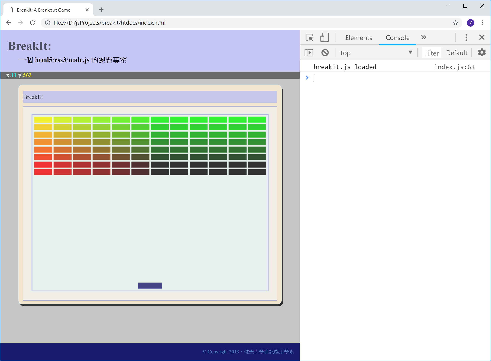
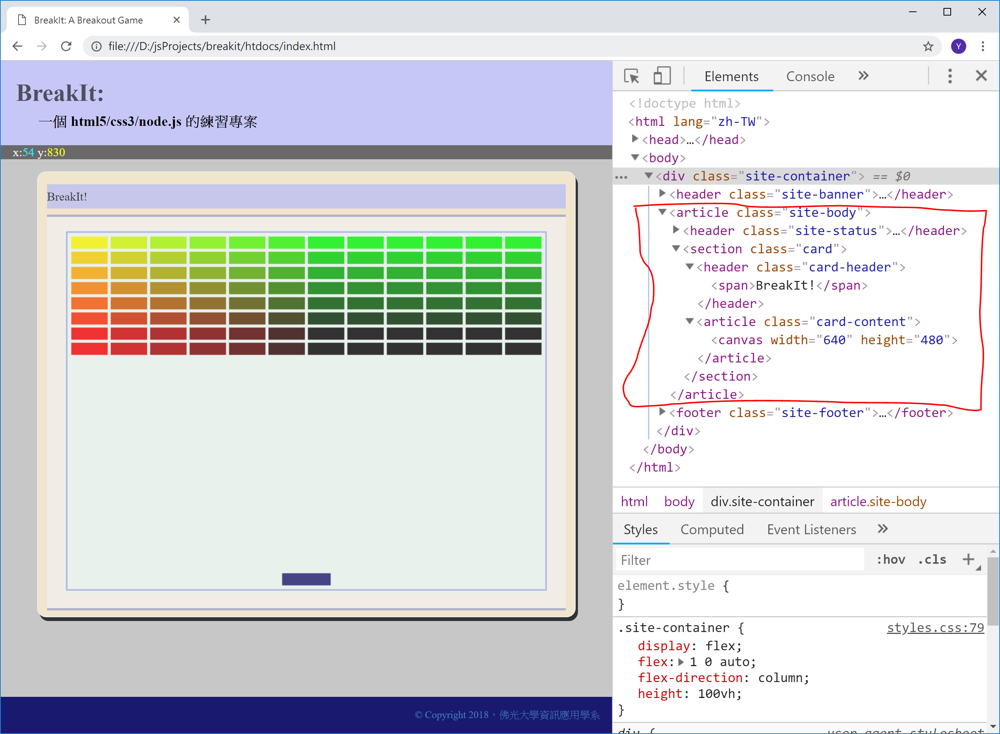

<!---
  @file       chapter_05.md
  @date       11/23/2018 created.
  @copyright  CC-BY, (C) 2017 Yiwei Chiao
  @detail
    This file is machine-generated. DONOT MODIFY IT DIRECTLY.
-->
# 前言

 前一章嘗試在網頁上呈現了對滑鼠座標變化的追踪。這一章開始進入
 *canvas* 2D 繪圖。

## 專案準備

 和前一章比較，有作更動的檔案只有 `htdocs/js/index.js`；如前所述，
 需要的 [HTML][mdnHTML5] 元素都可以利用 [JavaScript][mdnJavaScript]
 操作 [DOM][mdnDOM] 來建構。因此，這裡就利用這一點，持續利用
 [JavaScript][mdnJavaScript] 來建構專案想像的版面。

 目前執行畫面，如下圖 \ref{draft}：

  

[mdnCSS]: https://developer.mozilla.org/en-US/docs/Web/CSS  

<!-- intro.md -->

## [DOM][mdnDOM] canvas 繪圖

 `htdocs/js/index.js` 的內容如下：

```javascript
  1. 'use strict';
  2.
  3. // 繪出 *擊球板* (paddle)
  4. let paintPaddle = function (ctx) {
  5.   ctx.save();
  6.
  7.   ctx.fillStyle = 'midnightblue';
  8.   ctx.fillRect(288, 454, 64, 16);
  9.
 10.   ctx.restore();
 11. };
 12.
 13. // 繪出 *磚塊* (paddle)
 14. let paintBricks = function (ctx) {
 15.   ctx.save();
 16.
 17.   let width = 12;
 18.   let height = 8;
 19.
 20.   for (let x = 0; x < width; x ++) {
 21.     for (let y = 0; y < height; y++) {
 22.       ctx.fillStyle =
 23.         `rgb(${Math.floor(255 - 42.5 * x)}, ${Math.floor(255 - 42.5 * y)}, 0)`;
 24.
 25.       ctx.fillRect((x * 52) + 10, (y * 20) + 10, 48, 16);
 26.     }
 27.   }
 28.
 29.   ctx.restore();
 30. };
 31.
 32. // 重繪 *遊戲盤面*
 33. let paint = function (ctx) {
 34.   // 將圖紙填滿背景色
 35.   ctx.fillRect(0, 0, 640, 480);
 36.
 37.   ctx.strokeStyle = 'slateblue';
 38.   ctx.strokeRect(4, 4, 632, 472);
 39.
 40.   // 繪出磚塊
 41.   paintBricks(ctx);
 42.
 43.   // 繪出擊球板
 44.   paintPaddle(ctx);
 45. };
 46.
 47. /**
 48.  * breakit 程式進入點
 49.  *
 50.  * @callback
 51.  * @param 'load' : DOM 事件名
 52.  * @returns {undefined}
 53.  */
 54. window.addEventListener('load', () => {
 55.   console.log("breakit.js loaded");
 56.
 57.   // 準備承載 *遊戲標題* (title) 的 HTML 元素
 58.   let gameTitle = document.createElement('span');
 59.   gameTitle.textContent = 'BreakIt!';
 60.
 61.   // 準備承載 *遊戲版頭* (header) 的 HTML 元素
 62.   let gameHeader = document.createElement('header');
 63.   gameHeader.className = 'card-header';
 64.
 65.   // 將 *遊戲標題* 放上 *遊戲版頭*
 66.   gameHeader.appendChild(gameTitle);
 67.
 68.   // 準備 *遊戲盤面* 的繪圖圖紙 (canvas)
 69.   let gameCanvas = document.createElement('canvas');
 70.
 71.   // 取得能在 canvas 上繪圖的 context2d 物件
 73.   let ctxPaint = gameCanvas.getContext('2d');
 74.
 75.   // 設定繪圖圖紙的寬高
 76.   gameCanvas.width = 640;
 77.   gameCanvas.height = 480;
 78.
 79.   // 設定圖紙背景色
 80.   ctxPaint.fillStyle = 'mintcream';
 81.
 82.   // 繪出基本遊戲盤面
 83.   paint(ctxPaint);
 84.
 85.   // 準備承載 *遊戲內容* 的 HTML 元素
 86.   let gameContent = document.createElement('article');
 87.   gameContent.className = 'card-content';
 88.
 89.   // 將 *遊戲盤面* 放上 *遊戲內容* 容器
 90.   gameContent.appendChild(gameCanvas);
 91.
 92.   // 準備 *遊戲桌面* 的 HTML 元素
 93.   let gameDesktop = document.createElement('section');
 94.   gameDesktop.className = 'card';
 95.
 96.   // 將 *遊戲版頭* 放上 *遊戲桌面*
 97.   gameDesktop.appendChild(gameHeader);
 98.
 99.   // 將 *遊戲內容* 放上 *遊戲桌面*
100.   gameDesktop.appendChild(gameContent);
101.
102.   // 將 *遊戲桌面* 放上 *網頁*
103.   let desktop = document.querySelector('.site-body')
104.   desktop.appendChild(gameDesktop);
105.
106.   /**
107.    * 滑鼠游標移動追踪
108.    *
109.    * @callback
110.    * @param 'canvasmove' : DOM 事件名
111.    * @param e : DOM event 物件
112.    * @returns {undefined}
113.    */
114.   desktop.addEventListener('canvasmove', (e) => {
115.     document.getElementById('cursor-x').textContent = e.clientX;
116.     document.getElementById('cursor-y').textContent = e.clientY;
117.   });
118. });
```

  將以上的內容放到 `htdocs/js/index.js` 檔案內之後，在瀏覽器內就可
  以看到如圖 \ref{draft} 的畫面。

  和前一章相比，程式碼由 `12` 行暴增至 `118` 行；不過這是因為裡面
  加了大量註解 (comments) 的原因。對照瀏覽器開發人員視窗裡顯示的
  [HTML][mdnHTML5] 結構，配合程式註解，其實並不難懂。

  和之前相同，可以依程式列表自行輸入，測試，除錯；或者到 [github][]
  取得專案源碼。

  `git clone` [https://github.com/ywchiao/breakit.git](https://github.com/ywchiao/breakit.git)

## APIs 說明

  和前一章相比，這一章裡大量使用了 [DOM][mdnDOM] 裡的 *建構* APIs；
  另一部份則是 [canvas][mdnCanvas2D] 的 2D 繪圖 APIs。

  以下分別討論。

### [DOM][mdnDOM] APIs

  程式碼 `57` 行到 `104` 行的作用是在建立畫面呈現需要的
  [HTML][mdnHTML5] 結構，也就是圖 \ref{struct} 裡紅線框起來的部份。

  

  程式碼看起來很長，其實就只是兩三個步驟的重覆而已：

 1. 呼叫 `document.createElement(string)` 建構想要的 [DOM][mdnDOM] 元素，其中
  *string* 是 [HTML][mdnHTML] 的 *tag* 名稱。如 `62` 行，
  建立一個 `<header>` 元素，同時將它放進 `gameHeader` 變數保存。

 1. 設定新建立的元素的 [CSS][mdnCSS] 屬性；一般是設定它的 [CSS][mdnCSS]
   `class`。如 `63` 行，設定
   `gameHeader` 的 [CSS][mdnCSS] `class` 是 `card-header`。

 1. 呼叫 `parent.appendChild(element)` 將建構好的 (child) *element* 
  插入 [DOM][mdnDOM] 樹裡，當作 parent 的一個子節點。
  如 `97` 行，將 `gameHeader` 元素插入 [DOM][mdnDOM] 樹內，作為
  `gameDesktop` 的子節點 (child node)。

  程式碼的流程，對照圖 \ref{struct} 裡的紅圈部分，是先產生最*內層*
  的子元素，再往外 (上) 產生親 (parent) 元素，再利用 `appendChild()`
  將親/子元素結合，重覆到結構完成。

### [canvas][mdnCanvas2D] APIs

  [canvas][mdnCanvas2D] 是 [HTML][mdnHTML5] 為了處理 Web 繪圖所提供
  的數個解決方案之一，主要針對 2D 繪圖；其它還有為了向量圖 (vector
  graph) 的 [SVG][mdnSVG] 與 3D 繪圖 (支援繪圖卡加速) 的 [webGL][mdnWebGL]。
  [Breakit][breakit] 專案只使用 [canvas][mdnCanvas2D] 的 2D 繪圖。

  [canvas][mdnCanvas2D] 繪圖的流程很簡單：

 1. 建立一個 `<canvas>` 物件

 1. 由這個 `<canvas>` 物件取得綁定的 `CanvasRenderingContext2D`
  繪圖物件，以下簡稱 'ctx2d'。

 1. 呼叫 `ctx2d` 提供的 2D 繪圖 APIs，在綁定的 `<canvas>` 物件上作畫。

  目前程式碼就遵照上面的邏輯運作。

  目前使用的 APIs 有：

 . `canvas.getContext('2d')`: 取得 `CanvasRenderingContext2D` 物件

 . 繪圖
 
  - `fillRect(x, y, width, height)`: 以 `(x, y)` 作為左上角座標，
  *填滿*一個指定寬 (width)，高 (height) 的色塊。如 `35` 行。

  - `strokeRect(x, y, width, height)`: 同上；但只繪出色塊的邊框；而
  *不會*填滿它。如 `38` 行。

 . 屬性

  - `save()`: 保留目前這個 `ctx2d` 物件的屬性；供之後還原 (restore)。

  - `restore()`: 還原目前這個 `ctx2d` 物件的屬性到之前 `save()` 的狀態

  - `fillStyle`: 字串；*填滿* (fill) 色塊時使用的 `RGBA` 顏色。如
   第 `7` 行。

  - `strokeStyle`: 字串；*繪線* (stroke) 時使用的 `RGBA` 顏色。如
   第 `37` 行。

 搭配 [JavaScript][mdnJavaScript] 的迴圈 (loop) 控制，得到目前的結果。

## 思考與練習

  * `4` 和 `14` 行是將*函數* (function) 指定 (assign) 給一個變數；
   這樣作的目的，除了因為文法許可，所以就這麼寫，之外，還有什麼考
   量？為什麼 [JavaScript][mdnJavaScript] 允許這樣的寫法？其設計目
   的是？嘗試蒐集資料 (網路，書本，源碼) 了解一下。

  * `20`, `21` 行使用的是 `C` 語言風格的 `for` 迴圈；其實，
   [JavaScript][mdnJavaScript] 還支援多種*不同*的 `for` 迴圈，因應
   不同的使用情境；嘗試蒐集資料 (網路，書本，源碼) 了解一下。

<!-- canvas.md -->

[ECMAScript]: https://www.ecma-international.org/publications/standards/Ecma-262.htm
[breakit]: https://github.com/ywchiao/breakit.git
[breakout]: https://en.wikipedia.org/wiki/Breakout_(video_game)
[nodejs]: https://nodejs.org
[atom]: https://atom.io
[babeljs]: https://babeljs.io
[browserify]: http://browserify.org
[git]: https://git-scm.com
[github]: https://github.com
[ide]: https://en.wikipedia.org/wiki/Integrated_development_environment
[rollupjs]: https://rollupjs.org
[terser]: https://github.com/terser-js/terser
[torvalds]: https://en.wikipedia.org/wiki/Linus_Torvalds
[typescript]: https://www.typescriptlang.org
[vcs]: https://en.wikipedia.org/wiki/Version_control
[vscode]: https://github.com/Microsoft/vscode
[webpack]: https://webpack.github.io
[brew]: https://github.com/Homebrew/brew
[cli]: https://en.wikipedia.org/wiki/Command-line_interface
[cmder]: https://github.com/cmderdev/cmder
[gui]: https://en.wikipedia.org/wiki/Graphical_user_interface
[npm]: https://www.npmjs.com
[nvm]: https://github.com/creationix/nvm
[vim]: https://vim.sourceforge.io
[xcode]: https://developer.apple.com/xcode
[commonmark]: http://commonmark.org
[gfm]: https://github.github.com/gfm
[gitignore]: https://git-scm.com/docs/gitignore
[markdown]: https://en.wikipedia.org/wiki/Markdown
[MIT]: https://opensource.org/licenses/MIT
[scriptingLanguage]: https://en.wikipedia.org/wiki/Scripting_language
[shellScript]: https://en.wikipedia.org/wiki/Shell_script
[mdnCSS]: https://developer.mozilla.org/en-US/docs/Web/CSS
[mdnHTML]: https://developer.mozilla.org/en-US/docs/Web/HTML
[mdnJavaScript]: https://developer.mozilla.org/zh-TW/docs/Web/JavaScript
[wikiCSS]: https://en.wikipedia.org/wiki/Cascading_Style_Sheets
[wikiECMAScript]: https://en.wikipedia.org/wiki/ECMAScript
[wikiHTML]: https://en.wikipedia.org/wiki/HTML
[githubHead]: https://github.com/joshbuchea/HEAD
[mdnHTML5]: https://developer.mozilla.org/en-US/docs/Web/Guide/HTML/HTML5
[wikiMarkdown]: https://en.wikipedia.org/wiki/Markdown
[wikiMarkupLang]: https://en.wikipedia.org/wiki/Markup_language
[wikiMetadata]: https://en.wikipedia.org/wiki/Metadata
[wikiProgLang]: https://en.wikipedia.org/wiki/Programming_language
[wikiText]: https://en.wikipedia.org/wiki/Text_(literary_theory)
[wikiXML]: https://en.wikipedia.org/wiki/XML
[wikiYAML]: https://en.wikipedia.org/wiki/YAML
[chrome]: https://www.google.com.tw/chrome
[firefox]: https://www.mozilla.org/zh-TW/firefox/
[jade]: http://jade-lang.com/
[jinja]: http://jinja.pocoo.org/
[mdnDOM]: https://developer.mozilla.org/en-US/docs/Web/API/Document_Object_Model
[mdnSVG]: https://developer.mozilla.org/kab/docs/Web/SVG
[mdnXML]: https://developer.mozilla.org/en-US/docs/XML_introduction
[PHP]: https://secure.php.net/
[Python]: https://www.python.org/
[Ruby]: https://www.ruby-lang.org/zh_tw/
[twig]: https://twig.symfony.com/
[wikiERuby]: https://en.wikipedia.org/wiki/ERuby
[wikiJSP]: https://en.wikipedia.org/wiki/JavaServer_Pages
[wikiTemplatEngine]: https://en.wikipedia.org/wiki/Template_processor
[mdnCanvas2D]: https://developer.mozilla.org/en-US/docs/Web/API/CanvasRenderingContext2D
[mdnWebGL]: https://developer.mozilla.org/en-US/docs/Web/API/WebGL_API
[^ECMAScript]: https://en.wikipedia.org/wiki/ECMAScript
[^breakit]: https://github.com/ywchiao/breakit
[^breakout]: https://en.wikipedia.org/wiki/Breakout_(video_game)
[^nodejs]: https://nodejs.org
[^atom]: https://atom.io
[^babeljs]: https://babeljs.io
[^browserify]: http://browserify.org
[^git]: https://git-scm.com
[^github]: https://github.com
[^ide]: https://en.wikipedia.org/wiki/Integrated_development_environment
[^rollupjs]: https://rollupjs.org
[^terser]: https://github.com/terser-js/terser
[^torvalds]: https://en.wikipedia.org/wiki/Linus_Torvalds
[^typescript]: https://www.typescriptlang.org
[^vcs]: https://en.wikipedia.org/wiki/Version_control
[^vscode]: https://github.com/Microsoft/vscode
[^webpack]: https://webpack.github.io
[^brew]: https://github.com/Homebrew/brew
[^cli]: https://en.wikipedia.org/wiki/Command-line_interface
[^cmder]: https://github.com/cmderdev/cmder
[^gui]: https://en.wikipedia.org/wiki/Graphical_user_interface
[^npm]: https://www.npmjs.com
[^nvm]: https://github.com/creationix/nvm
[^vim]: https://vim.sourceforge.io
[^xcode]: https://developer.apple.com/xcode
[^commonmark]: http://commonmark.org
[^gfm]: https://github.github.com/gfm
[^gitignore]: https://git-scm.com/docs/gitignore
[^markdown]: https://en.wikipedia.org/wiki/Markdown
[^MIT]: https://opensource.org/licenses/MIT

<!--- chapter_05.md -->