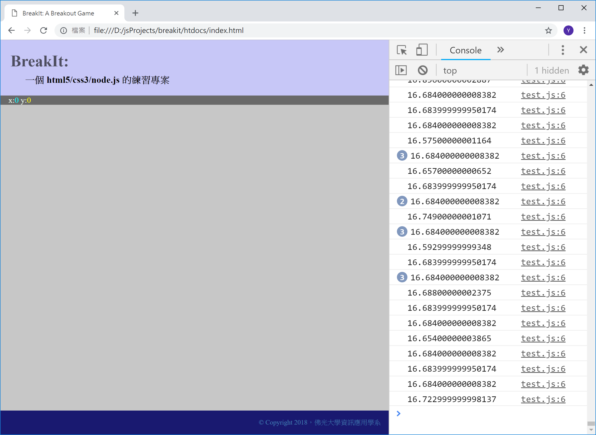

<!---
  @file       animation.md
  @author     Yiwei Chiao (ywchiao@gmail.com)
  @date       11/01/2018 created.
  @date       11/02/2018 last modified.
  @version    0.1.0
  @since      0.1.0
  @copyright  CC-BY, © 2018 Yiwei Chiao
-->

## [JavaScript][mdnJavaScript] 的**動畫** (*animation*)

  任何**動畫**的原理都是利用人眼的**視覺暫留** (*persistence of vision*)
  現象。電腦動畫因為要計算產生，不像影視作品是直接拍好，所以對硬體
  要較高的要求。

  動畫的基本流程是：

```JavaScript
  while (true) {
    updateData(); // 計算下一張畫面要呈現的資料

    drawFrame();  // 更新下一張畫面 (frame)
  }
```

  如果這個迴圈的每一次計算都能在 `25ms` 內完成，畫面就可以達到 `40fps`
   (frame/second)；人眼感受連續動畫的最低標準。但為了流暢性，現在
  一般定義的最低標準是 `60fps`，也就是約 `16.66ms` 內要完成圖片資料的
  計算和繪製。`1ms` 是 `0.001` 秒。

### `requestAnimationFrame()`

  現代的瀏覽器都支援 `requestAnimationFrame()` 這個 Web API，供
  [JavaScript][mdnJavaScript] 程式製作動畫使用。原則上，這個
  `requestAnimationFrame()` 會儘可能的維持住 `16.66ms` 的間隔，
  也就是維持住 `60fps` 的動畫要求。

  為理解 `requestAnimationFrame` 的使用，可以先準備下面的
  [JavaScript][mdnJavaScript] 程式碼：

```JavaScript
 1. 'use strict';
 2.
 3. let lastCalled = 0;
 4.
 5. let loop = function (ticks) {
 6.   console.log(`${ticks - lastCalled}`);
 7.
 8.   lastCalled = ticks;
 9.
10.   requestAnimationFrame(loop);
11. }
12.
13. requestAnimationFrame(loop);
```

  將上面的程式碼存放在 `htdosc/js/test.js` 檔案內，再將
  `htdocs/index.html` 裡的

```HTML
13. <script src="js/index.js"></script>
```

  改成：

```HTML
13. <script src="js/test.js"></script>
```

 用瀏覽器打開後，就會看到類似圖 \ref{raf} 的畫面：

  

### `requestAnimationFrame()` API 說明

  `requestAnimationFrame(callback)` 要求一個參數 `callback`。這個
 `callback` 本身必需是一個可呼叫執行的函數。因為
 `requestAnimationFrame(callback)` 作的其實是類似
 `addEventListener(e, callback)`，它的意思是說：

 **當下次 frame 更新前，請先呼叫執行 `callback` 函數**

 但是和 `addEventListener` 不同的是，這個 `callback`
 只會生效**一次**；也就是說，只對呼叫後的**下一次** `frame` 更新
 有效；這是為什麼，前面測試程式裡，在 `loop()` 函數內，會有額外的
 一行：

```JavaScript
10.   requestAnimationFrame(loop);
```

 確保每個 `frame` 更新前都要執行一次 `callback`。

#### `callback` 函數

 `requestAnimationFrame` 要求的 `callback` 函數接受一個參數，`ticks`，
 這個 `ticks` 代表當前網頁被載入後，到這個 `callback` 被呼叫時流逝
 的時間，單位是 `ms` (0.001 秒)。一般來說，這個值本身沒有太多用途，
 但是，**連續兩次**呼叫間的間隔，就剛好代表目前的 frame 刷新間隔；
 對控制動畫就很有用了。

 所以，在測試程式裡，

```javascript
 3. let lastCalled = 0;
```

 宣告一個變數 `lastCalled` 來保留**上一次**呼叫時的時間，

```javascript
 6.   console.log(`${ticks - lastCalled}`);
```

 顯示，這一次呼叫和上一次呼叫間的間隔。

```javascript
 8.   lastCalled = ticks;
```

 更新 `lastCalled`，給下一次呼叫使用。

### `breakit` 物件

 結合 [JavaScript][mdnJavaScript] 的物件，動畫的基本原理，和
 `requestAnimationFrame()`，有了 [BreakIt][breakit] 的遊戲物件如下：

```JavaScript
 1. let breakIt = {
 2.   _loop: function (ticks) {
 3.     if (!this._startAt) {
 4.       this._startAt = ticks;
 5.     };
 6.
 7.     this.update(ticks);
 8. i   paint();
 9.
10.     requestAnimationFrame(this._loop.bind(this));
11.   },
12.
13.   pause: function () {
14.     cancelAnimationFrame(this._tickHandler);
15.   },
16.
17.   start: function () {
18.     this._tickHandler = requestAnimationFrame(this._loop.bind(this));
19.   },
20.
21.   update: function (ticks) {
22.     if (this._lastUpdate) {
23.       ball.update(ticks - this._lastUpdate);
24.     };
25.
26.     this._lastUpdate = ticks;
27.   }
28. };
```

  然後，在 `index.js` 的最後一行，換成：

```JavaScript
203.  breakIt.start();
```

  就得到了一個一直在彈跳的球。

## 思考與練習

  * **球**的繪製，是在 `index.js` 裡的 `81` 到 `87` 行，嘗試利用
   網路資料去理解這幾行在寫些什麼。

  * `index.js` 裡，`ball = { ... }` 和 `breakit = { ... }` 兩個物
   件定義裡，都有大量出現 `this` 這個關鍵字，由 **this** 這個英文
   字的意義 (this: 這，這個)，不難猜到，它指得就是**當前**這個物件
   實體 (object instance)；但 `this` 在 [JavaScript][mdnJavaScript]
   裡，其實是個有趣，又容易誤用的一個概念，嘗試利用網路資源對 `this`
   作一些進一步的挖掘。

  * 承上，在 `index.js` 的 `121` 行，使用了 `bind()`
   函數，而它的參數就是 `this`；利用網路去查詢，`bind()` 函數的作用，
   進一步了解，`this` 在那裡的作用。

[github]: https://github.com
[mdnCanvas2D]: https://developer.mozilla.org/en-US/docs/Web/API/CanvasRenderingContext2D
[mdnCSS]: https://developer.mozilla.org/en-US/docs/Web/CSS
[mdnDOM]: https://developer.mozilla.org/en-US/docs/Web/API/Document_Object_Model
[mdnHTML5]: https://developer.mozilla.org/en-US/docs/Web/Guide/HTML/HTML5
[mdnJavaScript]: https://developer.mozilla.org/zh-TW/docs/Web/JavaScript
[mdnSVG]: https://developer.mozilla.org/kab/docs/Web/SVG
[mdnWebGL]: https://developer.mozilla.org/en-US/docs/Web/API/WebGL_API
[breakit]: https://github.com/ywchiao/breakit.git

<!-- animation.md -->
