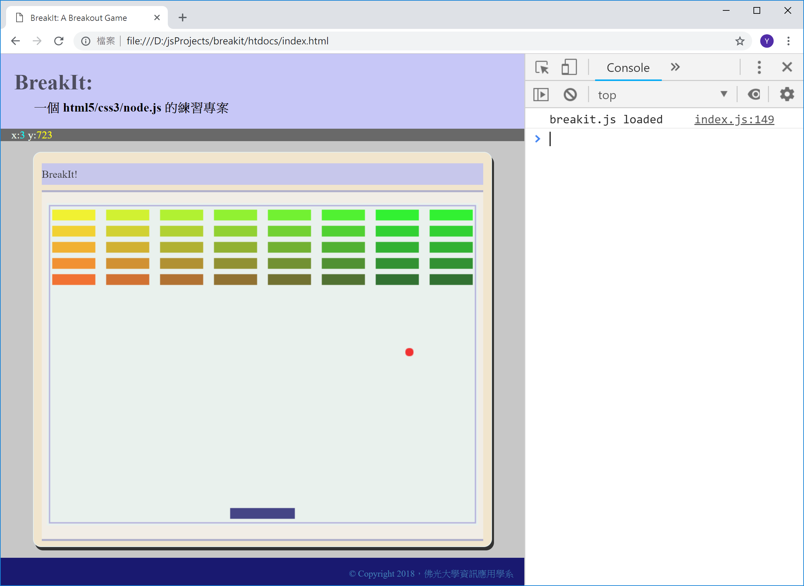

<!---
  @file       chapter_06.md
  @date       11/30/2018 created.
  @copyright  CC-BY, (C) 2017 Yiwei Chiao
  @detail
    This file is machine-generated. DONOT MODIFY IT DIRECTLY.
-->
# 前言

 前一章嘗試了基本的 [canvas][mdnCanvas2D] 2D 繪圖，這一章開始
 進入**動畫** (*animation*) 的世界。

## 專案準備

 和前一章比較，這一章開始將接觸到 [JavaScript][mdnJavaScript]
 的**物件** (*object*) 系統；[JavaScript][mdnJavaScript] 的物件系統
 和 *C++/C#/Java* 等語言的物件系統非常不同；所以是個全新的開始。

 目前專案執行畫面，如下圖 \ref{movingball}：

  

[mdnCSS]: https://developer.mozilla.org/en-US/docs/Web/CSS  

<!-- intro.md -->

## [JavaScript][mdnJavaScript] 的**物件** (*object*)

  先看遊戲內用來擊落磚塊的**球** (*ball*) 的程式碼，共 `44` 行：

```javascript
 1. let ball = {
 2.   _elapsed: 0,
 3.
 4.   x: 320,
 5.
 6.   y: 240,
 7.
 8.   offX: -2,
 9.
10.   offY: 2,
11.
12.   paint: function (ctx) {
13.     ctx.save();
14.
15.     ctx.fillStyle = 'red';
16.
17.     ctx.beginPath();
18.     ctx.arc(this.x, this.y, 6, 0, 2 * Math.PI, true);
19.     ctx.closePath();
20.
21.     ctx.fill();
22.
23.     ctx.restore();
24.   },
25.
26.   update: function (drifts) {
27.     this._elapsed += drifts;
28.
29.     while (this._elapsed > 16) {
30.       this.x += this.offX;
31.       this.y += this.offY;
32.
33.       if (this.x < 20 || this.x > 620) {
34.         this.offX = - this.offX;
35.       }
36.
37.       if (this.y < 20 || this.y > 460) {
38.         this.offY = - this.offY;
39.       }
40.
41.       this._elapsed -= 16;
42.     }
43.   }
44. };
```

  這 `44` 行程式碼建立了一個**物件實體** (*object instance*)，並可
  以利用變數 `ball` 來存取這個物件實體 (*instance*)。

### Object literal

  先將 `44` 行程式碼簡化成如下兩行：

```JavaScript
 1. let ball = {
      ...
44. };
```

  上面的程式碼建立了一個 [JavaScript][mdnJavaScript] 的**物件**
  (*object*)，同時將這個物件的**參考** (*reference*)**指定**
  (*assign*) 給同時宣告的變數 *ball* 儲存。

  具體的說，在 [JavaScript][mdnJavaScript] 裡，除了數字 (如
  `1`, `3.1415` 等) 之類的純量 (scalar) 外，**所有**的程式元素都是
  **物件** (*object*)，包括**函數** (*function*) 都是物件。

  最簡單建構一個物件的方法是寫 `{}`，然後將它指定給某個變數，如前
  所示。

  這種建構物件的方法，稱為 *object literals*。*Object literal* 的
  優點是寫完了立刻可以用，不必另外再去呼叫**建構函數** (*constructor*)
  來建立物件**實體** (instance)。

  相對的，除非另外處理，否則利用 *object literal* 建立的物件實體
  (*instance*) 傾向就是這**唯一一個**實體；程式並不需要第二個或更
  多的實體存在。

### Object properties

  `{}` 只定義了一個**空**物件，因為在 `{` 和 `}` 之間，沒有寫任何
  東西。要讓 `{}` 物件有作用，必需替它加上一些**物件屬性**
  (*object property*)。*Object literal* 裡的**屬性** (*property*) 是
  一個用 `:` 隔開的 `key: value` 配對 (*pair*)；不同的**屬性**
  (*property*) 間再利用 `,` 分隔；如下所示：

```javascript
 1. let ball = {
 2.   _elapsed: 0,
 3.
 4.   x: 320,
 5.
 6.   y: 240,
 7.
 8.   offX: -2,
 9.
10.   offY: 2,
11.
12.   paint: function (ctx) {
        ...
24.   },
25.
26.   update: function (drifts) {
        ...
43.   }
44. };
```

  *ball* 物件定義 `_elapsed`, `x`, `y`, ..., `update` 等 7 (七) 個
  屬性。

  而因為 [JavaScript][mdnJavaScript] 裡，所有元素
  (除了**純量** *scalar*)，全部都是**物件**；所以不像 `C++/C#/Java`
  等語言，物件的內部成員有分**屬性** (*property*)和**方法** (*method*)；
  [JavaScript][mdnJavaScript] 物件的內部成員全部都只有：
  **屬性** (*property*)；只不過某些屬性**剛好**是**函數**，所以可以
  被呼叫執行而已。如同 `ball` 裡的 `paint` 和 `update` 屬性。

### Object properties 存取

  物件屬性的存取和其它語言相同，利用 `.` 運算子；

```JavaScript
  ball.x = 10;
```

  如果那個屬性值是個函數物件，而且要呼叫執行，就和其它語言呼叫物件
  方法相同，使用 `()` 運算子：

```JavaScript
  ball.paint();
```

### Object properties 存取控制

  [JavaScript][mdnJavaScript] 的**物件屬性** (object property) 全部
  都是**公開** (*public*) 的；不像 `C++/C#/Java` 有
  `public/protected/private` 之類的存取控制關鍵字。

  有時為了備忘或作警示之用，會在屬性名稱前加上 `_` 符號，指出這個
  屬性是為了物件**內部使用**；不應在物件外直接存取。如程式碼列表裡
  的第 2 行：

```JavaScript
 2.   _elapsed: 0,
```

  但那純粹是程式碼寫作的一種**慣例** (*convention*)；沒有任何語言
  層級的強制力。

<!-- object.md -->

## [JavaScript][mdnJavaScript] 的**動畫** (*animation*)

  任何**動畫**的原理都是利用人眼的**視覺暫留** (*persistence of vision*)
  現象。電腦動畫因為要計算產生，不像影視作品是直接拍好，所以對硬體
  要較高的要求。

  動畫的基本流程是：

```JavaScript
  while (true) {
    updateData(); // 計算下一張畫面要呈現的資料

    drawFrame();  // 更新下一張畫面 (frame)
  }
```

  如果這個迴圈的每一次計算都能在 `25ms` 內完成，畫面就可以達到 `40fps`
   (frame/second)；人眼感受連續動畫的最低標準。但為了流暢性，現在
  一般定義的最低標準是 `60fps`，也就是約 `16.66ms` 內要完成圖片資料的
  計算和繪製。`1ms` 是 `0.001` 秒。

### `requestAnimationFrame()`

  現代的瀏覽器都支援 `requestAnimationFrame()` 這個 Web API，供
  [JavaScript][mdnJavaScript] 程式製作動畫使用。原則上，這個
  `requestAnimationFrame()` 會儘可能的維持住 `16.66ms` 的間隔，
  也就是維持住 `60fps` 的動畫要求。

  為理解 `requestAnimationFrame` 的使用，可以先準備下面的
  [JavaScript][mdnJavaScript] 程式碼：

```JavaScript
 1. 'use strict';
 2.
 3. let lastCalled = 0;
 4.
 5. let loop = function (ticks) {
 6.   console.log(`${ticks - lastCalled}`);
 7.
 8.   lastCalled = ticks;
 9.
10.   requestAnimationFrame(loop);
11. }
12.
13. requestAnimationFrame(loop);
```

  將上面的程式碼存放在 `htdocs/js/test.js` 檔案內，再將
  `htdocs/index.html` 裡的

```HTML
13. <script src="js/index.js"></script>
```

  改成：

```HTML
13. <script src="js/test.js"></script>
```

 用瀏覽器打開後，就會看到類似圖 \ref{raf} 的畫面：

  

### `requestAnimationFrame()` API 說明

  `requestAnimationFrame(callback)` 要求一個參數 `callback`。這個
 `callback` 本身必需是一個可呼叫執行的函數。因為
 `requestAnimationFrame(callback)` 作的其實是類似
 `addEventListener(e, callback)`，它的意思是說：

 **當下次 frame 更新前，請先呼叫執行 `callback` 函數**

 但是和 `addEventListener` 不同的是，這個 `callback`
 只會生效**一次**；也就是說，只對呼叫後的**下一次** `frame` 更新
 有效；這是為什麼，前面測試程式裡，在 `loop()` 函數內，會有額外的
 一行：

```JavaScript
10.   requestAnimationFrame(loop);
```

 確保每個 `frame` 更新前都要執行一次 `callback`。

#### `callback` 函數

 `requestAnimationFrame` 要求的 `callback` 函數接受一個參數，`ticks`，
 這個 `ticks` 代表當前網頁被載入後，到這個 `callback` 被呼叫時流逝
 的時間，單位是 `ms` (0.001 秒)。一般來說，這個值本身沒有太多用途，
 但是，**連續兩次**呼叫間的間隔，就剛好代表目前的 frame 刷新間隔；
 對控制動畫就很有用了。

 所以，在測試程式裡，

```javascript
 3. let lastCalled = 0;
```

 宣告一個變數 `lastCalled` 來保留**上一次**呼叫時的時間，

```javascript
 6.   console.log(`${ticks - lastCalled}`);
```

 顯示，這一次呼叫和上一次呼叫間的間隔。

```javascript
 8.   lastCalled = ticks;
```

 更新 `lastCalled`，給下一次呼叫使用。

### `breakit` 物件

 結合 [JavaScript][mdnJavaScript] 的物件，動畫的基本原理，和
 `requestAnimationFrame()`，有了 [BreakIt][breakit] 的遊戲物件如下：

```JavaScript
 1. let breakIt = {
 2.   _loop: function (ticks) {
 3.     if (!this._startAt) {
 4.       this._startAt = ticks;
 5.     };
 6.
 7.     this.update(ticks);
 8.     paint();
 9.
10.     requestAnimationFrame(this._loop.bind(this));
11.   },
12.
13.   pause: function () {
14.     cancelAnimationFrame(this._tickHandler);
15.   },
16.
17.   start: function () {
18.     this._tickHandler = requestAnimationFrame(this._loop.bind(this));
19.   },
20.
21.   update: function (ticks) {
22.     if (this._lastUpdate) {
23.       ball.update(ticks - this._lastUpdate);
24.     };
25.
26.     this._lastUpdate = ticks;
27.   }
28. };
```

  然後，在 `index.js` 的最後一行，換成：

```JavaScript
203.  breakIt.start();
```

  就得到了一個一直在彈跳的球。

## 思考與練習

  * **球**的繪製，是在 `index.js` 裡的 `81` 到 `87` 行，嘗試利用
   網路資料去理解這幾行在寫些什麼。

  * `index.js` 裡，`ball = { ... }` 和 `breakit = { ... }` 兩個物
   件定義裡，都有大量出現 `this` 這個關鍵字，由 **this** 這個英文
   字的意義 (this: 這，這個)，不難猜到，它指得就是**當前**這個物件
   實體 (object instance)；但 `this` 在 [JavaScript][mdnJavaScript]
   裡，其實是個有趣，又容易誤用的一個概念，嘗試利用網路資源對 `this`
   作一些進一步的挖掘。

  * 承上，在 `index.js` 的 `121` 行，使用了 `bind()`
   函數，而它的參數就是 `this`；利用網路去查詢，`bind()` 函數的作用，
   進一步了解，`this` 在那裡的作用。

<!-- animation.md -->

[ECMAScript]: https://www.ecma-international.org/publications/standards/Ecma-262.htm
[breakit]: https://github.com/ywchiao/breakit.git
[breakout]: https://en.wikipedia.org/wiki/Breakout_(video_game)
[nodejs]: https://nodejs.org
[atom]: https://atom.io
[babeljs]: https://babeljs.io
[browserify]: http://browserify.org
[git]: https://git-scm.com
[github]: https://github.com
[ide]: https://en.wikipedia.org/wiki/Integrated_development_environment
[rollupjs]: https://rollupjs.org
[terser]: https://github.com/terser-js/terser
[torvalds]: https://en.wikipedia.org/wiki/Linus_Torvalds
[typescript]: https://www.typescriptlang.org
[vcs]: https://en.wikipedia.org/wiki/Version_control
[vscode]: https://github.com/Microsoft/vscode
[webpack]: https://webpack.github.io
[brew]: https://github.com/Homebrew/brew
[cli]: https://en.wikipedia.org/wiki/Command-line_interface
[cmder]: https://github.com/cmderdev/cmder
[gui]: https://en.wikipedia.org/wiki/Graphical_user_interface
[npm]: https://www.npmjs.com
[nvm]: https://github.com/creationix/nvm
[vim]: https://vim.sourceforge.io
[xcode]: https://developer.apple.com/xcode
[commonmark]: http://commonmark.org
[gfm]: https://github.github.com/gfm
[gitignore]: https://git-scm.com/docs/gitignore
[markdown]: https://en.wikipedia.org/wiki/Markdown
[MIT]: https://opensource.org/licenses/MIT
[scriptingLanguage]: https://en.wikipedia.org/wiki/Scripting_language
[shellScript]: https://en.wikipedia.org/wiki/Shell_script
[mdnCSS]: https://developer.mozilla.org/en-US/docs/Web/CSS
[mdnHTML]: https://developer.mozilla.org/en-US/docs/Web/HTML
[mdnJavaScript]: https://developer.mozilla.org/zh-TW/docs/Web/JavaScript
[wikiCSS]: https://en.wikipedia.org/wiki/Cascading_Style_Sheets
[wikiECMAScript]: https://en.wikipedia.org/wiki/ECMAScript
[wikiHTML]: https://en.wikipedia.org/wiki/HTML
[githubHead]: https://github.com/joshbuchea/HEAD
[mdnHTML5]: https://developer.mozilla.org/en-US/docs/Web/Guide/HTML/HTML5
[wikiMarkdown]: https://en.wikipedia.org/wiki/Markdown
[wikiMarkupLang]: https://en.wikipedia.org/wiki/Markup_language
[wikiMetadata]: https://en.wikipedia.org/wiki/Metadata
[wikiProgLang]: https://en.wikipedia.org/wiki/Programming_language
[wikiText]: https://en.wikipedia.org/wiki/Text_(literary_theory)
[wikiXML]: https://en.wikipedia.org/wiki/XML
[wikiYAML]: https://en.wikipedia.org/wiki/YAML
[chrome]: https://www.google.com.tw/chrome
[firefox]: https://www.mozilla.org/zh-TW/firefox/
[jade]: http://jade-lang.com/
[jinja]: http://jinja.pocoo.org/
[mdnDOM]: https://developer.mozilla.org/en-US/docs/Web/API/Document_Object_Model
[mdnSVG]: https://developer.mozilla.org/kab/docs/Web/SVG
[mdnXML]: https://developer.mozilla.org/en-US/docs/XML_introduction
[PHP]: https://secure.php.net/
[Python]: https://www.python.org/
[Ruby]: https://www.ruby-lang.org/zh_tw/
[twig]: https://twig.symfony.com/
[wikiERuby]: https://en.wikipedia.org/wiki/ERuby
[wikiJSP]: https://en.wikipedia.org/wiki/JavaServer_Pages
[wikiTemplatEngine]: https://en.wikipedia.org/wiki/Template_processor
[mdnCanvas2D]: https://developer.mozilla.org/en-US/docs/Web/API/CanvasRenderingContext2D
[mdnWebGL]: https://developer.mozilla.org/en-US/docs/Web/API/WebGL_API
[^ECMAScript]: https://en.wikipedia.org/wiki/ECMAScript
[^breakit]: https://github.com/ywchiao/breakit
[^breakout]: https://en.wikipedia.org/wiki/Breakout_(video_game)
[^nodejs]: https://nodejs.org
[^atom]: https://atom.io
[^babeljs]: https://babeljs.io
[^browserify]: http://browserify.org
[^git]: https://git-scm.com
[^github]: https://github.com
[^ide]: https://en.wikipedia.org/wiki/Integrated_development_environment
[^rollupjs]: https://rollupjs.org
[^terser]: https://github.com/terser-js/terser
[^torvalds]: https://en.wikipedia.org/wiki/Linus_Torvalds
[^typescript]: https://www.typescriptlang.org
[^vcs]: https://en.wikipedia.org/wiki/Version_control
[^vscode]: https://github.com/Microsoft/vscode
[^webpack]: https://webpack.github.io
[^brew]: https://github.com/Homebrew/brew
[^cli]: https://en.wikipedia.org/wiki/Command-line_interface
[^cmder]: https://github.com/cmderdev/cmder
[^gui]: https://en.wikipedia.org/wiki/Graphical_user_interface
[^npm]: https://www.npmjs.com
[^nvm]: https://github.com/creationix/nvm
[^vim]: https://vim.sourceforge.io
[^xcode]: https://developer.apple.com/xcode
[^commonmark]: http://commonmark.org
[^gfm]: https://github.github.com/gfm
[^gitignore]: https://git-scm.com/docs/gitignore
[^markdown]: https://en.wikipedia.org/wiki/Markdown
[^MIT]: https://opensource.org/licenses/MIT

<!--- chapter_06.md -->