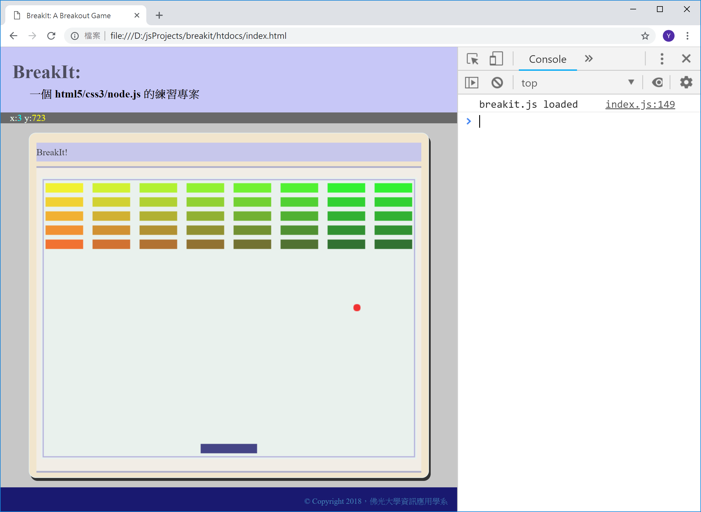

<!---
  @file       intro.md
  @author     Yiwei Chiao (ywchiao@gmail.com)
  @date       11/01/2018 created.
  @date       11/01/2018 last modified.
  @version    0.1.0
  @copyright  CC-BY, © 2018 Yiwei Chiao
-->

# 前言

 前一章嘗試了基本的 [canvas][mdnCanvas2D] 2D 繪圖，這一章開始
 進入**動畫** (*animation*) 的世界。

## 專案準備

 和前一章比較，這一章開始將接觸到 [JavaScript][mdnJavaScript]
 的**物件** (*object*) 系統；[JavaScript][mdnJavaScript] 的物件系統
 和 *C++/C#/Java* 等語言的物件系統非常不同；所以是個全新的開始。

 目前專案執行畫面，如下圖 \ref{movingball}：

  

[breakit]: https://github.com/ywchiao/breakit.git
[mdnCanvas2D]: https://developer.mozilla.org/en-US/docs/Web/API/CanvasRenderingContext2D
[mdnCSS]: https://developer.mozilla.org/en-US/docs/Web/CSS  
[mdnDOM]: https://developer.mozilla.org/en-US/docs/Web/API/Document_Object_Mode
[mdnHTML5]: https://developer.mozilla.org/en-US/docs/Web/Guide/HTML/HTML5
[mdnJavaScript]: https://developer.mozilla.org/zh-TW/docs/Web/JavaScript
[nodejs]: https://nodejs.org

<!-- intro.md -->
