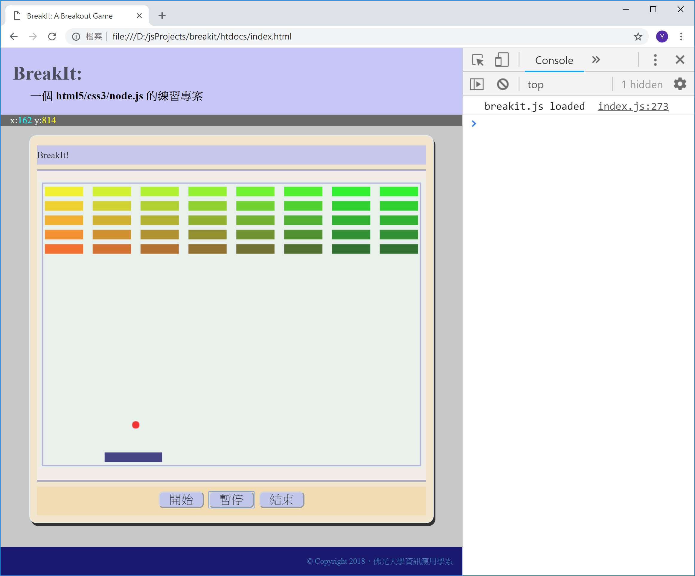

<!---
  @file       chapter_07.md
  @date       11/30/2018 created.
  @copyright  CC-BY, (C) 2017 Yiwei Chiao
  @detail
    This file is machine-generated. DONOT MODIFY IT DIRECTLY.
-->
# 前言

 之前介紹了 [JavaScript][mdnJavaScript] 的 *literal objects* (用在
  ```ball``` 物件)；這一章，將進入 [JavaScript][mdnJavaScript] 的
  class*。

 這一章將利用 *class* 將**擊球板** ```paddle``` 和**磚塊** ```brick``` 
 都轉換成**物件**；同時，為了遊戲進行方便，也加上了**開始**，**暫停**，
 等控制按鈕。

 目前專案執行畫面，如下圖 \ref{movingpaddle}：

  

<!-- intro.md -->

## [JavaScript][mdnJavaScript] 的**類別** (*class*)

  先看遊戲內**磚塊** (*brick*) 目前的程式碼，共 `36` 行：

```javascript
 1. class Brick {
 2.   constructor (x, y, color) {
 3.     this._x = x;
 4.     this._y = y;
 5.
 6.     this._width = 64;
 7.     this._height = 16;
 8.
 9.     this._color = color;
10.   }
11.
12.   get x() {
13.     return this._x;
14.   }
15.
16.   get y() {
17.     return this._y;
18.   }
19.
20.   get width() {
21.     return this._width;
22.   }
23.
24.   get height() {
25.     return this._height;
26.   }
27.
28.   paint (ctx) {
29.     ctx.save();
30.
31.     ctx.fillStyle = this._color;
32.     ctx.fillRect(this._x, this._y, this._width, this._height);
33.
34.     ctx.restore();
35.   }
36. };
```

  這 `36` 行程式碼建立了一個**類別宣告** (*class declairation*)，並可
  以利用關鍵字 ```new``` 來建立真正的**物件實體** (*object instances*)
  如，在 ```breakIt``` 物件裡新增的 ```reset``` 方法：

```JavaScript
   let breakIt = {
     ...
 1.  reset: function () {
 2.    let width = 8;
 3.    let height = 5;
 4.
 5.    for (let x = 0; x < width; x ++) {
 6.      for (let y = 0; y < height; y++) {
 7.        this._bricks.push(new Brick(
 8.          (x * 80) + 8,
 9.          (y * 24) + 10,
10.          `rgb(${Math.floor(255 - 42.5 * x)}, ${Math.floor(255 - 42.5 * y)}, 0)`
11.        ));
12.      }
13.    }
14.
15.    this._paddle = new Paddle(272, 454);
16.
17.    this.paint();
18.  },
     ...
   };
```

### Class

  [JavaScript][mdnJavaScript] 在**語法** (*syntax*) 上屬於 ```C```
  語言家族，受到 ```C``` 相當大的影響；宣告 ```class``` 也是利用
  ```關鍵字 + 識別字 + {}``` 的方式。

```JavaScript
 1. class Brick {
      ...
36. };
```

  宣告了一個稱作 ```Brick``` 的**類別** (*class*)。

### 建構子 (constructor)

  [JavaScript][mdnJavaScript] 類別 (class) 的**建構函數** (constructor)
  名字就直接稱作 ```constructor```；

```JavaScript
 2.   constructor (x, y, color) {
 3.     this._x = x;
 4.     this._y = y;
 5.
 6.     this._width = 64;
 7.     this._height = 16;
 8.
 9.     this._color = color;
10.   }
```

  如上面的程式片段所示，```constructor``` 可以接受參數，好在建構
  物件實體時直接初始化相對的屬性。

  和 ```C++/C#/Java``` 不同，[JavaScript][mdnJavaScript] 類別裡的
  屬性一樣**不**需要宣告；直接**賦值** (assign value)，
  [JavaScript][mdnJavaScript] 就知道要為這個類別產生相應的屬性了；
  如第 ```3``` 到第 ```9``` 行所作的。注意，為了知道這個利用
  **賦值** (assign value) 操作產生的屬性是給**物件實體** (*object
  instance*) 的，所以，前面都有 *this* 這個關鍵字。

  這裡的屬性很簡單，基本上就是記錄**磚塊** (*brick*) 的
  **左上角座標** (```x, y```)；**長寬** (```width, height```) 和
  **顏色** (```color```)。

### 方法 (method)

  宣告方法的文法和其它語言一樣，就是 ```識別字 () {}```；如下：

```JavaScript
28.   paint (ctx) {
29.     ctx.save();
30.
31.     ctx.fillStyle = this._color;
32.     ctx.fillRect(this._x, this._y, this._width, this._height);
33.
34.     ctx.restore();
35.   }
```

  目前，```Brick``` 類別就只有一個將**自己** (*this*) 繪出來的方法；
  注意它在查詢自己的**屬性**時，前面都加了 *this* 關鍵字，這樣
  [JavaScript][mdnJavaScript] 才知道去那兒找那些屬性。

### getter 方法 (method)

  物件導向 (object-oriented) 設計原理強調**封裝** (encapsulation)；
  因為**限制**資料的存取就可以簡化/減少資料不當存取的機會。

  ```C++/C#/Java``` 利用 ```public/protected/private``` 等存取控制
  字來趨近這個目的；可是 [JavaScript][mdnJavaScript] 沒有這些關鍵字。

  另一方面，假定有一個屬性 ```x```，代表 ```x``` 軸座標值；以
  ```public/protected/private``` 這類的存取控制子來控制，```x```
  要不是**可讀可寫**，要不就是**不可讀寫**；無法作到**唯讀**
  (*read-only*) 或**唯寫** (*write-only*)。

  不難想到，很多情況下，其實真的只需要**讀取** (*read*) 而已；

  因應這種觀察，有所謂的 ```getter/setter``` 函數被提出來。顧名思
  義，```getter``` 函數就是**唯讀** (*read-only*)；而
  ```setter``` 函數則是**唯寫** (*write-only*)；

  以 ```Java``` 為例：

```Java
public class Point {
  private int x;
  private int y;

  public Point(int x, int y) {
      this.x = x;
      this.y = y;
  }

  // getter functions
  public int getX() {
      return x;
  }

  public int getY() {
      return y;
  }

  // setter functions
  public void setX(int x) {
      this.x = x;
  }

  public void setY(int y) {
      this.y = y;
  }
}
```

  如上面程式碼，將**資料** (```x, y```) 設成 ```private```，所以外
  界無法直接存取，再透過 ```getter/setter``` 函數來存取它們。

  在 [JavaScript][mdnJavaScript] 提供了更簡單的 ```getter/setter```
  方法。如：

```JavaScript
 1. class Brick {
      ...
12.   get x() {
13.     return this._x;
14.   }
      ...
36. };
```

  就定義了一個 ```getter``` 函數；而可以這麼使用：

```JavaScript
  let brick = new Brick( 100, 100, 'red');

  console.log(`brick.x = ${brick.x}`);
```

<!-- class.md -->

[ECMAScript]: https://www.ecma-international.org/publications/standards/Ecma-262.htm
[breakit]: https://github.com/ywchiao/breakit.git
[breakout]: https://en.wikipedia.org/wiki/Breakout_(video_game)
[nodejs]: https://nodejs.org
[atom]: https://atom.io
[babeljs]: https://babeljs.io
[browserify]: http://browserify.org
[git]: https://git-scm.com
[github]: https://github.com
[ide]: https://en.wikipedia.org/wiki/Integrated_development_environment
[rollupjs]: https://rollupjs.org
[terser]: https://github.com/terser-js/terser
[torvalds]: https://en.wikipedia.org/wiki/Linus_Torvalds
[typescript]: https://www.typescriptlang.org
[vcs]: https://en.wikipedia.org/wiki/Version_control
[vscode]: https://github.com/Microsoft/vscode
[webpack]: https://webpack.github.io
[brew]: https://github.com/Homebrew/brew
[cli]: https://en.wikipedia.org/wiki/Command-line_interface
[cmder]: https://github.com/cmderdev/cmder
[gui]: https://en.wikipedia.org/wiki/Graphical_user_interface
[npm]: https://www.npmjs.com
[nvm]: https://github.com/creationix/nvm
[vim]: https://vim.sourceforge.io
[xcode]: https://developer.apple.com/xcode
[commonmark]: http://commonmark.org
[gfm]: https://github.github.com/gfm
[gitignore]: https://git-scm.com/docs/gitignore
[markdown]: https://en.wikipedia.org/wiki/Markdown
[MIT]: https://opensource.org/licenses/MIT
[scriptingLanguage]: https://en.wikipedia.org/wiki/Scripting_language
[shellScript]: https://en.wikipedia.org/wiki/Shell_script
[mdnCSS]: https://developer.mozilla.org/en-US/docs/Web/CSS
[mdnHTML]: https://developer.mozilla.org/en-US/docs/Web/HTML
[mdnJavaScript]: https://developer.mozilla.org/zh-TW/docs/Web/JavaScript
[wikiCSS]: https://en.wikipedia.org/wiki/Cascading_Style_Sheets
[wikiECMAScript]: https://en.wikipedia.org/wiki/ECMAScript
[wikiHTML]: https://en.wikipedia.org/wiki/HTML
[githubHead]: https://github.com/joshbuchea/HEAD
[mdnHTML5]: https://developer.mozilla.org/en-US/docs/Web/Guide/HTML/HTML5
[wikiMarkdown]: https://en.wikipedia.org/wiki/Markdown
[wikiMarkupLang]: https://en.wikipedia.org/wiki/Markup_language
[wikiMetadata]: https://en.wikipedia.org/wiki/Metadata
[wikiProgLang]: https://en.wikipedia.org/wiki/Programming_language
[wikiText]: https://en.wikipedia.org/wiki/Text_(literary_theory)
[wikiXML]: https://en.wikipedia.org/wiki/XML
[wikiYAML]: https://en.wikipedia.org/wiki/YAML
[chrome]: https://www.google.com.tw/chrome
[firefox]: https://www.mozilla.org/zh-TW/firefox/
[jade]: http://jade-lang.com/
[jinja]: http://jinja.pocoo.org/
[mdnDOM]: https://developer.mozilla.org/en-US/docs/Web/API/Document_Object_Model
[mdnSVG]: https://developer.mozilla.org/kab/docs/Web/SVG
[mdnXML]: https://developer.mozilla.org/en-US/docs/XML_introduction
[PHP]: https://secure.php.net/
[Python]: https://www.python.org/
[Ruby]: https://www.ruby-lang.org/zh_tw/
[twig]: https://twig.symfony.com/
[wikiERuby]: https://en.wikipedia.org/wiki/ERuby
[wikiJSP]: https://en.wikipedia.org/wiki/JavaServer_Pages
[wikiTemplatEngine]: https://en.wikipedia.org/wiki/Template_processor
[mdnCanvas2D]: https://developer.mozilla.org/en-US/docs/Web/API/CanvasRenderingContext2D
[mdnWebGL]: https://developer.mozilla.org/en-US/docs/Web/API/WebGL_API
[^ECMAScript]: https://en.wikipedia.org/wiki/ECMAScript
[^breakit]: https://github.com/ywchiao/breakit
[^breakout]: https://en.wikipedia.org/wiki/Breakout_(video_game)
[^nodejs]: https://nodejs.org
[^atom]: https://atom.io
[^babeljs]: https://babeljs.io
[^browserify]: http://browserify.org
[^git]: https://git-scm.com
[^github]: https://github.com
[^ide]: https://en.wikipedia.org/wiki/Integrated_development_environment
[^rollupjs]: https://rollupjs.org
[^terser]: https://github.com/terser-js/terser
[^torvalds]: https://en.wikipedia.org/wiki/Linus_Torvalds
[^typescript]: https://www.typescriptlang.org
[^vcs]: https://en.wikipedia.org/wiki/Version_control
[^vscode]: https://github.com/Microsoft/vscode
[^webpack]: https://webpack.github.io
[^brew]: https://github.com/Homebrew/brew
[^cli]: https://en.wikipedia.org/wiki/Command-line_interface
[^cmder]: https://github.com/cmderdev/cmder
[^gui]: https://en.wikipedia.org/wiki/Graphical_user_interface
[^npm]: https://www.npmjs.com
[^nvm]: https://github.com/creationix/nvm
[^vim]: https://vim.sourceforge.io
[^xcode]: https://developer.apple.com/xcode
[^commonmark]: http://commonmark.org
[^gfm]: https://github.github.com/gfm
[^gitignore]: https://git-scm.com/docs/gitignore
[^markdown]: https://en.wikipedia.org/wiki/Markdown
[^MIT]: https://opensource.org/licenses/MIT

<!--- chapter_07.md -->