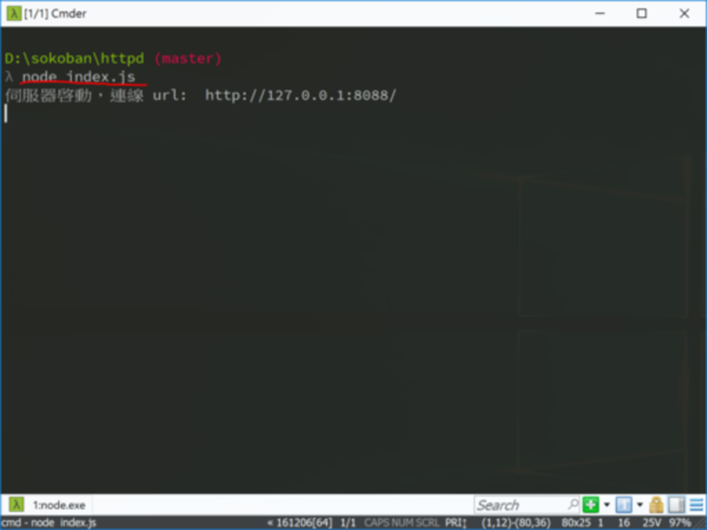
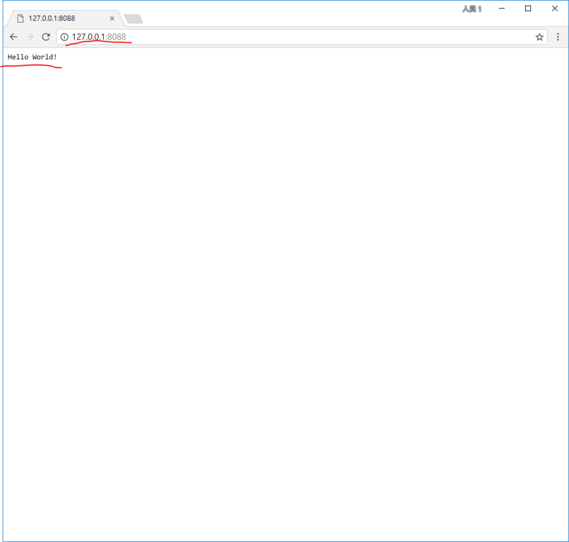

<!---
  @file       chapter_08.md
  @date       12/14/2018 created.
  @copyright  CC-BY, (C) 2017 Yiwei Chiao
  @detail
    This file is machine-generated. DONOT MODIFY IT DIRECTLY.
-->
# Httpd

  這一章將利用 [Node.js][nodejs] 建立一個簡單的 Web 服務器，以提供
  [BreakIt!][breakit] 遊戲內容到瀏覽器端。先從簡單的傳送靜態 Web 網頁開
  始。

## 專案目錄結構

  專案目錄結構是程式碼住的小窩。程式碼住的舒服，程式開發與維護才能輕鬆
  寫意。目前 [BreakIt!][breaikit] 的專案結構如下：

---

**專案目錄結構**
```
  D:\breakit         專案資料夾
  │  .gitignore        .gitignore 檔
  │  LICENSE           授權聲明
  │  README.md         專案說明檔。 Markdwon 格式。
  │
  ├─htdocs           客戶端程式資料夾
  │  ├─assets          客戶端程式資源
  │  │  └─css             .css 檔
  │  └─js              .js 檔；客戶端 Javascript/ECMAScript 程式碼
  └─httpd            伺服端程式資料夾
      │  index.js         伺服端程式入口 (main)
      │
      └─js             伺服端 Javascript/ECMAScript 程式碼
```
---

  如列表所示，整個專案大致分為兩個資料夾：

  * *htdocs*: 客戶端 (瀏覽器) 相關程式與資源。
  * *httpd*: 伺服端 (node.js) 程式。

  基本上，專案啟動時是啟動 *httpd* 資料夾內的 `index.js` 檔案 (伺服端程式進入點)；而使用者利用瀏覽器 (browser) 連上伺服後，伺服端會先將放在 *htdocs*
  資料夾裡的程式文件與資源按瀏覽器的要求依序傳送到客戶端執行或顯示。從而完成網頁
  應用程式的執行。

  之前處理了 `htdocs` 下客戶端的部份，現在開始處理**伺服端**的部份。

# Hello World

  專案伺服端一樣先由傳統的 *Hello World!* 開始。
  (**注意**: 以下的檔案沒有特別註明的話，都是放在 `breakit/httpd`
  資料夾之下)

## `index.js`

  一開始的 `index.js` 的內容如下：

---

**index.js**
```javascript
  1: 'use strict';
  2:
  3: let http = require('http');
  4:
  5: http.createServer((request, response) => {
  6:   // 傳送 HTTP header
  7:   // HTTP Status: 200 : OK
  8:   // Content Type: text/plain
  9:   response.writeHead(200, {
 10:     'Content-Type': 'text/plain'
 11:   });
 12:
 13:   // 傳送回應內容。
 14:   response.end('Hello World!\n');
 15:
 16:   console.log('request.headers: \n', request.headers)
 17: }).listen(8088);
 18:
 19: // log message to Console
 20: console.log('伺服器啓動，連線 url:  http://127.0.0.1:8088/');
```
---

  將 `index.js` 存檔後，在命令提示字元 ([cmder][])/終端機 (terminal) 下，
  輸入 `node index.js`，如圖 Figure \ref{server_start}，

  

  就可以啟動剛剛寫作的簡易網頁伺服器；再利用網頁瀏覽器，依伺服器訊息指示，開啟
   `http://127.0.0.1:8088` 就會看到如下的畫面
   (Figure \ref{hello_world})。

  

## `index.js` 程式說明

  如 Figure \ref{hello_world} 所示，瀏覽器就簡單顯示了 `Hello World!`
  訊息，沒有任何一般網頁的風範。這是因為伺服端真的什麼都沒作，就只送了那兩個英
  文字。比對程式碼，可以發現 `Hello World!` 出現在程式碼的第 14 行。由上下
  文的觀察可以猜出第 5 行到第 17 行是整個回應的核心。下面就來逐行解析這個程式
  的內容。

### Line 1: `'use strict';`

  之前有提過，[JavaScript][] 在 2009 年左右開始了一場標準化的變革，以應對
  愈來愈重要的網頁平台需求。為了擁抱改變，但又不能捨棄過去，所以 [ECMAScript][] 5 [引入][ECMAScript5]了 `strict` 模式。

  `strict` 模式對語法有更嚴格的要求，對過去一些模糊的語法作出了明確的規範或捨
  棄。舉例而言，`strict mode` 要求變數一定要宣告，但傳統的 [JavaScript][]
  不用。更詳細的討論可以見 [MDN][mdn] ([Mozilla Developer Network][mdn])
  對 [strict mode][strict] 的介紹。

  利用 `strict` 模式的宣告讓程式設計師可以有簡單的機制將傳統和新的標準化
  [JavaScript][] 作連結。

  第一行的 `'use strict';` 就是**聲明**這個程式是以 `strict` 模式撰寫。

### Line 3: `let http = require('http');`

  * [let][] 是 [ECMAScript][] 6 (又稱
   [ECMAScript Harmony][ECMAScript5]/[ES Harmony][ECMAScript5]/
   [ES 2015][ECMAScript5]) 引入的 **關鍵字** 之一。用途是 **宣告**一個
   **範圍變數** (scoped variable)；相對於 [var][] 宣告的變數則是 **全域**
   (global vairable) 或與函數綁定 ([closure][])。
  * [require][] 是 [Node.js][nodejs] 提供的 **模組** (module) 系統
   API 函數之一。作用為 **載入** (load) 指定的 [JavaScript][] 模組。這裡
   載入的是名為 [http][httpmod] 的 [Node.js][nodejs] 標準模組。

   透過 [require][] 載入的模組就初始化為一個 [JavaScript][] 的程式物件 (object instance)，可以直接呼叫使用。

   [http][httpmod] 模組是 [Node.js][nodejs] 提供的打造 [HTTP][http]
   服務器或客戶端的核心模組。它會負責處理和網路通訊相關真正麻煩的部份，專案需
   要作的，只是提供它必要的資訊。

### Line 5: `http.createServer(...)`

  * [HTTP.createServer][createserver]  
   如它的名字所示，是 [http][httpmod] 的內建方法，作用就是建立起一個
   http protocol 的伺服物件 ([http.Server][httpserver])。
   [HTTP.createServer][createserver] 要求一個 **函數** 參數:
   `requestListener`。

   因為 http 伺服物件知道如何處理網路協定，但無法知道如何回應使用者要求。這個
   傳入的 `requestListener` 函數就是 [http.Server][httpserver] 物件接
   收到使用者要求 (*request* 事件)時，需要 **呼叫執行** 來回應使用者要求的
   函數。因為 `requestListener` 函數不是由程式設計師在編寫程式時主動呼叫，
   而是由程式物件在程式執行時期自己呼叫，所以稱為： **回呼函數** (*callback*
   function)。  

   Callback function 在類似 [JavaScript][] 這類的函數式語言是個很重要的
   概念。

   `requestListener` 函數需要接收兩個參數：

   - [request][clientrequest]: [JavaScript][] 物件，代表瀏覽器傳遞的使用
     者要求。
   - [response][serverresponse]: [JavaScript][] 物件，用來回傳伺服器想
     傳送給瀏覽器的資料。

   這裡專案程式碼利用 **匿名函數** `(request, response) => {...}` 實作了
   [HTTP.createServer][createserver] 要求的 `requestListener`

  * `(request, response) => {...}`  
   就是 `function (request, response) {...}` 的另一種寫法。也就是宣告了
   一個 **匿名函數** (anonymous function)。  
   `(...) => {...}` 稱為 [*arrow function*][arrowfunction] 除了語法
   (syntax) 的改變外，在語義 (semantic)上，
   [arrow function][arrowfunction] 和傳統函數也有些細節的不同，這裡先略
   過，有興趣可以先去看參考資料。

### Line 9 ~ Line 14: `response`

  上面的 [response][serverresponse] 物件其實是 [Node.js][nodejs] 提供
  的 [ServerResponse][serverresponse] 類別的實例 (instace)。

  [response][serverresponse] 物件回應，基本上可以分為三 (3) 步走：

  1. `ServerResponse.writeHead(statusCode[, statusMessage][, headers])`: 傳送 HTTP header 資訊。
   參見 [ServerResponse.writeHead][responsewritehead]
  1. `ServerResponse.write(chunk[, encoding][, callback])`: 傳送
   回應內容。參見 [ServerReposne.write][responsewrite]。
  1. `ServerResponse.end([data][, encoding][, callback])`:
   回應結束。**一定** 要呼叫。參見 [ServerResponse.end][responseend]。

  由上述流程中可以看到 [ServerResponse.writeHead(...)][responsewritehead]
  基本回應了瀏覽器這次訪問是否成功 (`statusCode`)，瀏覽器應該如何解讀回應
  內容 (`headers`) 等。

  `header` 裡主要是放回應內容的編碼方式 (`encoding='utf8'`)，
  內容型別 ([MIME types][mime]，如: `'Content-Type: text/plain'`)
  等。

  因為這個小程式只需要回應 `'Helo World!`，所以就直接省略了對
  [ServerResponse.write(...)][responsewrite] 的呼叫；直接以
  `'Hello Wrold!'` 作為參數呼叫
  [ServerResponse.end(...)][responseend]。

### Line 16 `console.log(...)`

  [Node.js][nodejs] 的 [console][] 物件代表的就是 **命令提示字元**/
  **終端機** (terminal)。主要用途是 `log` 訊息到螢幕輸出，讓系統管理員能夠
  知道系統發生了些什麼事情。

  而裡面的 [request][clientrequest] 物件是 [Node.js][nodejs] 提供
  的 [ClientRequest][clientrequest] 類別的實例 (instace)。記錄了瀏覽器
  傳送的資料細節。

  目前專案沒有用到它的內容，這裡單純將 `request.headers` 的資訊倒到 [console][] 上。

### Line 17: `listen(8088)`

  到 17 行，整個 [HTTP.createServer(...)][createserver] 就完成了呼叫，
  傳回一個 [http.Server][httpserver] 的實例。但這個伺服物件還沒有起動。
  第 17 行尾端的 [lister(8088)][serverlisten] 就是起動這個伺服物件，同時
  指定它在 *8088* 這個通訊埠 (port) 等待使用者的連線。

### Line 20 `console.log(...)`

  如果一切順利，到這兒，一個 http 伺服程序已經在背後運行，但是沒有任何訊息
  呈現在 [console][]，系統管理員無從判斷系統狀態。所以這裡在 console 印出一個
  提示訊息，說明伺服器已起動，同時印出它的 ip 址地和 port 號碼。

## Javascript 模組系統簡介

  這小節是關於 [JavaScript][] 模組系統的一些簡略背景介紹，和專案程式碼沒有直接
  關係。如果沒有興趣可以跳過。

  傳統 [JavaScript][] 本身沒有模組系統 ([ECMAScript][] 6 之後才有)。程式碼
  不管分成幾個檔案，執行後全部混在一起，所有的變數全部都是 global，包在物件或
  [**閉包**][closure] ([closure][]) 裡。對發展大型專案或初學者而言是個充滿
  陷阱的雷區。

  為解決這個問題，[Node.js][nodejs] 和其它一些 [JavaScript][] 的函式庫，
  利用 [JavaScript][] 的物件 (objects) 和 [closure][] 建構了自己的模組
  系統。當然，各家的實作方法都不太相同。為了保持中立，[ECMAScript][] 6 提出
  的模組系統**當然**又是另一種。所以說，[JavaScript][] 是個充滿新鮮感與
  驚奇的語言。

  [Node.js][nodejs] 使用的模組系統繼承自 [CommonJS][commonjs]，為伺服
  端 [JavaScript][] 程式；另一個廣泛使用的格式稱作
  [AMD][amd] ([Asynchronous Module Definition][amd]) 是針對 Web 瀏覽器
  設計；最後一種，稱為
  [IIFE][iife] ([Immediately-Invoked Function Expression][iife])。
  [IIFE][iife] 本身其實是應用 [JavaScript][] function 物件的一個進階程式
  技巧，並不是什麼模組系統。但實作簡單，應用廣泛，在這個專案的進行中也會引入
  [IIFE][iife] 的寫作方式。

  [BreakIt!][breakit] 專案在：

  * 伺服端，使用 [Node.js][nodejs]，使用 [Node.js][nodejs] 的模組系統。
  * 客戶端，使用 [ECMAScript][] 6 的模組系統。

[ECMAScript5]: https://en.wikipedia.org/wiki/ECMAScript      

[ECMAScript]: https://www.ecma-international.org/publications/standards/Ecma-262.htm
[breakit]: https://github.com/ywchiao/breakit.git
[breakout]: https://en.wikipedia.org/wiki/Breakout_(video_game)
[nodejs]: https://nodejs.org/en
[atom]: https://atom.io
[babeljs]: https://babeljs.io
[browserify]: http://browserify.org
[git]: https://git-scm.com
[github]: https://github.com
[ide]: https://en.wikipedia.org/wiki/Integrated_development_environment
[rollupjs]: https://rollupjs.org
[terser]: https://github.com/terser-js/terser
[torvalds]: https://en.wikipedia.org/wiki/Linus_Torvalds
[typescript]: https://www.typescriptlang.org
[vcs]: https://en.wikipedia.org/wiki/Version_control
[vscode]: https://github.com/Microsoft/vscode
[webpack]: https://webpack.github.io
[brew]: https://github.com/Homebrew/brew
[cli]: https://en.wikipedia.org/wiki/Command-line_interface
[cmder]: https://github.com/cmderdev/cmder
[gui]: https://en.wikipedia.org/wiki/Graphical_user_interface
[npm]: https://www.npmjs.com
[nvm]: https://github.com/creationix/nvm
[vim]: https://vim.sourceforge.io
[xcode]: https://developer.apple.com/xcode
[commonmark]: http://commonmark.org
[gfm]: https://github.github.com/gfm
[gitignore]: https://git-scm.com/docs/gitignore
[markdown]: https://en.wikipedia.org/wiki/Markdown
[MIT]: https://opensource.org/licenses/MIT
[scriptingLanguage]: https://en.wikipedia.org/wiki/Scripting_language
[shellScript]: https://en.wikipedia.org/wiki/Shell_script
[mdnCSS]: https://developer.mozilla.org/en-US/docs/Web/CSS
[mdnHTML]: https://developer.mozilla.org/en-US/docs/Web/HTML
[mdnJavaScript]: https://developer.mozilla.org/zh-TW/docs/Web/JavaScript
[wikiCSS]: https://en.wikipedia.org/wiki/Cascading_Style_Sheets
[wikiECMAScript]: https://en.wikipedia.org/wiki/ECMAScript
[wikiHTML]: https://en.wikipedia.org/wiki/HTML
[githubHead]: https://github.com/joshbuchea/HEAD
[mdnHTML5]: https://developer.mozilla.org/en-US/docs/Web/Guide/HTML/HTML5
[wikiMarkdown]: https://en.wikipedia.org/wiki/Markdown
[wikiMarkupLang]: https://en.wikipedia.org/wiki/Markup_language
[wikiMetadata]: https://en.wikipedia.org/wiki/Metadata
[wikiProgLang]: https://en.wikipedia.org/wiki/Programming_language
[wikiText]: https://en.wikipedia.org/wiki/Text_(literary_theory)
[wikiXML]: https://en.wikipedia.org/wiki/XML
[wikiYAML]: https://en.wikipedia.org/wiki/YAML
[chrome]: https://www.google.com.tw/chrome
[firefox]: https://www.mozilla.org/zh-TW/firefox/
[jade]: http://jade-lang.com/
[jinja]: http://jinja.pocoo.org/
[mdnDOM]: https://developer.mozilla.org/en-US/docs/Web/API/Document_Object_Model
[mdnSVG]: https://developer.mozilla.org/kab/docs/Web/SVG
[mdnXML]: https://developer.mozilla.org/en-US/docs/XML_introduction
[PHP]: https://secure.php.net/
[Python]: https://www.python.org/
[Ruby]: https://www.ruby-lang.org/zh_tw/
[twig]: https://twig.symfony.com/
[wikiERuby]: https://en.wikipedia.org/wiki/ERuby
[wikiJSP]: https://en.wikipedia.org/wiki/JavaServer_Pages
[wikiTemplatEngine]: https://en.wikipedia.org/wiki/Template_processor
[mdnCanvas2D]: https://developer.mozilla.org/en-US/docs/Web/API/CanvasRenderingContext2D
[mdnWebGL]: https://developer.mozilla.org/en-US/docs/Web/API/WebGL_API
[amd]: http://requirejs.org/docs/whyamd.html
[arrowfunction]: https://developer.mozilla.org/zh-TW/docs/Web/JavaScript/Reference/Functions/Arrow_functions
[clientrequest]: https://nodejs.org/api/http.html#http_class_http_clientrequest
[closure]: https://developer.mozilla.org/zh-TW/docs/Web/JavaScript/Closures
[commonjs]: http://www.commonjs.org
[console]: https://nodejs.org/api/console.html#console_class_console
[createserver]: https://nodejs.org/api/http.html#http_http_createserver_requestlistener
[http]: https://en.wikipedia.org/wiki/Hypertext_Transfer_Protocol
[httpmod]: https://nodejs.org/api/http.html#http_http
[httpserver]: https://nodejs.org/api/http.html#http_class_http_server
[iife]: https://en.wikipedia.org/wiki/Immediately-invoked_function_expression
[JavaScript]: https://developer.mozilla.org/zh-TW/docs/Web/JavaScript
[let]: https://developer.mozilla.org/zh-TW/docs/Web/JavaScript/Reference/Statements/let
[mdn]: https://developer.mozilla.org/zh-TW
[mime]: https://developer.mozilla.org/en-US/docs/Web/HTTP/Basics_of_HTTP/MIME_types
[require]: https://nodejs.org/api/modules.html#modules_require
[responseend]: https://nodejs.org/api/http.html#http_response_end_data_encoding_callback
[responsewrite]: https://nodejs.org/api/http.html#http_response_write_chunk_encoding_callback
[responsewritehead]: https://nodejs.org/api/http.html#http_response_writehead_statuscode_statusmessage_headers
[serverlisten]: https://nodejs.org/api/http.html#http_server_listen_port_hostname_backlog_callback
[serverresponse]: https://nodejs.org/api/http.html#http_class_http_serverresponse
[strict]: https://developer.mozilla.org/en-US/docs/Web/JavaScript/Reference/Strict_mode
[var]: https://developer.mozilla.org/zh-TW/docs/Web/JavaScript/Reference/Statements/var
[^ECMAScript]: https://en.wikipedia.org/wiki/ECMAScript
[^breakit]: https://github.com/ywchiao/breakit
[^breakout]: https://en.wikipedia.org/wiki/Breakout_(video_game)
[^nodejs]: https://nodejs.org
[^atom]: https://atom.io
[^babeljs]: https://babeljs.io
[^browserify]: http://browserify.org
[^git]: https://git-scm.com
[^github]: https://github.com
[^ide]: https://en.wikipedia.org/wiki/Integrated_development_environment
[^rollupjs]: https://rollupjs.org
[^terser]: https://github.com/terser-js/terser
[^torvalds]: https://en.wikipedia.org/wiki/Linus_Torvalds
[^typescript]: https://www.typescriptlang.org
[^vcs]: https://en.wikipedia.org/wiki/Version_control
[^vscode]: https://github.com/Microsoft/vscode
[^webpack]: https://webpack.github.io
[^brew]: https://github.com/Homebrew/brew
[^cli]: https://en.wikipedia.org/wiki/Command-line_interface
[^cmder]: https://github.com/cmderdev/cmder
[^gui]: https://en.wikipedia.org/wiki/Graphical_user_interface
[^npm]: https://www.npmjs.com
[^nvm]: https://github.com/creationix/nvm
[^vim]: https://vim.sourceforge.io
[^xcode]: https://developer.apple.com/xcode
[^commonmark]: http://commonmark.org
[^gfm]: https://github.github.com/gfm
[^gitignore]: https://git-scm.com/docs/gitignore
[^markdown]: https://en.wikipedia.org/wiki/Markdown
[^MIT]: https://opensource.org/licenses/MIT

<!--- chapter_08.md -->