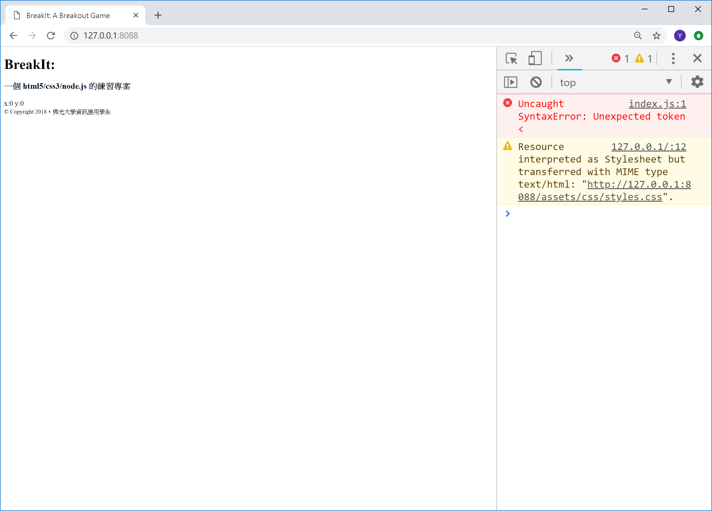
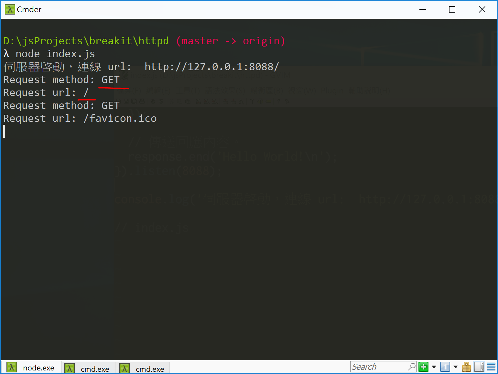
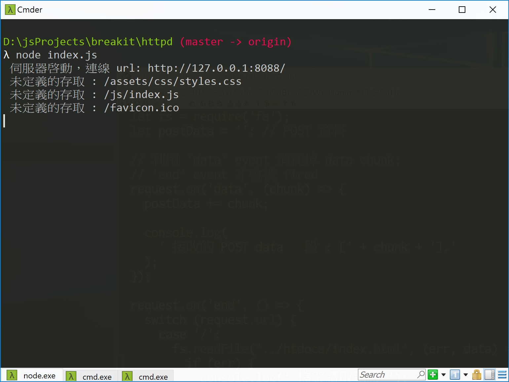

<!---
  @file       chapter_09.md
  @date       11/30/2018 created.
  @copyright  CC-BY, (C) 2017 Yiwei Chiao
  @detail
    This file is machine-generated. DONOT MODIFY IT DIRECTLY.
-->
# httpd server 和檔案服務

 之前的 `httpd/index.js` 檔案可以接受使用者連線，傳回簡單的 `Hello World!`
 訊息； 但是 [BreakIt!][breakit] 的內容是在 `htdocs/` 資料夾下的
 `index.html` 和 `htdocs/js` 資料夾下的 `index.js`，與 `htdocs/assets/css/`
 資料夾下的 `styles.css` 檔案。也就是說， httpd server 必需能在收到
 使用者要求時傳回相應的*檔案*內容，而不是簡單的文字而已。

 要作到這個目的，需要 `Node.js` 的 `fs` 模組。

<!-- intro.md -->

# [Node.js][nodejs] 的 [fs][] 模組

 針對檔案系統的讀寫，[Node.js][nodejs] 提供了一個 [fs][]
 (*File System*) 模組。

 先看引入了 [fs][] 模組的 `httpd/index.js` 的程式碼：

```javascript
 1. 'use strict';
 2.
 3. let http = require('http');
 4.
 5. http.createServer((request, response) => {
 6.   // 取得 node.js 的 fs 模組
 7.   let fs = require('fs');
 8.
 9.   fs.readFile('../htdocs/index.html', (err, data) => {
10.     response.writeHead(200, {
11.       'Content-Type': 'text/html'
12.     });
13.
14.     response.write(data);
15.
16.     response.end();
17.   });
18. }).listen(8088);
19.
20. // log message to Console
21. console.log('伺服器啟動，連線 url:  http://127.0.0.1:8088/');
```

 和原來的 `index.js` 內容比較，主要的變化出現在第 6 行到第 17 行這段 `callback` 函數的內容。具體的說是：

  * 第 7 行：利用 `require('fs')` 載入了 [Node.js][nodejs] 的
   [fs][] ([File System][fs])模組，並將產生的物件放入同名的 `fs` 變數
   內。
  * 第 9 行：呼叫 [fs][] 物件的 [`readFile`][readfile] 方法；讀入
   `index.html` 檔案；有趣的在第二個參數的 `callback` 函數。
   這個 `callback` 函數本身需要兩個參數：  
    * `err`：代表 [`readFile()`][readfile] 執行中發生錯誤。
    * `data`: 代表讀取成功的資料。
   目前的 `index.js` 檔案暫時不處理錯誤，所以並沒有對 `err` 進行處理。而讀入
   的 `data` 就直接準備傳送給客戶端 (瀏覽器)。
  * 第 10 到 16 行：和之前一樣，呼叫 [`response`][serverresponse] 三步
   走；不一樣的是，現在這幾行變成
   [`readFile(fname, callback)`][readfile] 第二個參數： `callback`
   函數的內容：
    - 第 10 行，[`writeHead(...)`][responsewritehead]；因為傳回的資料
     現在是 `html`，所以 `'Content-Type'`([MIME Type][mime]) 設為
     `'text/html'`。
    - 第 14 行，[`write(data)`][responsewrite]：呼叫
     [`response`][serverresponse] 的 [`write`][`responsewrite`]
     方法將讀入的資料 (`data`) 傳送給客戶端 (瀏覽器)
    - 第 16 行，[`end()`][responseend]：**結東**
     [`response`][serverresponse] 物件的工作，確實將資料傳送出去。

## 非同步 (asynchronous) 的 `fs.readFile(...)`

  如果去查 `index.js` 第 9 行的 [`fs.readFile(...)`][readfile] 說明
  文件，會注意到文件特別強調它是 *asynchronous* (**非同步**) 的。這是
  [Node.js][nodejs] 的一個特點。[Node.js]][nodejs] 提供的模組裡的
  [API][]s (Application Programming Interface: 應用程式介面)，除非特
  別聲明，或者如 [readFile(...)][readfile] 的姊妹函數
  [readFileSync(...)][readfilesync] 般，函數名稱裡就帶有
  *Sync* (*SYNChronous*)，全部都是**非同步** (*asynchronous*) 的。

  所謂**非同步** (*asynchronous*) 指的是，以 [readFile(...)][readfile]
  方法為例，[Node.js][nodejs] **不會** 等檔案讀取完畢之後才進行下一步
  驟的執行； **[Node.js][nodejs] 啟動 I/O 作業，開始讀取檔案後，就去
  處理程式的下一個指令了；一直到 I/O 系統完成了工作，才會透過
  [readFile(...)][readfile] 的 `callback` 函數，通知 [Node.js][nodejs]
  回頭進行讀取資料的後續處理。**

  這樣設計的好處是，同樣以 [readFile(...)][readfile] 為例，如果讀
  取的檔案很大，[Node.js][nodejs] 可以不用傻傻的在那兒等檔案讀完，
  而可以先去忙其它事情，等到檔案讀完再回頭處理。從而最大化運算核心
  和記憶體的使用效率。

<!-- fs.md -->

# `routing` (路由)

  修改過後的 `index.js` 執行結果如圖 Figure
  \ref{http_index}，

  

 這是因為目前 [BreakIt][breakit] 專案需要回傳給瀏覽器的資料分成三 (3) 個檔案:

  * `index.html` 在 `breakit/htdocs` 資料夾下，網頁客戶端的
   [HTML][mdnHTML5] 框架。
  * `styles.css` 在 `breakit/htdocs/assets/css` 資料夾下，負責網頁
   客戶端的 [CSS][mdnCSS] styling。
  * `breakit.js` 在 `breakit/htdocs/js` 資料夾下，[BreakIt][breakit]
   遊戲程式。

 問題在目前伺服端的 `index.js` 檔案執行時**只**是簡單地讀入
 `index.html` 檔案內容，並將它傳給客戶端瀏覽器；而實際上它還需要
 `styles.css`, `breakit.js` 等不同形式的檔案，`index.js` 應該在
 **何時**，**如何** 讀取它們的內容並傳給客戶端，就是現在要處理的
 挑戰。

## [`http.IncomingMessage`][http_inmsg]

 原始的 `index.js` 內容如下：

```JavaScript
 1. 'use strict';
 2.
 3. let http = require('http');
 4.
 5. http.createServer((request, response) => {
 6.   // 傳送 HTTP header
 7.   // HTTP Status: 200 : OK
 8.   // Content Type: text/plain
 9.   response.writeHead(200, {
10.     'Content-Type': 'text/plain'
11.   });
12.
13.   // 傳送回應內容。
14.   response.end('Hello World!\n');
15.
16.   console.log('request.headers: \n', request.headers)
17. }).listen(8088);
18.
19. // log message to Console
20. console.log('伺服器啓動，連線 url:  http://127.0.0.1:8088/');
```

  目前關注的是第 5 行的 `http.createServer((request, response) => {`。
  這裡，`index.js` 建立了真正的 `HTTP` 伺服器物件；而 `request`
  參數就是客戶端送來的請求。

  據 [Node.js][nodejs] 文件，`request` 物件的型別是
  [`http.IncomingMessage`][http_inmsg]。由
  [Node.js][nodejs] 文件裡對 [`http.IncomingMessage`][http_inmsg]
  的說明，可以找到兩個重要的資料欄位：

  * `message.method`: 客戶端要求使用的**方法**，如：`GET`，`POST` 等；
  * `message.url`: 客戶端提出要求使用的 `URL` (Uniform Resource
   Locator)，也就是一般習稱的**網址**。

  要理解這兩個欄位的意義，可以修改 `index.js` 如下：

```javascript
 1. 'use strict';
 2.
 3. let http = require('http');
 4.
 5. http.createServer((request, response) => {
 6.   request.on('end', () => {
 7.     console.log(`Request method: ${request.method}`);
 8.     console.log(`Request url: ${request.url}`);
 9.   });
10.
11.   // 傳送 HTTP header
12.   // HTTP Status: 200 : OK
13.   // Content Type: text/plain
14.   response.writeHead(200, {
15.     'Content-Type': 'text/plain'
16.   });
17.
18.   // 傳送回應內容。
19.   response.end('Hello World!\n');
20. }).listen(8088);
21.
22. // log message to Console
23. console.log('Server running at http://127.0.0.1:8088/');
```

 主要差別在增加了第 6 ~ 9 行的程式碼。其中第 6 行設定當 HTTP 伺服完成接收
 `request` 物件時執行；而第 7, 8 行則分別在 `console` 印出
 `request.method` 和 `request.url` 的內容。執行結果應該有點像圖 Figure
 \ref{http_request}，

 

 伺服器可以利用這兩個欄位來達成回傳不同檔案的目的。

## `index.js` 修正

 依之前對 `request.method` 和 `request.url` 的了解，`index.js` 可以修改
 如下：

```javascript
 1. 'use strict';
 2.
 3. let http = require('http');
 4.
 5. http.createServer((request, response) => {
 6.   let fs = require('fs');
 7.   let postData = ''; // POST 資料
 8.
 9.   // 利用 'data' event 消耗掉 data chunk;
10.   // 'end' event 才會被 fired
11.   request.on('data', (chunk) => {
12.     postData += chunk;
13.
14.     console.log(
15.       `接收的 POST data 片段: [${chunk}].`
16.     );
17.   });
18.
19.   request.on('end', () => {
20.     switch (request.url) {
21.       case '/':
22.         fs.readFile('../htdocs/index.html', (err, data) => {
23.           if (err) {
24.              console.log('檔案讀取錯誤');
25.           }
26.           else {
27.             response.writeHead(200, {
28.               'Content-Type': 'text/html'
29.             });
30.
31.             response.write(data);
32.             response.end();
33.           }
34.         });
35.
36.         break;
37.
38.       default:
39.         console.log(`未定義的存取: ${request.url}`);
40.
41.         response.end();
42.
43.         break;
44.     }
45.   });
46. }).listen(8088);
47.
48. // log message to Console
49. console.log('伺服器啓動，連線 url: http://127.0.0.1:8088/');
```

## 問題與練習

  修改過後的 `index.js` 執行結果如圖 Figure
  \ref{http_index}，

  而伺服端的輸出如圖 Figure \ref{http_switched}，

  

  嘗試解決這個問題。

[mdnCSS]: https://developer.mozilla.org/en-US/docs/Web/CSS  

<!-- routing.md -->

[ECMAScript]: https://www.ecma-international.org/publications/standards/Ecma-262.htm
[breakit]: https://github.com/ywchiao/breakit.git
[breakout]: https://en.wikipedia.org/wiki/Breakout_(video_game)
[nodejs]: https://nodejs.org
[atom]: https://atom.io
[babeljs]: https://babeljs.io
[browserify]: http://browserify.org
[git]: https://git-scm.com
[github]: https://github.com
[ide]: https://en.wikipedia.org/wiki/Integrated_development_environment
[rollupjs]: https://rollupjs.org
[terser]: https://github.com/terser-js/terser
[torvalds]: https://en.wikipedia.org/wiki/Linus_Torvalds
[typescript]: https://www.typescriptlang.org
[vcs]: https://en.wikipedia.org/wiki/Version_control
[vscode]: https://github.com/Microsoft/vscode
[webpack]: https://webpack.github.io
[brew]: https://github.com/Homebrew/brew
[cli]: https://en.wikipedia.org/wiki/Command-line_interface
[cmder]: https://github.com/cmderdev/cmder
[gui]: https://en.wikipedia.org/wiki/Graphical_user_interface
[npm]: https://www.npmjs.com
[nvm]: https://github.com/creationix/nvm
[vim]: https://vim.sourceforge.io
[xcode]: https://developer.apple.com/xcode
[commonmark]: http://commonmark.org
[gfm]: https://github.github.com/gfm
[gitignore]: https://git-scm.com/docs/gitignore
[markdown]: https://en.wikipedia.org/wiki/Markdown
[MIT]: https://opensource.org/licenses/MIT
[scriptingLanguage]: https://en.wikipedia.org/wiki/Scripting_language
[shellScript]: https://en.wikipedia.org/wiki/Shell_script
[mdnCSS]: https://developer.mozilla.org/en-US/docs/Web/CSS
[mdnHTML]: https://developer.mozilla.org/en-US/docs/Web/HTML
[mdnJavaScript]: https://developer.mozilla.org/en-US/docs/Web/JavaScript
[wikiCSS]: https://en.wikipedia.org/wiki/Cascading_Style_Sheets
[wikiECMAScript]: https://en.wikipedia.org/wiki/ECMAScript
[wikiHTML]: https://en.wikipedia.org/wiki/HTML
[githubHead]: https://github.com/joshbuchea/HEAD
[mdnHTML5]: https://developer.mozilla.org/en-US/docs/Web/Guide/HTML/HTML5
[wikiMarkdown]: https://en.wikipedia.org/wiki/Markdown
[wikiMarkupLang]: https://en.wikipedia.org/wiki/Markup_language
[wikiMetadata]: https://en.wikipedia.org/wiki/Metadata
[wikiProgLang]: https://en.wikipedia.org/wiki/Programming_language
[wikiText]: https://en.wikipedia.org/wiki/Text_(literary_theory)
[wikiXML]: https://en.wikipedia.org/wiki/XML
[wikiYAML]: https://en.wikipedia.org/wiki/YAML
[chrome]: https://www.google.com.tw/chrome
[firefox]: https://www.mozilla.org/zh-TW/firefox/
[jade]: http://jade-lang.com/
[jinja]: http://jinja.pocoo.org/
[mdnDOM]: https://developer.mozilla.org/en-US/docs/Web/API/Document_Object_Model
[mdnSVG]: https://developer.mozilla.org/kab/docs/Web/SVG
[mdnXML]: https://developer.mozilla.org/en-US/docs/XML_introduction
[PHP]: https://secure.php.net/
[Python]: https://www.python.org/
[Ruby]: https://www.ruby-lang.org/zh_tw/
[twig]: https://twig.symfony.com/
[wikiERuby]: https://en.wikipedia.org/wiki/ERuby
[wikiJSP]: https://en.wikipedia.org/wiki/JavaServer_Pages
[wikiTemplatEngine]: https://en.wikipedia.org/wiki/Template_processor
[mdnCanvas2D]: https://developer.mozilla.org/en-US/docs/Web/API/CanvasRenderingContext2D
[mdnWebGL]: https://developer.mozilla.org/en-US/docs/Web/API/WebGL_API
[amd]: http://requirejs.org/docs/whyamd.html
[arrowfunction]: https://developer.mozilla.org/zh-TW/docs/Web/JavaScript/Reference/Functions/Arrow_functions
[clientrequest]: https://nodejs.org/api/http.html#http_class_http_clientrequest
[closure]: https://developer.mozilla.org/zh-TW/docs/Web/JavaScript/Closures
[commonjs]: http://www.commonjs.org
[console]: https://nodejs.org/api/console.html#console_class_console
[createserver]: https://nodejs.org/api/http.html#http_http_createserver_requestlistener
[http]: https://en.wikipedia.org/wiki/Hypertext_Transfer_Protocol
[httpmod]: https://nodejs.org/api/http.html#http_http
[httpserver]: https://nodejs.org/api/http.html#http_class_http_server
[iife]: https://en.wikipedia.org/wiki/Immediately-invoked_function_expression
[JavaScript]: https://developer.mozilla.org/zh-TW/docs/Web/JavaScript
[let]: https://developer.mozilla.org/zh-TW/docs/Web/JavaScript/Reference/Statements/let
[mdn]: https://developer.mozilla.org/zh-TW
[mime]: https://developer.mozilla.org/en-US/docs/Web/HTTP/Basics_of_HTTP/MIME_types
[require]: https://nodejs.org/api/modules.html#modules_require
[responseend]: https://nodejs.org/api/http.html#http_response_end_data_encoding_callback
[responsewrite]: https://nodejs.org/api/http.html#http_response_write_chunk_encoding_callback
[responsewritehead]: https://nodejs.org/api/http.html#http_response_writehead_statuscode_statusmessage_headers
[serverlisten]: https://nodejs.org/api/http.html#http_server_listen_port_hostname_backlog_callback
[serverresponse]: https://nodejs.org/api/http.html#http_class_http_serverresponse
[strict]: https://developer.mozilla.org/en-US/docs/Web/JavaScript/Reference/Strict_mode
[var]: https://developer.mozilla.org/zh-TW/docs/Web/JavaScript/Reference/Statements/var
[API]: https://en.wikipedia.org/wiki/Application_programming_interface
[fs]: https://nodejs.org/api/fs.html#fs_file_system
[readfile]: https://nodejs.org/api/fs.html#fs_fs_readfile_path_options_callback
[readfilesync]: https://nodejs.org/api/fs.html#fs_fs_readfilesync_path_options
[http_inmsg]: https://nodejs.org/api/http.html#http_class_http_incomingmessage
[^ECMAScript]: https://en.wikipedia.org/wiki/ECMAScript
[^breakit]: https://github.com/ywchiao/breakit
[^breakout]: https://en.wikipedia.org/wiki/Breakout_(video_game)
[^nodejs]: https://nodejs.org
[^atom]: https://atom.io
[^babeljs]: https://babeljs.io
[^browserify]: http://browserify.org
[^git]: https://git-scm.com
[^github]: https://github.com
[^ide]: https://en.wikipedia.org/wiki/Integrated_development_environment
[^rollupjs]: https://rollupjs.org
[^terser]: https://github.com/terser-js/terser
[^torvalds]: https://en.wikipedia.org/wiki/Linus_Torvalds
[^typescript]: https://www.typescriptlang.org
[^vcs]: https://en.wikipedia.org/wiki/Version_control
[^vscode]: https://github.com/Microsoft/vscode
[^webpack]: https://webpack.github.io
[^brew]: https://github.com/Homebrew/brew
[^cli]: https://en.wikipedia.org/wiki/Command-line_interface
[^cmder]: https://github.com/cmderdev/cmder
[^gui]: https://en.wikipedia.org/wiki/Graphical_user_interface
[^npm]: https://www.npmjs.com
[^nvm]: https://github.com/creationix/nvm
[^vim]: https://vim.sourceforge.io
[^xcode]: https://developer.apple.com/xcode
[^commonmark]: http://commonmark.org
[^gfm]: https://github.github.com/gfm
[^gitignore]: https://git-scm.com/docs/gitignore
[^markdown]: https://en.wikipedia.org/wiki/Markdown
[^MIT]: https://opensource.org/licenses/MIT

<!--- chapter_09.md -->