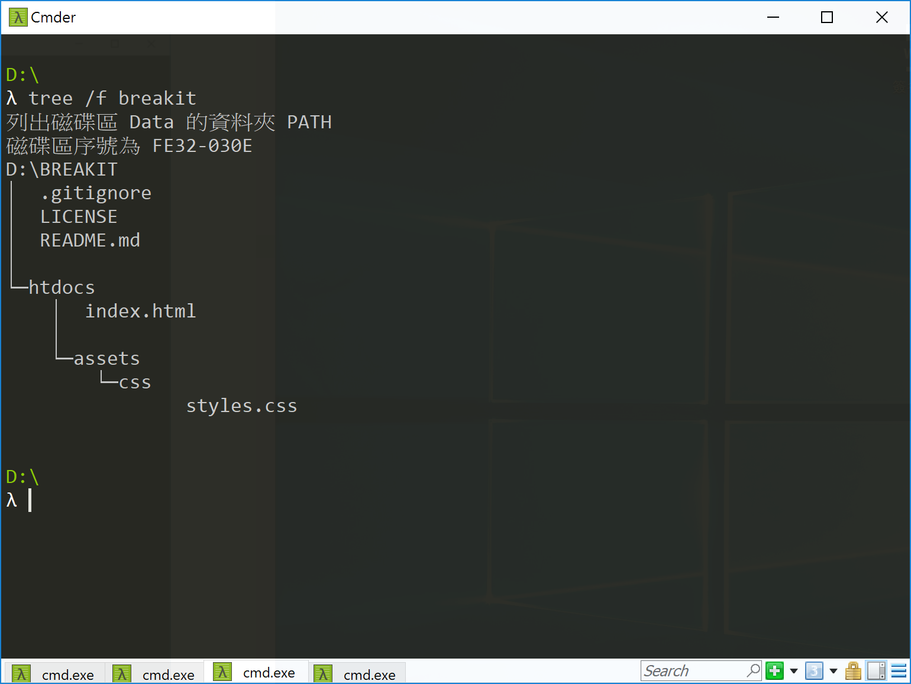
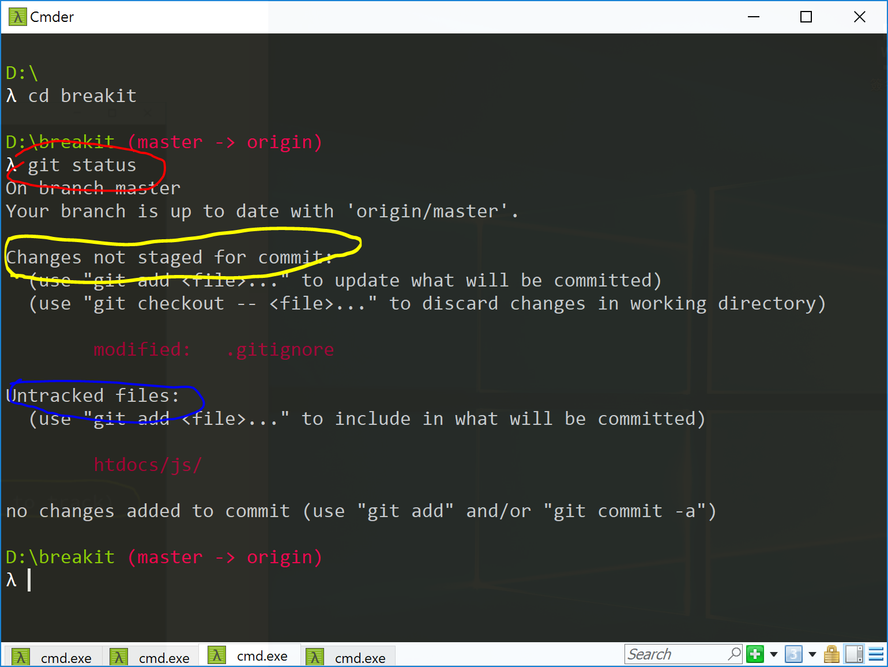
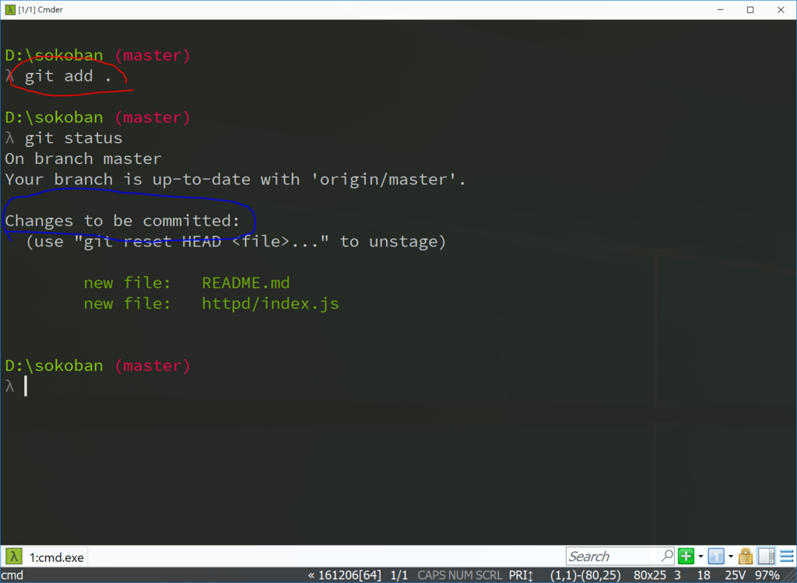
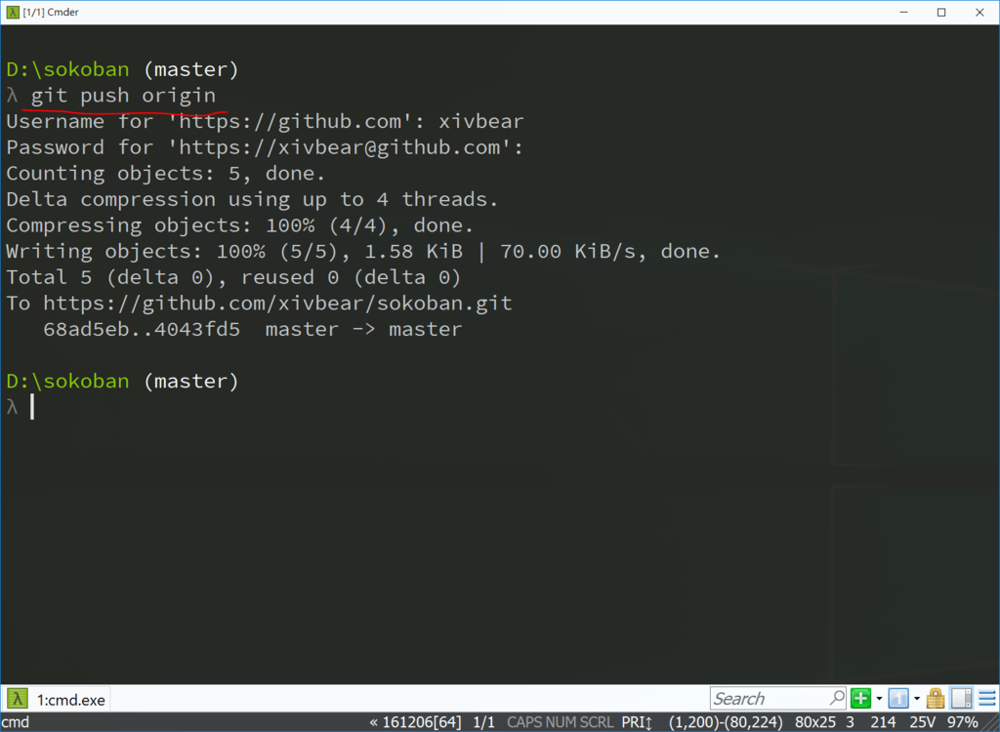
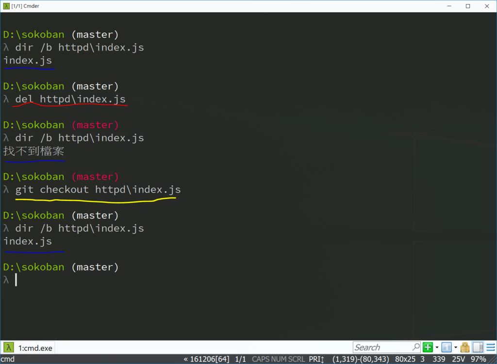
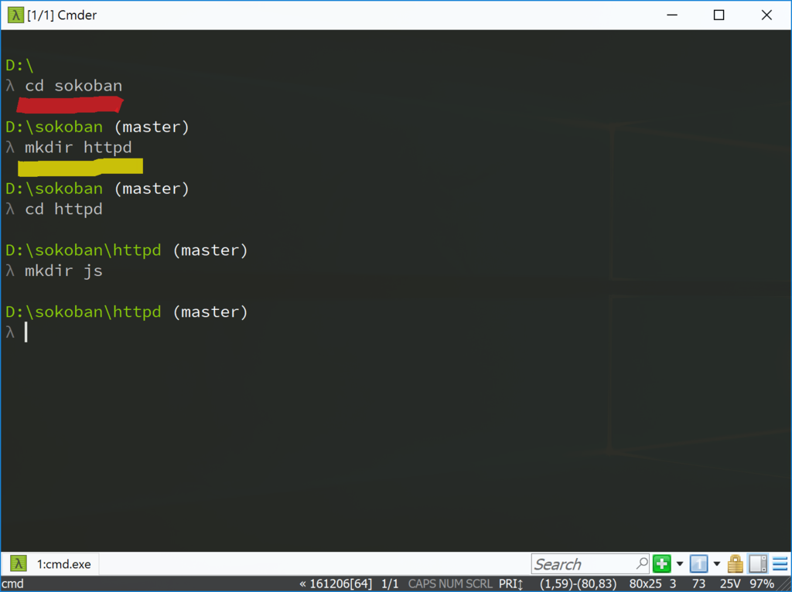
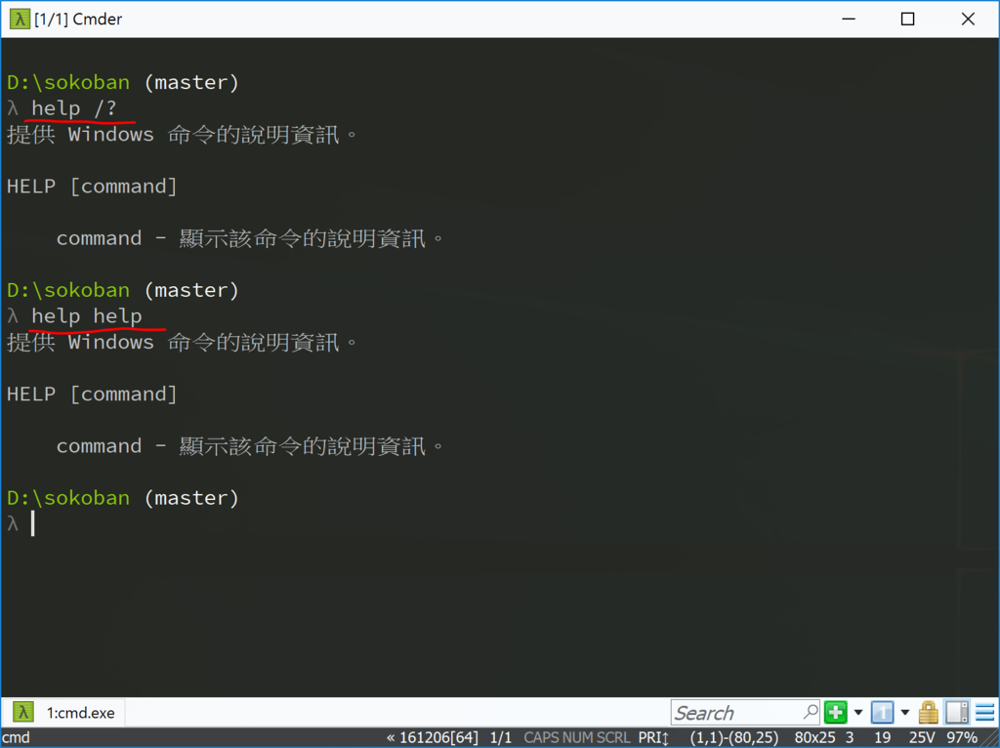
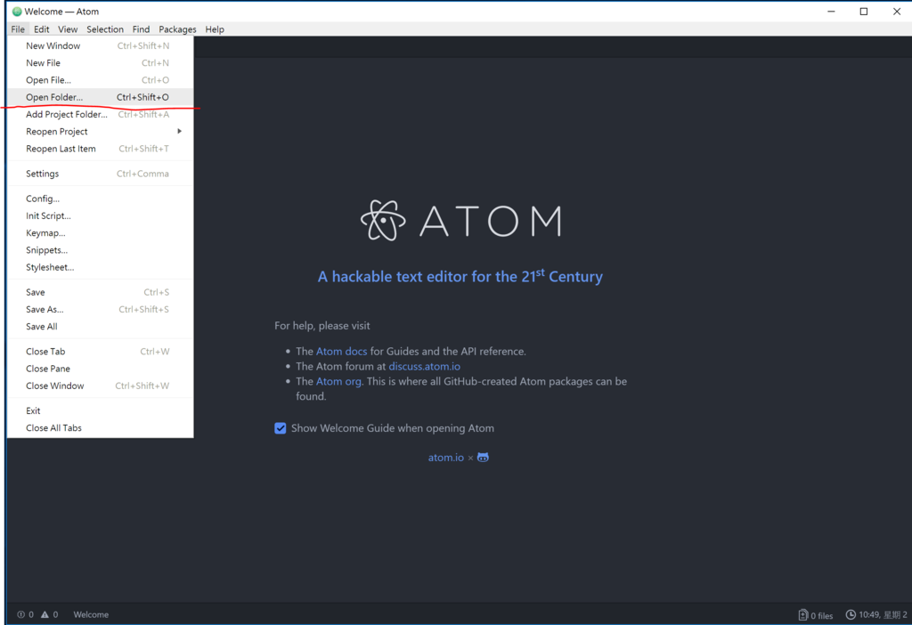

<!---
  @file       chapter_appendix.md
  @date       10/26/2018 created.
  @copyright  CC-BY, (C) 2017 Yiwei Chiao
  @detail
    This file is machine-generated. DONOT MODIFY IT DIRECTLY.
-->
# 版本管理 - [git][] 基礎使用

  專案開發，避免不了的是相關檔案及內容的增刪修改。更煩人的是，有可能增刪修改了
  某個部份，結果導至專案有了非預期的行為，想要回復之前的狀態卻發現忘了修改那些
  地方；或者，修改的地方太多，已經沒有力氣回頭了。

  這些情境，還有其它的一些問題，是[**版本管理系統**][vcs] ([Version Control System][vcs]) 發展的背後動力。

  [BreakIt][breakit] 專案放在 [GitHub][github] 上，
  [GitHub][github] 是利用 [git][] 架設的雲服務。而 [git][] 本身正是一個
  [版本管理系統][vcs]。

  目前專案寫了第一版的 `index.js` 檔，可以在瀏覽器上顯示 `Hello World!`。
  正好用來建立專案在 [git][] 系統裡的第一個 **節點**。

## 專案目前狀態

  如果沒有其它變數，目前的專案檔案結構應該長的很像 Figure
  \ref{tree_breakit} 所示。

  

---

#### Note

  * `tree` 是 Windows 的指令；
  * Linux 環境：
    - 如果系統內沒有，去找找該 Linux 發行版的套件庫，
    - 或者到這個連結自己安裝：http://mama.indstate.edu/users/ice/tree/

  * MacOS 環境：
    - 如果沒裝 [Homebrew][brew]，先安裝 [Homebrew][brew]；
    - 有安裝 [Homebrew][brew]，直接下 `brew install tree`

---  

## 專案目前狀態 - `git status`

  Figure \ref{tree_breakit} 是檔案系統內看到的樣子；另一方面，由 [git][]
  的觀點來看，專案目前的狀態應該類似 Figure \ref{git_breakit}：

  

  Figure \ref{git_breakit} 裡有三 (3) 處用色筆圈起來的部份。

  * 紅圈：`git status` 呼叫 [git][] 回報目前的專案狀態。[git][] 本身是個命
   令列工具，採用 [cli][] 介面，為了避免與其它的 [cli][] 介面工具有命令名稱
   衝突 (name colision)，所有的 [git][] 指令都由 `git` 這個中控指令來
   處理。如 `git status`，`git add` 等。
  * 藍圈：`git status` 如果發現專案目錄結構裡有檔案 **變動**，就會在螢幕上
   回報。這裡因為專案 **新增** 了資料夾 `httpd` 和其下檔案
   `httpd/index.js`，所以 [git][] 回報有 `Untracked files:` - 未被追蹤
   的檔案存在。同時，在藍圈下方的區域可以看到紅色字的列表，列出了 `httpd` 資料夾和 `README.md` 檔案。  
   為什麼 `htdocs` 和其它的資料夾沒有列出來？因為 `htdocs` 資料夾下目前沒有任何檔案存在。單純是個 **空** 資料夾。[git][] 不會追蹤空資料夾，因為那沒有
   意義。
  * 黃圈：單純是 [git][] 給使用者的建議。因為發現了未被追踪的檔案存在，
   [git][] 提示可以利用 `git add` 指令將它們加入追蹤。

## 將檔案加入追蹤 - `git add`

  依 [git][] 的建議，呼叫 `git add .` 指令後，再呼叫 `git status`，可以
  看到類似 Figure \ref{git_add} 的樣子。

  

  * 紅圈：`git add .` 將 **當前** 資料夾下，含所有子資料夾，所有變動的檔案都
   納入追蹤。注意那個 **句點** (`.`) 指得是當前資料夾 (目錄)。如果需要的話，
   也可以 `git add filename` 只將檔名為 `filename` 的檔案加入追蹤；只是
   這樣需要一個一個的加，可能，不是那麼理想。
  * 藍圈：呼叫完 `git add .` 後，再次呼叫 `git status` 確認目前狀態。
   [git][] 回報 `Changes to be commited.` - 準備好要 `commit` (執行)
   的變動列表。就下方區域的綠色字列表。可以再次確誋是否真的要將這些列表的檔案
   加入追蹤。藍圈那行下面的括號內有提示如果反悔要將某個檔案解除追蹤的話可以利用
   `git reset HEAD <file>` 來達成。

## 確定執行變動 - `git commit`

  如果一切都確認沒問題，可以如 Figure \ref{git_commit} 所示，

  

  `git commit -m "index.js ..."` 執行 `commit` 的指令是 `git commit`，
  後面 `-m "..."` 的參數則是作變動的註解，讓自己未來回顧版本變動時，可以知
  道這個時後發生了什麼事。

  `-m "..."` 後面的字串內容當然隨個人的意思打，但 **一定** 要加。如果只下
  `git commit` 而沒有跟著後面的 `-m "..."`，[git][] 會認為你需要更多，
  遠超過一個字串所能表達的內容要記錄，[git][] 會貼心的幫你叫出文字編輯器，
  等你輸入文字。

## 檢視變動歷史 - `git log`

  在 Figure \ref{git_commit} 的下半部。如果呼叫 `git log` 指令，就可以
  看到這個專案由啟動以來的 `commit` 歷史。也就可以看到剛剛在 `-m "..."` 裡的內容顯示在螢幕上。

  可以看到 `git log` 顯示的 `-m "..."` 訊息是一團亂碼。這是因為 Windows 系
  統雖然支援 [Unicode][] ([utf8][])，[git][] 也使用
  [Unicode][] ([utf8][])，但是因為歷史因素，Windows 在命令提示字元下要顯示
  文字時，一律會轉換成各地區的編碼。例如，台灣的 Windows 命令提示字元強制設在
  CP 950 (微軟字碼頁，實實就是 [Big5][big5] 碼)，所以會有亂碼問題。
  解決方案？個人放棄。全使用英文最簡單，免傷腦筋。

## 同步至遠端 (GitHub) - `git push origin`

  `git commit -m "..."` 之後只是將變動在本機端 (local) 記錄下來
  [GitHub][github] 上的專案沒有變。為了讓兩邊的專案變動同步，可以使用
  `git push orign` 指令。如 Figure \ref{git_push}。

  

  執行 `git push orign` 之後，`git` 會回報它傳了多少資料到遠端去。

## 由遠端同步回本機 - `git pull origin`

  假設使用兩台以上的電腦在寫作這個專案，假定一台稱作 `A`，一台稱作 `B`。假定，
  兩台電腦都已由 [GitHub][github] 利用 `git clone` 取得了同一個專案的專案
  源碼。

  進一步假定 `A` 電腦對專案作了更新，呼叫了 `git commit`，並利用
  `git push origin` 將更新同步到 [GitHub][github] 上；如果 `B` 電腦
  想要取得 `A` 電腦的更新怎麼辦？

  可以在 `B` 電腦利用 `git pull origin` 指令由 [GitHub][github]
  將 `A` 電腦更新的資料**拉**下來。拉下來之後，除非 `A` 電腦在 `git push`
  後還有更新，否則 `A`，`B` 電腦和 [GitHub][github] 上的專案源碼將會是
  相同的。

## 回復之前狀態 - `git checkout`

  開始時提過，[git][] 是個[版本管理系統][vcs]，而[版本管理系統][vcs]的目的
  就是要管控專案發展中不同的版本分支或變動。現在專案已交由 [git][] 管理，所以
  可以簡單的來玩一下。如圖 Figure \ref{git_checkout}

  

  * 藍線：在 Figure \ref{git_checkout} 裡畫藍色底線的部份是利用 `dir`
   指令在看 `httpd/index.js` 在不在；
  * 紅線：畫紅線的部份，利用 `del` 指令將 `httpd\index.js` 刪除。由藍線
   部份也可以看到 `httpd/index.js` 在那之後真的不存在了。
  * 黃線：畫黃線的部份，利用 `git checkout` 指令到 [git][] 的版本倉庫裡
   將之前 `commit` 的 `httpd\index.js` 取出；於是 `httpd/index.js`
   檔案就又回來了。

   也就是 `git checkout` 是用來將之前儲放在 [git][] 倉庫裡的程式檔案拿出
   來，取代目前同名的檔案，如果有的話。而當然， `git checkout` 不是拿來像這個
   範例一樣，好像是用來 `undelete` 一樣。它的用途其實主要是版本回溯。只要是由
   `git commit` 產生的版本節點，不管時間多久，改了幾次版，都可以利用
   `git checkout` 時光倒流回到當時的那個版本狀態。而如何知道要回到之前的那個版本節點？就是靠當時 `git commit -m "..."` 裡，要求放的 `-m "..."`
   `commit` 訊息協助。

## 小結

   隨著專案進展，將會不斷的使用這些基礎的 [git][] 指令。或者，趁現在專案還年
   輕，上網或找書，多熟悉 [git][] 的使用會是個不錯的主意。

[big5]: https://zh.wikipedia.org/wiki/%E5%A4%A7%E4%BA%94%E7%A2%BC

<!-- git_basics.md -->

# 基本 shell 指令

  這一小節簡單介紹在命令提示字元/terminal 下的操作指令，一般稱為 shell 指令。
  基本目標為能夠在命令提示字元/terminal 環境下，於專案的目錄結構自在往來為主。
  範例圖式以 Windows 為主， Linux/MacOS 指令若有差異會再註明。

## `dir`: 列出檔案列表

  

　如 Figure \ref{cmd_dir} 紅色圈起來的地方所示。在 Windows 環境的命令提示字
  字元下輸入指令：`dir`，命令提示字元會列出檔前資料夾下所有的檔案。

  專案發展過程，如果需要知道目前所在資料夾，資料夾下有沒有特定檔案，有那些檔案，
  都可以利用這個指令來查看。

  `dir` 指令名稱的來源來自英文的**目錄** (*DIRectory*。)

  對應的，Linux/MacOS 環境的相對指令稱為 `ls`。`ls` 的命令名稱來源，你猜到
  了。英文的**列出** (*LiSt* directory。)

  在 Figure \ref{cmd_dir} 裡還有幾點值得一提：

  * 當前目錄: *.* 與 上層目錄: *..*: 在 Figure \ref{cmd_dir} 裡可以看到
   用黃線圈起來的 *.* 和 *..*，其中，
   - *.*: 代表 **當前** 資料夾，而
   - *..*: 代表 **上一層** 資料夾。
   在某些指令操作場合很好用。舉例而言，`cd ..` 代表切換到上一層資料夾。
  * 畫藍色底線的 *.gitignore*。記得，在 Windows 環境，檔名/目錄名前的 *.*
   沒有意義，但在 Linux/MacOS 環境下，代表 **隱藏檔**，也就是，沒特別指定的
   話， `ls` 指令不會顯示名稱以 *.* 開頭的檔案或資料夾。

## `cd`: 切換資料夾

  如果要移動到不同的資料夾下工作。使用的指是： `cd`，也就是英文的 *Change Directory*。如 Figure \ref{dir_httpd}，畫紅色底線的部份。

  

  如在 Figure \ref{cmd_dir} 裡說明的，`cd ..` 代表切換至上層目錄；而這是可
  以組合的。意思是說： `cd ..\..` 代表移至上兩層目錄，`cd ..\..\..` 代表移
  到上三層目錄等。

  這裡要注意的是 `cd ..\..` 裡的 `\` (*backslash* 字元)；這個 `\` 字元
  用來作為 **路徑** (*path*) 的資料夾分隔字元；但是，同樣的目的，
  Linux/MacOS 使用的是 `/` (*slash*) 字元。

## `md` 或 `mkdir`: 建立資料夾

  Figure \ref{dir_httpd} 裡，畫黃線的部份，呼叫 `mkdir` 來建立新資料夾；同樣指令也可簡寫為 `md` (*Make Directory*。)

## 指令說明/幫助

  如果對這些指令還有疑問或想查有沒有進階的用法。除了上網問 Google，現在的作業
  環境都附痈完善的線上說明。

  

  如 Figure \ref{cmd_help} 所示，在 Windows 環境下有兩種取得指令說明的
  方式：

  * `cmd /?` 和
  * `help cmd`

  注意第一種方式的 `/` (slash) 字元在 Linux/MacOS 是用作目錄分隔符號。

  在 Linux/MacOS 環境下，則簡單的輸入：

  * `man cmd` 就行； `man` 來自 **手冊** 的英文 `MANual`；可以先
  * `man man` 查詢 `man` 指令本身的用法。

# [Atom][atom] 基本操作

  這一節簡單介紹如何利用 [atom][] 編輯器編輯 [sokoban.js][sokobanjs] 的
  檔案。

## `Open Folder`

  啟動 [atom][] 後，先到左上角的 `File` 選擇 `Open Folder`。如 Figure \ref{atom_openfolder}

  

  在檔案總管視窗選擇了專案資料夾後，畫面會變成如 Figure \ref{atom_new_proj}
  所示。

  

## `New file`

  如果專案的目錄結構已建好，可以在畫面右上角的 `httpd` 資料夾點右鍵，選擇
  Figure \ref{atom_new_file} 裡的紅圈，

  

  然後在 \ref{atom_index} 裡輸入 `index.js`

  

  就可以快樂的開始編輯 `index.js` 檔案了。

####  Happy Coding!

[ECMAScript]: https://www.ecma-international.org/publications/standards/Ecma-262.htm
[breakit]: https://github.com/ywchiao/breakit.git
[breakout]: https://en.wikipedia.org/wiki/Breakout_(video_game)
[nodejs]: https://nodejs.org
[atom]: https://atom.io
[babeljs]: https://babeljs.io
[browserify]: http://browserify.org
[git]: https://git-scm.com
[github]: https://github.com
[ide]: https://en.wikipedia.org/wiki/Integrated_development_environment
[rollupjs]: https://rollupjs.org
[terser]: https://github.com/terser-js/terser
[torvalds]: https://en.wikipedia.org/wiki/Linus_Torvalds
[typescript]: https://www.typescriptlang.org
[vcs]: https://en.wikipedia.org/wiki/Version_control
[vscode]: https://github.com/Microsoft/vscode
[webpack]: https://webpack.github.io
[brew]: https://github.com/Homebrew/brew
[cli]: https://en.wikipedia.org/wiki/Command-line_interface
[cmder]: https://github.com/cmderdev/cmder
[gui]: https://en.wikipedia.org/wiki/Graphical_user_interface
[npm]: https://www.npmjs.com
[nvm]: https://github.com/creationix/nvm
[vim]: https://vim.sourceforge.io
[xcode]: https://developer.apple.com/xcode
[commonmark]: http://commonmark.org
[gfm]: https://github.github.com/gfm
[gitignore]: https://git-scm.com/docs/gitignore
[markdown]: https://en.wikipedia.org/wiki/Markdown
[MIT]: https://opensource.org/licenses/MIT
[scriptingLanguage]: https://en.wikipedia.org/wiki/Scripting_language
[shellScript]: https://en.wikipedia.org/wiki/Shell_script
[mdnCSS]: https://developer.mozilla.org/en-US/docs/Web/CSS
[mdnHTML]: https://developer.mozilla.org/en-US/docs/Web/HTML
[mdnJavaScript]: https://developer.mozilla.org/zh-TW/docs/Web/JavaScript
[wikiCSS]: https://en.wikipedia.org/wiki/Cascading_Style_Sheets
[wikiECMAScript]: https://en.wikipedia.org/wiki/ECMAScript
[wikiHTML]: https://en.wikipedia.org/wiki/HTML
[githubHead]: https://github.com/joshbuchea/HEAD
[mdnHTML5]: https://developer.mozilla.org/en-US/docs/Web/Guide/HTML/HTML5
[wikiMarkdown]: https://en.wikipedia.org/wiki/Markdown
[wikiMarkupLang]: https://en.wikipedia.org/wiki/Markup_language
[wikiMetadata]: https://en.wikipedia.org/wiki/Metadata
[wikiProgLang]: https://en.wikipedia.org/wiki/Programming_language
[wikiText]: https://en.wikipedia.org/wiki/Text_(literary_theory)
[wikiXML]: https://en.wikipedia.org/wiki/XML
[wikiYAML]: https://en.wikipedia.org/wiki/YAML
[chrome]: https://www.google.com.tw/chrome
[firefox]: https://www.mozilla.org/zh-TW/firefox/
[jade]: http://jade-lang.com/
[jinja]: http://jinja.pocoo.org/
[mdnDOM]: https://developer.mozilla.org/en-US/docs/Web/API/Document_Object_Model
[mdnSVG]: https://developer.mozilla.org/kab/docs/Web/SVG
[mdnXML]: https://developer.mozilla.org/en-US/docs/XML_introduction
[PHP]: https://secure.php.net/
[Python]: https://www.python.org/
[Ruby]: https://www.ruby-lang.org/zh_tw/
[twig]: https://twig.symfony.com/
[wikiERuby]: https://en.wikipedia.org/wiki/ERuby
[wikiJSP]: https://en.wikipedia.org/wiki/JavaServer_Pages
[wikiTemplatEngine]: https://en.wikipedia.org/wiki/Template_processor
[mdnCanvas2D]: https://developer.mozilla.org/en-US/docs/Web/API/CanvasRenderingContext2D
[mdnWebGL]: https://developer.mozilla.org/en-US/docs/Web/API/WebGL_API
[Unicode]: https://zh.wikipedia.org/wiki/Unicode
[utf8]: https://zh.wikipedia.org/wiki/UTF-8
[sokobanjs]: https://github.com/ywchiao/sokoban.js.git
[^ECMAScript]: https://en.wikipedia.org/wiki/ECMAScript
[^breakit]: https://github.com/ywchiao/breakit
[^breakout]: https://en.wikipedia.org/wiki/Breakout_(video_game)
[^nodejs]: https://nodejs.org
[^atom]: https://atom.io
[^babeljs]: https://babeljs.io
[^browserify]: http://browserify.org
[^git]: https://git-scm.com
[^github]: https://github.com
[^ide]: https://en.wikipedia.org/wiki/Integrated_development_environment
[^rollupjs]: https://rollupjs.org
[^terser]: https://github.com/terser-js/terser
[^torvalds]: https://en.wikipedia.org/wiki/Linus_Torvalds
[^typescript]: https://www.typescriptlang.org
[^vcs]: https://en.wikipedia.org/wiki/Version_control
[^vscode]: https://github.com/Microsoft/vscode
[^webpack]: https://webpack.github.io
[^brew]: https://github.com/Homebrew/brew
[^cli]: https://en.wikipedia.org/wiki/Command-line_interface
[^cmder]: https://github.com/cmderdev/cmder
[^gui]: https://en.wikipedia.org/wiki/Graphical_user_interface
[^npm]: https://www.npmjs.com
[^nvm]: https://github.com/creationix/nvm
[^vim]: https://vim.sourceforge.io
[^xcode]: https://developer.apple.com/xcode
[^commonmark]: http://commonmark.org
[^gfm]: https://github.github.com/gfm
[^gitignore]: https://git-scm.com/docs/gitignore
[^markdown]: https://en.wikipedia.org/wiki/Markdown
[^MIT]: https://opensource.org/licenses/MIT

<!--- chapter_appendix.md -->